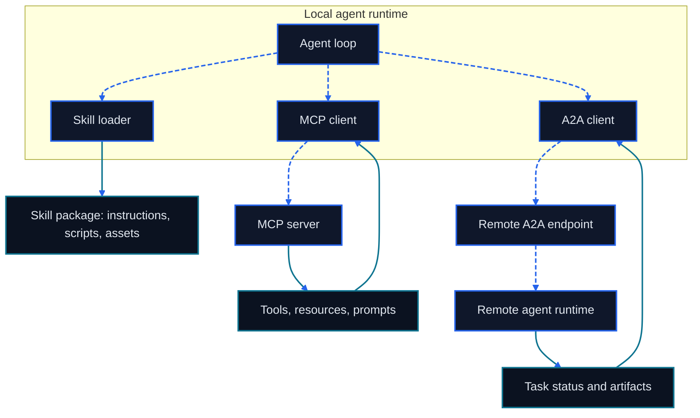

# Chapter 10: MCP, Skills, and A2A

<figure class="course-hero">
  
  <figcaption><em>A shared protocol lets runtimes reach many tools through one consistent bridge.</em></figcaption>
</figure>



<div class="diagram-legend" aria-label="Flow legend">
  <span class="diagram-legend-data">Data · solid cyan</span>
  <span class="diagram-legend-control">Control · dashed blue</span>
</div>

*Diagram conclusion:* Skills package local procedure, MCP exposes external capabilities, and A2A exchanges task state and artifacts across agent runtimes.

The Agents from earlier chapters already have a Loop, Tools, an Environment, Memory, and Context. This chapter addresses the next layer: reusing capabilities across processes, loading complex procedures only when needed, and exchanging work and outputs between independent Agents.

These concerns belong to different boundaries:

- **MCP** standardizes context exchange between AI applications and external capabilities.
- A **Skill** packages instructions, scripts, references, and templates as an on-demand capability.
- **A2A** lets one Agent delegate a stateful task to another Agent.

They can be composed, but they are not interchangeable. This chapter chooses the boundary before the protocol. Its example is a deterministic local teaching fixture for observing schema, permission, and error semantics. It is not a production MCP Server and makes no claim of MCP conformance.

## 10.1 Choose the Boundary Before the Technology

### 10.1.1 Tool, API, Skill, or Agent

| Choice | Suitable problem | What the caller receives | Main cost |
| --- | --- | --- | --- |
| Tool | One describable, verifiable operation | Typed input and a result or error | Schema, permission, idempotency, and validation |
| API | A stable program-to-program business interface | A resource or business operation | Authentication, versioning, and client adaptation |
| Skill | A reusable way of doing a multi-step job | On-demand instructions, scripts, references, and assets | Version, provenance, and host compatibility |
| Agent | A remote collaborator that must plan autonomously | Messages, state, tasks, and artifacts | Trust, budget, delegation, and observability |

Use these rules:

1. Define a Tool when one deterministic call can do the work; use an existing API directly when it is already the stable service boundary.
2. Package a Skill when the current Agent needs to learn a reusable multi-step procedure.
3. Delegate to an Agent only when the other party must plan independently, run for a long time, or own task state.
4. Consider MCP when hosts need to discover Tools, Resources, or Prompts; consider A2A when Agents delegate tasks.

Wrapping an ordinary function as a remote Agent adds failure modes. Hiding a long workflow inside one Tool hides intermediate state. The boundary should follow responsibility and validation points.

### 10.1.2 A Protocol Does Not Grant Permission

A protocol defines message shape and interaction order; it does not create trust. Discovering a capability does not authorize its use, and a successful call does not prove the business goal is complete.

A safe call crosses at least these gates:

```text
discover → validate schema → check identity and permission → request approval if needed
         → execute in a restricted environment → validate outcome → record evidence
```

The Host must retain control of user intent, permission policy, and final validation. Remote descriptions, Tool results, Resource contents, Skill files, and Agent messages are all potentially untrusted input.

## 10.2 MCP: The Boundary Between AI Applications and External Capabilities

MCP is a stateful protocol built on JSON-RPC. Its official architecture separates Host, Client, and Server and specifies a one-to-one session between a Client and a Server[1].

### 10.2.1 Host, Client, and Server

| Role | Responsibility | Control it should retain |
| --- | --- | --- |
| Host | Own the user experience and model, create Clients, aggregate Context | User authorization, global policy, isolation between Servers |
| Client | Maintain a session with one Server, negotiate versions and capabilities, route messages | Never forward another Server's secrets |
| Server | Expose focused Tools, Resources, and Prompts | Never expand permission or assume user consent |

A procurement assistant might connect to an order Server and an email Server. The Host decides which capabilities this session can see. Two Clients maintain separate connections. The order Server handles only its domain and should not see the other Server's complete conversation.

During initialization, the peers negotiate a protocol version and capabilities. The Client may use only negotiated capabilities and must handle list changes, notifications, timeouts, cancellation, and disconnects. `stdio` fits local processes launched by the Host; Streamable HTTP fits remote deployments. Transport does not change the permission boundary.

### 10.2.2 Tools, Resources, and Prompts Are Different

The official MCP concepts distinguish three Server primitives by their typical controller[2]:

| Primitive | Meaning | Typical controller | Procurement example |
| --- | --- | --- | --- |
| Tool | A schema-defined operation the model may request | Model proposes; Host approves or executes | `lookup_order`, `update_due_date` |
| Resource | Passive data the application reads into Context | Application | `order://PO-7/history` |
| Prompt | A parameterized message template selected explicitly | User | “Prepare a supplier-delay review” |

A Tool is not an arbitrary code string. Its definition needs a clear name, description, and JSON Schema, while its result should distinguish success, domain failure, protocol failure, and execution failure. A Resource has a URI and media type and is useful for Context; read-only data still needs access control. A Prompt is a workflow entry point, not authorization for a privileged Tool.

Several common confusions produce weak designs:

- Hiding a write inside a Resource violates the user's expectation of passive data.
- Putting a long procedure in every Tool description wastes Context.
- Treating a Prompt as a trusted system instruction lets remote text cross authority boundaries.
- Approving every result from `tools/list` treats discovery as authorization.

### 10.2.3 Lifecycle and Security

A robust MCP integration records Server identity, protocol version, capabilities, Tool Schema version, and call evidence. It rediscovers after a Schema change and renegotiates after reconnecting instead of caching old session capabilities forever.

Approval for a side-effecting Tool should display the actual target, material arguments, and expected effect. Bind tokens to the intended Server and least scope; never pass an upstream token through to a downstream service. Remote MCP implementations must also follow OAuth security practice against confused-deputy flows, malicious redirects, and token theft[3]. Local Servers still need process isolation, directory limits, and minimal environment variables.

MCP standardizes a boundary. It does not replace transactions, idempotency keys, read-after-write validation, or compensation in the business API.

## 10.3 Skills: Progressively Disclosed Capability Packages

A Skill is not a communication protocol. The Agent Skills specification defines a Skill as a directory containing at least `SKILL.md`, with optional scripts, references, and assets[4]:

```text
order-delay-review/
├── SKILL.md
├── scripts/
├── references/
└── assets/
```

The `SKILL.md` frontmatter provides at least `name` and `description`. Its body explains steps, boundaries, and validation. Scripts hold deterministic operations, references hold knowledge loaded when needed, and assets hold templates or output material.

### 10.3.1 Three Layers of Progressive Disclosure

```text
discovery: load name and description only
  ↓ task matches
activation: read the complete SKILL.md
  ↓ a step requires more
execution: load a named reference/asset or run a script
```

Progressive disclosure reduces startup Context and clarifies provenance and purpose. It does not mean reading fragments of the main instructions: once selected, the Agent reads the complete `SKILL.md`, then loads only the supporting resources needed for the current step.

### 10.3.2 Skill Lifecycle

A reusable public Skill should pass through:

1. **Authoring:** state triggers, inputs, outputs, dependencies, permissions, and completion conditions.
2. **Validation:** exercise representative tasks, scripts, and failure paths.
3. **Publishing:** pin provenance, version, license, and compatibility requirements.
4. **Discovery and activation:** let the Host match metadata while preserving system and user instruction priority.
5. **Execution and observation:** record which resources were read, which commands ran, and which evidence resulted.
6. **Revision or retirement:** run regression tasks on changes and remove stale, contaminated, or unprovenanced versions.

A Skill may call Tools or guide an Agent in using MCP or A2A. Text inside the package cannot expand Host permission. Before installing a third-party Skill, review its scripts, links, dependencies, and secret-reading scope.

## 10.4 A2A: A Task Protocol Between Agents

A2A serves collaboration between a Client Agent and a Remote Agent. Its official specification defines Agent Card, Message, Task, Part, and Artifact as core objects[5].

### 10.4.1 From Discovery to Artifact

1. The Client obtains an **Agent Card** describing identity, endpoint, capabilities, Skills, and authentication requirements.
2. It sends a **Message** containing one or more Parts.
3. A simple interaction may return a Message directly; complex work creates a **Task** with a unique ID.
4. The Task moves through submitted, working, input-required, completed, failed, canceled, or rejected states.
5. The Remote Agent reports progress with status updates and delivers documents, file references, or structured data as **Artifacts**.
6. The Client may query the Task, subscribe to streaming updates, or configure Push Notifications for long work.

A Message is one communication turn. A Task is a stateful unit of work. An Artifact is a work product. Collapsing all three into a chat string makes cancellation, retry, recovery, and audit difficult.

### 10.4.2 Combining MCP and A2A

```text
procurement Agent (A2A Client)
  └─delegate “verify delay cause” → supplier-research Agent (A2A Server)
                                      ├─read an order Resource through MCP
                                      └─call a retrieval Tool through MCP
  ← Task status + source-backed Artifact
```

MCP connects capabilities; A2A delegates autonomous work. Whether the Remote Agent internally uses MCP is an implementation detail. The Client cares about the task contract, state, artifacts, and evidence.

### 10.4.3 Trust Boundaries in Agent Collaboration

An Agent Card is a claim, not proof. Verify provenance, transport security, authentication, and allowed Skills before calling. Isolate Tasks by caller, restrict Artifact size and media type, validate webhook targets against SSRF, and sign and replay-protect Push Notifications.

A delegation request should carry the goal, inputs, permissions, budget, deadline, output Schema, and acceptance rule. After the Remote Agent reports completion, the Client still validates the Artifact and external final state independently.

## 10.5 Deterministic Local Teaching Fixture

`code/go-agentic/10-mcp-skills-a2a/tool_server.py` provides an in-memory `lookup_order` Tool; the [example README](../../code/go-agentic/10-mcp-skills-a2a/README.md) records purpose, dependencies, inputs, outputs, safety boundaries, limitations, and exact commands. It demonstrates four boundary behaviors:

- discovery returns the name, description, input Schema, required permission, and read-only marker;
- extra, missing, mistyped, and malformed arguments return stable `INVALID_ARGUMENTS` results;
- a valid request checks `orders:read` before execution;
- an order absent from the fixture returns `NOT_FOUND` instead of invented data.

```python
from tool_server import LocalToolServer

server = LocalToolServer()
definition = server.list_tools()[0]
result = server.call_tool(
    definition.name,
    {"order_id": "PO-7"},
    granted_permissions={"orders:read"},
)
assert result.ok and result.content["supplier"] == "ABB"
```

Run the tests:

```bash
python3 -m pytest code/go-agentic/10-mcp-skills-a2a/test_tool_server.py -q
```

This fixture implements no JSON-RPC, handshake, transport, Resource, Prompt, OAuth, or A2A behavior. It reduces the testable protocol boundary to Schema, permission, result, and error. Production integrations should use the target protocol's official SDK and conformance tests.

## 10.6 Design Checklist and Ecosystem Note

Before integrating a capability, answer:

- Is it a deterministic operation, an existing API, a multi-step method, or an autonomous remote task?
- Who discovers, selects, approves, executes, and validates it?
- What are the input, output, error, timeout, cancellation, and idempotency semantics?
- Where are the least-permission and secret boundaries?
- How do version changes, disconnects, retries, and duplicate notifications behave?
- Which final state and evidence prove completion?

**ANP ecosystem note.** Agent Network Protocol explores Web- and DID-based Agent identity, discovery, description, messaging, and application protocols. Its official repository lists both released specifications and components that remain drafts[6]. It is useful to track, but this course does not present it as a mature substitute for MCP or A2A and builds no later code dependency on it.

## 10.7 Exercises

1. Extend `lookup_order` into two Tools: a read-only lookup and an approval-gated due-date update. First write failing tests for unknown fields, missing permission, and duplicate requests.
2. Design a Skill directory for a “supplier delay review.” Identify always-loaded metadata, instructions loaded on activation, and resources loaded only when needed.
3. Write an A2A Task contract with a goal, budget, cancellation condition, Artifact Schema, and acceptance evidence.
4. Audit a third-party MCP Server or Skill. List its token, file, network, and prompt-injection risks.

## 10.8 Chapter Summary

Protocol design keeps responsibility, permission, state, and evidence clear across boundaries. MCP separates Host, Client, and Server as well as Tool, Resource, and Prompt. Skills package methods through progressive disclosure. A2A expresses remote collaboration through Agent Cards, Tasks, and Artifacts. Choose the boundary first, then add least privilege, independent validation, and replayable evidence.

## References

1. Model Context Protocol, [Architecture, specification 2025-06-18](https://modelcontextprotocol.io/specification/2025-06-18/architecture).
2. Model Context Protocol, [Understanding MCP servers](https://modelcontextprotocol.io/docs/learn/server-concepts).
3. Model Context Protocol, [Security Best Practices](https://modelcontextprotocol.io/specification/2025-06-18/basic/security_best_practices).
4. Agent Skills, [Specification](https://agentskills.io/specification) and [What are skills?](https://agentskills.io/what-are-skills).
5. A2A Project, [A2A Protocol Specification](https://a2a-protocol.org/latest/specification/).
6. Agent Network Protocol, [official specification repository](https://github.com/agent-network-protocol/AgentNetworkProtocol).
