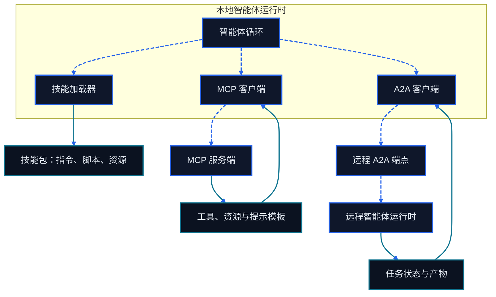

# 第十章 MCP、Skills 与 A2A

<figure class="course-hero">
  
  <figcaption><em>统一协议让运行时通过一致的桥梁连接多种工具。</em></figcaption>
</figure>



<div class="diagram-legend" aria-label="流程图例">
  <span class="diagram-legend-data">数据 · 青色实线</span>
  <span class="diagram-legend-control">控制 · 蓝色虚线</span>
</div>

*图示结论：* Skills 封装本地过程，MCP 暴露外部能力，A2A 则在智能体运行时之间交换任务状态与产物。

前几章中的 Agent 已经有 Loop、Tool、Environment、Memory 和 Context。本章解决下一层问题：能力怎样跨进程复用，复杂流程怎样按需装载，独立 Agent 怎样交换任务与产物。

这三个问题分别对应不同边界：

- **MCP** 标准化 AI 应用与外部能力之间的上下文交换；
- **Skill** 把说明、脚本、参考资料和模板打包成按需装载的能力；
- **A2A** 让一个 Agent 把有状态任务交给另一个 Agent。

它们可以组合，但不能互换。本章先判断边界，再选择协议。示例只实现一个确定性的本地教学 Fixture，用来观察 Schema、权限和错误语义；它不是生产 MCP Server，也不声称通过 MCP 一致性测试。

## 10.1 先选边界，再选技术

### 10.1.1 Tool、API、Skill 与 Agent

| 选择 | 适合的问题 | 调用方得到什么 | 主要代价 |
| --- | --- | --- | --- |
| Tool | 一个可描述、可验证的操作 | 带类型的输入、结果或错误 | Schema、权限、幂等与验证 |
| API | 稳定的程序间业务接口 | 资源或业务操作 | 认证、版本与客户端适配 |
| Skill | 一套可复用的做事方法 | 按需说明、脚本、参考资料、资产 | 版本、来源与宿主兼容性 |
| Agent | 需要自主规划的远程协作者 | 消息、状态、任务与产物 | 信任、预算、委派与可观测性 |

判断规则很直接：

1. 能用一次确定调用完成，就定义 Tool；已有稳定服务时直接使用 API。
2. 需要教会现有 Agent 一套多步方法，就封装 Skill。
3. 需要另一方独立规划、长时间运行或维护任务状态，才委派给 Agent。
4. 跨宿主发现 Tool、Resource 或 Prompt 时考虑 MCP；跨 Agent 委派任务时考虑 A2A。

把普通函数包装成远程 Agent 会增加失败面。把长流程塞进一个 Tool 又会隐藏中间状态。边界应与责任和验证点一致。

### 10.1.2 协议不授予权限

协议定义消息形状和交互顺序，不自动建立信任。能够发现某项能力，不等于获准执行它；调用成功，也不等于业务目标已经完成。

一次安全调用至少经过：

```text
发现能力 → 校验 Schema → 检查身份与权限 → 必要时请求批准
        → 在受限环境执行 → 校验结果 → 记录证据
```

宿主必须保留用户意图、权限策略和最终验证的控制权。远端描述、Tool 输出、Resource 内容、Skill 文件和 Agent 消息都可能是不可信输入。

## 10.2 MCP：AI 应用与外部能力的边界

MCP 是基于 JSON-RPC 的有状态协议。官方架构把参与者分为 Host、Client 和 Server，并明确一个 Client 与一个 Server 保持一对一会话[1]。

### 10.2.1 Host、Client、Server

| 角色 | 责任 | 不应外包的控制 |
| --- | --- | --- |
| Host | 承载用户体验和模型，创建 Client，聚合 Context | 用户授权、全局策略、Server 间隔离 |
| Client | 与一个 Server 建立会话，协商版本和能力，路由消息 | 不替其他 Server 转发秘密 |
| Server | 暴露聚焦的 Tool、Resource 和 Prompt | 不自行扩大权限或假设用户同意 |

例如采购助手可以连接订单 Server 和邮件 Server。Host 决定当前会话能看到哪些能力；两个 Client 分别维护连接；订单 Server 只处理订单领域。Server 不应直接看到其他 Server 的完整会话。

初始化时双方协商协议版本和 Capability。客户端只能调用已协商的能力，并应处理列表变化、通知、超时、取消和断连。`stdio` 适合由 Host 启动的本地进程；Streamable HTTP 适合远程部署。传输方式不会改变权限责任。

### 10.2.2 Tools、Resources、Prompts 不是同义词

MCP 官方概念文档按控制方区分三种 Server Primitive[2]：

| Primitive | 含义 | 典型控制方 | 采购例子 |
| --- | --- | --- | --- |
| Tool | 模型可请求执行的带 Schema 操作 | 模型提出，Host 批准或执行 | `lookup_order`、`update_due_date` |
| Resource | 应用读取并放入 Context 的被动数据 | 应用 | `order://PO-7/history` |
| Prompt | 用户显式选择的参数化消息模板 | 用户 | “生成供应商延期复盘” |

Tool 不是任意代码字符串。定义应包含清楚的名称、描述和 JSON Schema；结果还要区分成功、领域失败、协议失败和执行失败。Resource 有 URI 和媒体类型，适合读取 Context，但“只读”仍需访问控制。Prompt 是工作流入口，不是高权限 Tool 的授权凭证。

以下混淆会造成设计问题：

- 用 Resource 隐藏写操作，会绕过用户对副作用的预期；
- 把长篇说明塞进每个 Tool 描述，会浪费 Context；
- 把 Prompt 当作可信系统指令，会让远端文本越权；
- 仅凭 `tools/list` 的结果自动批准所有 Tool，会把发现误当授权。

### 10.2.3 生命周期与安全

一个稳健的 MCP 集成应保存 Server 身份、协议版本、Capability、Tool Schema 版本和调用证据。Schema 变化后重新发现，断线后重新协商；不要把旧会话能力永久缓存。

对有副作用的 Tool，批准界面要显示实际目标、关键参数和预计影响。令牌绑定目标 Server 与最小 Scope，不把上游 Token 透传给下游。远程 MCP 还要遵循 OAuth 安全实践，防范 confused deputy、恶意重定向和 Token 窃取[3]。本地 Server 同样需要进程隔离、目录范围和环境变量最小化。

MCP 标准化了边界，没有替代业务 API 的事务、幂等键、读后校验和补偿机制。

## 10.3 Skills：渐进披露的能力包

Skill 不是通信协议。Agent Skills 规范把 Skill 定义为至少包含一个 `SKILL.md` 的目录，还可以携带脚本、参考资料和资产[4]：

```text
order-delay-review/
├── SKILL.md
├── scripts/
├── references/
└── assets/
```

`SKILL.md` 的 Frontmatter 至少提供 `name` 和 `description`；正文说明步骤、边界和验证方法。脚本承载确定性操作，References 放按需查阅的知识，Assets 放模板或输出材料。

### 10.3.1 三层渐进披露

```text
发现：只加载名称与描述
  ↓ 任务匹配
激活：读取完整 SKILL.md
  ↓ 步骤确实需要
执行：加载指定 Reference/Asset，或运行 Script
```

渐进披露减少启动 Context，也让来源和用途更清楚。它不是“尽量少读”：一旦选择 Skill，就要完整读取其主说明；随后只加载当前步骤所需的资源。

### 10.3.2 Skill 生命周期

公开可复用的 Skill 应经历：

1. **编写**：写明触发条件、输入、输出、依赖、权限和完成条件。
2. **验证**：用代表性任务检查步骤、脚本和失败路径。
3. **发布**：固定来源、版本、许可证与兼容要求。
4. **发现和激活**：宿主依据元数据匹配，保留用户和系统指令优先级。
5. **执行和观察**：记录读取了哪些资源、运行了哪些命令、产生了什么证据。
6. **修订或退役**：用回归任务验证变更；撤下过期、被污染或来源不明的版本。

Skill 可以调用 Tool，也可以指导 Agent 使用 MCP 或 A2A。它不能凭文件中的文字扩大宿主权限。安装第三方 Skill 前要审查脚本、链接、依赖和秘密读取范围。

## 10.4 A2A：Agent 间的任务协议

A2A 面向 Client Agent 与 Remote Agent 的协作。官方规范把 Agent Card、Message、Task、Part 和 Artifact 作为核心对象[5]。

### 10.4.1 从发现到产物

1. Client 获取 **Agent Card**，了解身份、Endpoint、能力、Skills 和认证要求。
2. Client 发送由一个或多个 Part 组成的 **Message**。
3. 简单交互可以直接返回 Message；复杂工作创建带唯一 ID 的 **Task**。
4. Task 在提交、工作、等待输入、完成、失败、取消或拒绝等状态间迁移。
5. Remote Agent 用状态更新说明进度，用 **Artifact** 交付文档、文件引用或结构化数据。
6. Client 可以查询、订阅流式更新，或为长任务配置 Push Notification。

Message 是一次交流；Task 是有生命周期的工作单元；Artifact 是工作结果。三者混为一个聊天字符串后，取消、重试、恢复和审计都会变得困难。

### 10.4.2 MCP 与 A2A 的组合

```text
采购 Agent（A2A Client）
  └─委派“核实延期原因”→ 供应商调查 Agent（A2A Server）
                              ├─通过 MCP 读取订单 Resource
                              └─通过 MCP 调用检索 Tool
  ← Task 状态 + 引用来源的 Artifact
```

MCP 连接能力，A2A 委派自主工作。远端 Agent 是否使用 MCP 是其内部实现，Client 关心的是任务契约、状态、产物和证据。

### 10.4.3 Agent 协作的信任边界

Agent Card 是声明，不是证明。调用前验证来源、传输安全、认证方案和允许的 Skill；按调用方隔离 Task；限制 Artifact 大小和媒体类型；校验 Webhook 目标，防止 SSRF；对 Push Notification 验签并防重放。

委派请求应包含目标、输入、权限、预算、截止条件、输出 Schema 和验收规则。Remote Agent 返回“完成”后，Client 仍要独立验证 Artifact 和外部最终状态。

## 10.5 本地确定性教学 Fixture

`code/go-agentic/10-mcp-skills-a2a/tool_server.py` 提供一个内存中的 `lookup_order` Tool；[示例 README](../../code/go-agentic/10-mcp-skills-a2a/README.md)列出目的、依赖、输入输出、安全边界、限制和精确命令。它演示四个边界行为：

- Discovery 返回名称、描述、输入 Schema、所需权限和只读标记；
- 多余、缺失、类型错误和格式错误的参数得到稳定的 `INVALID_ARGUMENTS`；
- 合法请求在执行前检查 `orders:read`；
- Fixture 中没有的订单返回 `NOT_FOUND`，不编造数据。

```python
from tool_server import LocalToolServer

server = LocalToolServer()
definition = server.list_tools()[0]
result = server.call_tool(
    definition.name,
    {"order_id": "PO-7"},
    granted_permissions={"orders:read"},
)
assert result.ok and result.content["supplier"] == "ABB"
```

运行测试：

```bash
python3 -m pytest code/go-agentic/10-mcp-skills-a2a/test_tool_server.py -q
```

这个 Fixture 没有实现 JSON-RPC、握手、Transport、Resource、Prompt、OAuth 或 A2A。它只把可测试的协议边界缩小到 Schema、权限、结果和错误；生产实现应使用目标协议的官方 SDK 和一致性测试。

## 10.6 设计检查表与生态说明

接入一种能力前，回答：

- 它是确定操作、现有 API、多步方法，还是自主远程任务？
- 谁发现，谁选择，谁批准，谁执行，谁验证？
- 输入、输出、错误、超时、取消和幂等语义是什么？
- 最小权限和秘密边界在哪里？
- 版本变化、断线、重试和重复通知怎样处理？
- 哪些最终状态和证据证明任务完成？

**ANP 生态说明。** Agent Network Protocol 探索基于 Web 与 DID 的 Agent 身份、发现、描述、消息和应用协议。其官方仓库同时列出已发布规范与仍在草案阶段的部分[6]。它值得跟踪，但本课程不把它作为 MCP 或 A2A 的成熟替代，也不基于它建立后续代码依赖。

## 10.7 练习

1. 将 `lookup_order` 扩展为两个独立 Tool：只读查询和需批准的日期更新。先为未知字段、缺少权限和重复请求写失败测试。
2. 为“供应商延期复盘”设计一个 Skill 目录。说明哪部分常驻元数据，哪部分激活后读取，哪部分按需加载。
3. 写一个 A2A Task 契约，包含目标、预算、取消条件、Artifact Schema 和验收证据。
4. 审查一个第三方 MCP Server 或 Skill。列出其 Token、文件、网络和 Prompt Injection 风险。

## 10.8 本章小结

协议设计的关键是让责任、权限、状态和证据跨边界后仍然清楚。MCP 区分 Host、Client、Server 以及 Tool、Resource、Prompt；Skill 用渐进披露封装方法；A2A 用 Agent Card、Task 和 Artifact 表达远程协作。先选择正确边界，再加入最小权限、独立验证和可回放证据。

## 参考文献

1. Model Context Protocol, [Architecture, specification 2025-06-18](https://modelcontextprotocol.io/specification/2025-06-18/architecture).
2. Model Context Protocol, [Understanding MCP servers](https://modelcontextprotocol.io/docs/learn/server-concepts).
3. Model Context Protocol, [Security Best Practices](https://modelcontextprotocol.io/specification/2025-06-18/basic/security_best_practices).
4. Agent Skills, [Specification](https://agentskills.io/specification) and [What are skills?](https://agentskills.io/what-are-skills).
5. A2A Project, [A2A Protocol Specification](https://a2a-protocol.org/latest/specification/).
6. Agent Network Protocol, [official specification repository](https://github.com/agent-network-protocol/AgentNetworkProtocol).
