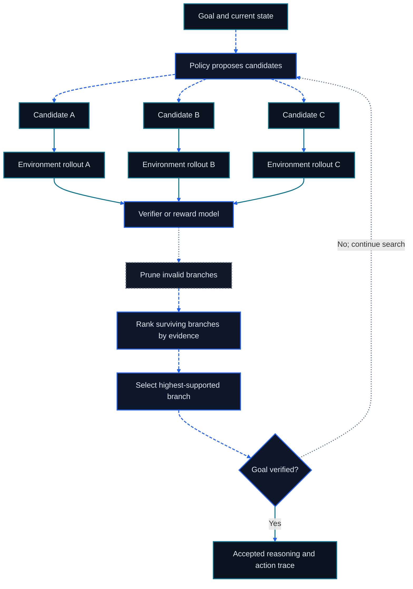

# Chapter 11: Agentic RL and Reasoning Models

<figure class="course-hero">
  
  <figcaption><em>Agent reasoning can be understood as searching and pruning possible policies.</em></figcaption>
</figure>



<div class="diagram-legend" aria-label="Flow legend">
  <span class="diagram-legend-data">Data · solid cyan</span>
  <span class="diagram-legend-control">Control · dashed blue</span>
  <span class="diagram-legend-failure">Failure · dotted neutral</span>
</div>

*Diagram conclusion:* Agentic reasoning becomes controlled search when candidate branches are tested in an environment, scored, pruned, and stopped by verification.

Agentic RL is more than training a chat model again. It places an Agent in an interactive Environment, lets the model produce a multi-step Trajectory, and supplies feedback from final state, constraints, and execution evidence. The model may be the training target, but capability comes from the whole loop:

```text
Policy/Model → Action → Tool/Environment → Observation
      ↑                                  ↓
      └──── Context, Memory, Reward, Verifier ────┘
```

This chapter stays at the conceptual and small-experiment level. It focuses on defining data, feedback, and decisions instead of building a complete GPU training cluster. One rule governs the chapter:

> **Improve the Loop and Environment before training.**

When Tool Schemas are ambiguous, state is unobservable, permission is wrong, rewards are exploitable, or verifiers are unreliable, training only makes the model better at exploiting a bad interface.

## 11.1 From a Single Answer to an Agent Trajectory

### 11.1.1 Environment, Observation, and Action

An ordinary generation sample is often written as input `x` and output `y`. An Agent task also needs:

- **State:** the true Environment state, such as order fields, file contents, and permissions;
- **Observation:** the projection of state visible to the Agent, such as a Tool Result or test failure;
- **Action:** a model message, Tool Call, query, edit, wait, or termination;
- **Reward/Feedback:** an assessment of an outcome or process;
- **Termination:** verified success, unrecoverable failure, exhausted budget, denial, or waiting.

An Agent usually sees only part of the state, so an Observation is not complete truth. When state changes outside the model, an old Observation becomes stale and the Loop must read again.

### 11.1.2 The Trajectory Is the Unit of Learning and Audit

A trajectory can be represented as:

```text
τ = (o₀, a₀, r₀, o₁, a₁, r₁, …, o_T)
```

A practical record also includes task ID, model and Prompt version, Tool Schema version, permissions, time, cost, errors, approvals, and evidence references. Final prose is only part of `o_T`; external final state may be the only proof that the task completed.

Consider “update the PO-7 due date”:

```text
read order → observe current revision v1
read supplier email → extract new date and source
request write approval → user grants approval:42
update conditionally on v1 → receive revision v2
read after write → PO-7.due_date = 2026-09-11
```

This trajectory shows where a failure happened, which action required approval, where credit belongs, and whether replay is safe. A final sentence saying “updated” does not.

## 11.2 Repair the Loop Before Training

### 11.2.1 Failure-Diagnosis Order

Inspect failures from lower to higher cost:

1. **Environment:** Are fixtures, state transitions, clocks, concurrency, and resets correct?
2. **Tool:** Are names, descriptions, Schemas, errors, permissions, and idempotency clear?
3. **Context/Memory:** Can relevant evidence be retrieved in time, and is stale material rejected?
4. **Loop:** Does retry change a variable, are validation and termination explicit, and are budgets sensible?
5. **Prompt and model configuration:** Are output structure, examples, temperature, and Context allocation suitable?
6. **Training:** Are the remaining errors stable, repeated, measurable, and actually caused by the Policy?

If a rule-based Validator can fix date formatting, the model does not need training to “be more careful.” If the model never receives a Tool's permission error, more examples will not repair the Environment.

### 11.2.2 When Training Is Justified

Training is justified by evidence such as:

- several model and Prompt versions repeatedly choose the wrong Action in the same state;
- correct behavior cannot be expressed with a simple constraint or deterministic code;
- representative Trajectories, a stable Environment, and a trusted Grader are available;
- improvement is measurable on a frozen holdout set, rather than only as higher training Reward;
- provenance, user consent, privacy, licensing, and deletion policy are clear.

Freeze the baseline and regression set before collecting training data. Do not leak test answers, future states created by human repair, or secrets into Observations. Split train, development, and test tasks by entity or time so the same order, repository, or template does not cross sets.

## 11.3 Three Kinds of Learning Signal

### 11.3.1 SFT: Demonstrate Correct Behavior

Supervised fine-tuning maximizes likelihood on reference outputs. For an Agent, the reference can be a Tool Call, structured plan, stop decision, or complete visible Action sequence.

SFT is useful for teaching:

- output format and Tool Schemas;
- common workflows and error-recovery patterns;
- when to request approval or cite evidence;
- basic style and domain terminology.

SFT imitates its data, including redundant steps and mistakes. It also cannot automatically know whether a plausible action changed the correct external state. Demonstrations should come from verified, permission-compliant, secret-scrubbed trajectories.

### 11.3.2 Preference Optimization: Compare Two Behaviors

Preference data provides a Chosen and Rejected response or trajectory for the same input. Methods such as DPO directly increase the probability of Chosen relative to Rejected without running an explicit Reward Model during optimization[3].

Preference optimization fits quality that is hard to express as an exact formula but easy for a human or rule to compare consistently:

- two plans complete the task, but one has stronger evidence;
- two answers are correct, but one is shorter and clearer;
- two safe trajectories differ in how precisely they scope permission.

It is not exploration in a live Environment. A rater who cannot see external state may prefer a failed trajectory that merely sounds successful. The comparison interface must expose the task outcome, material Actions, cost, and evidence.

### 11.3.3 RL: Learn from Execution Outcomes

Reinforcement learning samples behavior from a Policy, scores it with an Environment or Reward Function, and updates Action probabilities. Agentic RL can directly use:

- unit tests, compilers, and type checks;
- database constraints and read-after-write checks;
- simulator or game scores and business rules;
- permission violations, budget overruns, and forbidden Actions;
- human approvals and pairwise comparisons.

Executable feedback is closer to the task than language self-evaluation, but it remains incomplete. Passing tests do not imply safety, HTTP 200 does not imply correct final state, and a human thumbs-up may reflect presentation alone.

| Method | Data source | Best fit | Main risk |
| --- | --- | --- | --- |
| SFT | Verified demonstrations | Format and base policy | Imitating flaws in the data |
| Preference optimization | Pairwise preferences | Relative quality and style | Rater cannot see the real outcome |
| Agentic RL | Policy Rollout + Environment Reward | Executable multi-step behavior | Reward hacking, exploration risk, and cost |

The methods are often composed as `SFT → Preference/RL → Regression`, but this is not a law. A simple Tool-selection problem may need only SFT; a clearly verifiable task may support a small RL experiment directly.

## 11.4 Reward and Credit Assignment

### 11.4.1 Write the Success Contract Before the Reward

Derive Reward from the task contract. One teaching form is:

```text
R(τ) = w₁·final_state
     + w₂·required_evidence
     + w₃·constraint_compliance
     - w₄·cost
     - w₅·unnecessary_steps
```

Safety constraints usually belong in hard gates rather than small penalties that other scores can offset. A trajectory that executes a forbidden Action must not pass a release gate even when its final state is correct.

Reward design must anticipate:

- rewarding final prose alone teaches the model to claim completion without acting;
- rewarding test count teaches it to add meaningless tests;
- penalizing every step teaches it to skip validation;
- rewarding approvals teaches it to create unnecessary prompts;
- trusting a Policy-writable log as the only evidence lets it forge the grader input.

Use a Grader outside Policy control to read final state, then check the relationship between Reward and the real objective on a holdout set.

### 11.4.2 Delayed Feedback and Credit Assignment

A terminal Reward says whether the trajectory was good but not which step caused the result. The fault may be the first retrieval, a later false assumption, or a Tool failure after a correct plan. This is the credit-assignment problem.

Common strategies include:

- **Outcome Reward:** objective but sparse final-state feedback;
- **Process Reward:** denser step feedback that may confuse plausible-looking work with correct work;
- **phase decomposition:** split retrieval, planning, execution, and validation;
- **execution feedback:** return tests, Schema errors, state Diffs, and permission denials to the next step;
- **counterfactuals and ablations:** replace one Action or fork from a checkpoint and compare outcomes.

Do not reward the length of hidden reasoning text. Auditable objects are visible Actions, Observations, state transitions, and evidence. Longer reasoning can help or merely repeat itself.

## 11.5 Learning from Candidates Scored Against One Another

When execution produces a trustworthy score but no ideal trajectory to imitate, compare several attempts made under the same task contract. Sample a cohort of complete attempts, grade every attempt with the same Verifier and safety gates, then express each score relative to the cohort. GRPO is one implementation of this idea: DeepSeekMath uses the group comparison to estimate Advantages without a separately trained Critic[4]. This update is useful only after the Environment, Reward, and cohort construction are stable enough that “better than this group” means better task behavior.

For one input `x`, sample `y₁…y_G`:

```text
Aᵢ = (rᵢ - mean(r₁…r_G)) / (std(r₁…r_G) + ε)
```

Optimization raises the probability of samples with positive Advantage and lowers it for negative Advantage, typically with a clipped objective and a KL constraint relative to a reference Policy. In an Agent setting, `yᵢ` may be a complete Trajectory, while `rᵢ` comes from final state, constraints, cost, and evidence.

Material limitations include:

- a group whose samples all receive the same score has almost no relative signal;
- a wrong Grader systematically reinforces wrong behavior;
- terminal scores on long trajectories retain the credit-assignment problem;
- on-policy Rollouts are costly and may trigger real side effects;
- KL, sampling diversity, group size, and Reward scale jointly affect stability.

The course's small experiment does not require training a large model from scratch:

1. Select 20–50 resettable tasks with no real side effects; freeze the Grader and holdout set.
2. Sample several candidate trajectories per task and execute them in a deterministic Environment.
3. Compare distributions for outcome, evidence, forbidden Actions, steps, and cost.
4. First test the learning signal through candidate ranking or Prompt/Loop changes.
5. Only after the signal is stable, perform a small update in a controlled training stack.
6. Use the same baseline, multiple random seeds, and the holdout set to keep or roll back the change.

If step 3 cannot distinguish good behavior reliably, training will not fix the evaluation problem.

## 11.6 Reasoning Models and Test-Time Compute

Reasoning models can allocate more computation before answering, but “more tokens” is not a capability definition. Common forms of test-time compute include:

- **serial reasoning:** decompose, check, and revise within one trajectory;
- **parallel sampling:** generate candidates and select with a Verifier;
- **search:** expand and prune Action or solution states;
- **adaptive budgets:** finish easy tasks quickly and give difficult tasks more candidates or steps.

Research shows that gains from test-time compute depend on problem difficulty, search method, and verifier quality; adaptive allocation can be more effective than adding the same sampling budget everywhere[6]. For Agents, include Tool latency, fees, and side effects in the budget. Running eight writes in parallel is not safe majority voting.

Training changes the Policy. Test-time compute changes how one task uses the current Policy. Neither repairs an unobservable Environment or wrong Grader. Testing a strategy first with search, reflection, or candidate comparison is often cheaper than training immediately.

### 11.6.1 Test-Time Scaling Methods

| Method | Extra compute | Required verifier | Main risk |
| --- | --- | --- | --- |
| Self-consistency | Parallel samples and majority vote | Canonical answers | Correlated failures |
| Best-of-N | Score several candidates | Calibrated reward | Low diversity or reward hacking |
| ToT / GoT | Expand, merge, and prune intermediate states | Local feasibility/value | Branch-factor explosion |
| MCTS | Select, expand, simulate, and backpropagate | Resettable environment and terminal score | Simulation cost and model bias |
| Iterative refinement | Rewrite and revalidate | Critic identifying concrete defects | Self-confirmation without new evidence |

Search nodes retain auditable state, action, observation, score, and parent references rather than hidden reasoning. Pruning obeys node, tool-call, money, latency, and side-effect budgets.

### 11.6.2 From Self-Improvement to Agent Training

- **STaR** turns reasoning that reaches verified answers into demonstrations; answer leakage must be excluded.
- **Reflexion** stores execution feedback as experience; provenance, expiry, and conflict resolution are required.
- **LATS** combines language actions, environment feedback, and tree search; value comes from verified branches.
- **AgentQ** derives preference pairs from search or execution traces and optimizes the policy against them.
- **Voyager** accumulates executable skills; each skill needs versions, preconditions, tests, and retirement.
- **RLEF** learns from compilers, tests, simulators, or business execution feedback without blaming executor faults on the policy.

An interactive RL environment must be resettable, seedable, isolated, and able to record authoritative final state. Live email, payments, and production repositories are not safe exploration environments.

### 11.6.3 Budgeted Search Lab

```bash
cd code/go-agentic
python3 -m pytest 11-agentic-rl -q
```

`search.py` compares stable majority voting, Best-of-N, and best-first search under an expansion budget. Record candidates, scores, paths, and actual budget use.

## 11.7 From Execution Feedback to a Data Loop

A learning-ready record contains at least:

```yaml
task_id: approve-po-7
versions: {model: m3, prompt: p8, tools: t4, environment: e2}
authority: [orders:read, approval:request]
trajectory:
  - {action: read_order, observation: "revision=v1", cost: 2}
  - {action: request_approval, observation: "approval:42", cost: 3}
final_state: {order_id: PO-7, status: approved, revision: 2}
termination: verified
evidence: [erp:PO-7:v2, approval:42]
```

The data loop is `deploy → observe → attribute → repair loop/select learning method → evaluate offline → validate on limited traffic → regress`. Failed trajectories are valuable too, but distinguish model errors, Tool errors, permission denials, external outages, and Grader errors.

Remove secrets and unrelated personal data before training, retain provenance and consent records, and set a retention period. A production Trajectory does not automatically gain permission for secondary training use merely because it could improve the model.

## 11.8 Exercises

1. Write a complete Trajectory for “update an order date,” including Observations, Actions, permissions, cost, and evidence.
2. Design a Reward in which a trajectory with correct final state still fails after calling `send_email`. Explain which components are hard gates.
3. Give one Agent failure suitable for SFT, one for preference optimization, and one for GRPO, with reasons.
4. Design a four-candidate test-time compute experiment. Define its Verifier, budget, and stop condition.
5. Diagnose one failure in the order “Environment → Tool → Context → Loop → Prompt → Training.”

## 11.9 Chapter Summary

Agentic RL learns multi-step behavior inside an Environment. A Trajectory links Observations, Actions, execution feedback, final state, and evidence. SFT supplies demonstrations, preference optimization expresses relative choices, and GRPO uses within-group Reward. Rewards must follow the real task and safety gates; credit assignment must distinguish model and Environment faults; test-time compute must be bounded by a Verifier and budget. Repair in the Loop or Environment whenever the problem can be fixed there.

## References

1. Richard S. Sutton and Andrew G. Barto, [Reinforcement Learning: An Introduction, second edition](http://incompleteideas.net/book/the-book-2nd.html), 2018.
2. Shunyu Yao et al., [ReAct: Synergizing Reasoning and Acting in Language Models](https://arxiv.org/abs/2210.03629), 2022.
3. Rafael Rafailov et al., [paper introducing DPO](https://arxiv.org/abs/2305.18290), 2023.
4. Zhihong Shao et al., [DeepSeekMath paper](https://arxiv.org/abs/2402.03300), 2024.
5. DeepSeek-AI et al., [DeepSeek-R1: Incentivizing Reasoning Capability in LLMs via Reinforcement Learning](https://arxiv.org/abs/2501.12948), 2025.
6. Charlie Snell et al., [Scaling LLM Test-Time Compute Optimally can be More Effective than Scaling Model Parameters](https://arxiv.org/abs/2408.03314), 2024.
