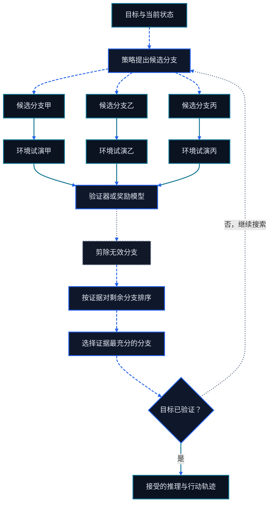

# 第十一章 Agentic RL 与推理模型

<figure class="course-hero">
  
  <figcaption><em>智能体推理可以理解为对候选策略进行搜索与剪枝。</em></figcaption>
</figure>



<div class="diagram-legend" aria-label="流程图例">
  <span class="diagram-legend-data">数据 · 青色实线</span>
  <span class="diagram-legend-control">控制 · 蓝色虚线</span>
  <span class="diagram-legend-failure">失败 · 中性色点线</span>
</div>

*图示结论：* 当候选分支经过环境试演、评分、剪枝并由验证决定停止时，智能体推理才成为受控搜索。

Agentic RL 不是“把聊天模型再训练一次”。它把 Agent 放进可交互的 Environment，让模型产生跨多步的 Trajectory，并依据最终状态、约束和执行证据获得反馈。训练对象可能是模型，但能力来自整个闭环：

```text
Policy/Model → Action → Tool/Environment → Observation
      ↑                                  ↓
      └──── Context、Memory、Reward、Verifier ────┘
```

本章保持在概念和小实验层面。重点是怎样定义数据、反馈和判断，而不是搭建完整 GPU 训练集群。贯穿全章的规则是：

> **先改进 Loop 与 Environment，再考虑训练。**

如果 Tool Schema 含糊、状态不可观测、权限错误、奖励可投机或验证器不可靠，训练只会让模型更熟练地利用坏接口。

## 11.1 从单次回答到 Agent Trajectory

### 11.1.1 Environment、Observation、Action

在普通生成中，样本常写成输入 `x` 和输出 `y`。Agent 任务还需要：

- **State**：Environment 的真实状态，例如订单字段、文件内容和权限；
- **Observation**：Agent 当前可见的状态投影，例如 Tool Result 或测试失败；
- **Action**：模型消息、Tool Call、查询、编辑、等待或终止；
- **Reward/Feedback**：对结果或过程的评价；
- **Termination**：验证成功、失败不可恢复、预算耗尽、拒绝或等待。

Agent 通常只看到部分状态，因此不能把 Observation 当成完整真相。状态在模型外部改变时，旧 Observation 会过期；Loop 必须重新读取。

### 11.1.2 Trajectory 是学习与审计单位

一条轨迹可表示为：

```text
τ = (o₀, a₀, r₀, o₁, a₁, r₁, …, o_T)
```

实际记录还应包含任务 ID、模型与 Prompt 版本、Tool Schema 版本、权限、时间、成本、错误、批准和证据引用。最终文本只是 `o_T` 的一部分；外部最终状态才可能证明任务完成。

以“更新 PO-7 交期”为例：

```text
读取订单 → 发现现有版本 v1
读取供应商邮件 → 提取新日期及来源
请求写入批准 → 用户批准 approval:42
按 v1 条件更新 → 返回版本 v2
读后校验 → PO-7.due_date = 2026-09-11
```

这条轨迹能回答哪里出错、哪一步需要批准、奖励属于谁，以及是否可以安全回放。只有“已更新”这句最终回答不能。

## 11.2 训练前先修闭环

### 11.2.1 故障诊断顺序

遇到失败时按成本从低到高检查：

1. **Environment**：Fixture、状态转换、时钟、并发和重置是否正确？
2. **Tool**：名称、描述、Schema、错误、权限和幂等语义是否清楚？
3. **Context/Memory**：相关证据是否能被及时检索，过期信息是否被拒绝？
4. **Loop**：重试是否改变变量，验证与终止是否明确，预算是否合理？
5. **Prompt 与模型配置**：输出结构、示例、温度和 Context 分配是否合适？
6. **训练**：剩余错误是否稳定、重复、可度量，并且确实来自 Policy？

如果规则化 Validator 就能修复日期格式，不需要训练模型“更认真”。如果模型从未看到 Tool 的权限错误，增加训练样本也不会修复 Environment。

### 11.2.2 何时训练才合理

训练适合以下证据：

- 多个模型和 Prompt 版本都在相同状态重复选择错误 Action；
- 正确行为无法用简单约束或确定性代码表达；
- 有足够的代表性 Trajectory、稳定 Environment 和可信 Grader；
- 改进能在冻结的保留集上测量，而不只提高训练 Reward；
- 数据来源、用户同意、隐私、许可证和删除策略都明确。

先冻结基线和回归集，再收集训练数据。不要把测试答案、人工修复后的未来状态或秘密混入 Observation。训练/开发/测试任务要按实体或时间切分，避免同一订单、仓库或模板泄漏到不同集合。

## 11.3 三类学习信号

### 11.3.1 SFT：示范正确行为

监督微调（SFT）对参考输出做最大似然学习。对 Agent 而言，参考输出可以是 Tool Call、结构化计划、停止决定或完整的可见 Action 序列。

SFT 擅长教：

- 输出格式和 Tool Schema；
- 常见工作流与错误恢复模板；
- 何时请求批准或引用证据；
- 基础风格和领域术语。

SFT 会模仿数据，包括冗余步骤和错误。它也无法自动知道一个看似合理的动作是否改变了正确的外部状态。示范应来自经过验证、权限合规并去除秘密的轨迹。

### 11.3.2 Preference Optimization：比较两个行为

偏好数据为同一输入提供 Chosen 与 Rejected 响应或轨迹。DPO 等方法直接提高 Chosen 相对 Rejected 的概率，不需要在优化过程中运行一个显式 Reward Model[3]。

偏好优化适合质量难以写成精确公式、但人或规则能稳定比较的场景，例如：

- 两个计划都完成任务，但一个证据更充分；
- 两个答案都正确，但一个更短、更清楚；
- 两条安全轨迹中，一条请求了更准确的权限范围。

它不等同于在真实 Environment 中探索。若偏好者看不到外部状态，就可能偏爱“说得像成功”的失败轨迹。比较界面必须展示任务结果、关键 Action、成本和证据。

### 11.3.3 RL：从执行结果学习

强化学习让 Policy 采样行为，由 Environment 或 Reward Function 打分，再更新 Action 概率。Agentic RL 的优势是可直接利用：

- 单元测试、编译器和类型检查；
- 数据库约束和读后校验；
- 模拟器、游戏得分或业务规则；
- 权限违规、预算超限和禁止 Action；
- 人工审批与成对比较。

可执行反馈比语言自评更接近任务，但仍可能不完整。测试通过不代表安全，API 返回 200 不代表最终状态正确，人工点赞也可能只反映表达。

| 方法 | 数据来自哪里 | 最适合 | 主要风险 |
| --- | --- | --- | --- |
| SFT | 验证过的示范 | 教格式和基础策略 | 模仿数据缺陷 |
| 偏好优化 | 成对偏好 | 调整相对质量与风格 | 偏好者看不到真实结果 |
| Agentic RL | Policy Rollout + Environment Reward | 优化可执行多步行为 | Reward Hacking、探索风险、成本 |

三者常按 `SFT → Preference/RL → Regression` 组合，但顺序不是定律。简单 Tool 选择问题可能只需 SFT；明确可验证的任务可能直接做小规模 RL 实验。

## 11.4 Reward 与 Credit Assignment

### 11.4.1 先写成功条件，再写 Reward

Reward 应从任务契约推导。一个教学形式可以是：

```text
R(τ) = w₁·final_state
     + w₂·required_evidence
     + w₃·constraint_compliance
     - w₄·cost
     - w₅·unnecessary_steps
```

安全约束通常更适合硬门槛，而不是可被其他分数抵消的小罚项。执行禁止 Action 的轨迹即使最终状态正确，也不能通过发布门。

Reward 设计要防止：

- 只奖励最终文本，模型便声称完成而不执行；
- 只奖励测试数量，模型便添加无意义测试；
- 只惩罚步骤，模型便跳过验证；
- 只奖励审批次数，模型便制造不必要的提示；
- 用可被 Policy 修改的日志作为唯一证据。

用不在 Policy 控制下的 Grader 读取最终状态，并在保留集检查 Reward 与真实目标的相关性。

### 11.4.2 延迟反馈与 Credit Assignment

终局 Reward 告诉我们整条轨迹好坏，却不说明哪一步负责。错误可能来自第一次检索、后续错误假设，也可能来自正确计划后的 Tool 失败。这就是 Credit Assignment。

常见策略包括：

- **Outcome Reward**：只看最终状态，客观但稀疏；
- **Process Reward**：评价中间步骤，密集但容易把“看起来合理”当正确；
- **阶段分解**：按检索、计划、执行、验证切分轨迹；
- **执行反馈**：把测试、Schema 错误、状态 Diff 和权限拒绝返回下一步；
- **对照与消融**：替换一个 Action 或从检查点分叉，观察结果变化。

不要奖励隐藏的思维文本长度。可审计对象应是可见 Action、Observation、状态转换和证据。长推理可能有用，也可能只是重复。

## 11.5 通过候选项相互比较来学习

当执行能给出可信分数，却没有理想 Trajectory 可供模仿时，可以比较同一任务契约下的多次尝试。先采样一组完整尝试，再用相同的 Verifier 与安全门逐一评分，最后把每个分数表示为它在组内的相对位置。GRPO 是这一思路的一种实现：DeepSeekMath 用组内比较估计 Advantage，无需另训 Critic[4]。只有当 Environment、Reward 和候选组构造足够稳定，使“优于本组”确实代表更好的任务行为时，这种更新才有意义。

对同一输入 `x` 采样 `y₁…y_G`：

```text
Aᵢ = (rᵢ - mean(r₁…r_G)) / (std(r₁…r_G) + ε)
```

优化提高正 Advantage 样本的概率、降低负 Advantage 样本的概率，并通常用裁剪目标和相对参考 Policy 的 KL 约束限制更新。Agent 场景中的 `yᵢ` 可以是一整条 Trajectory，`rᵢ` 来自最终状态、约束、成本和证据。

关键限制是：

- 组内样本全得同分时几乎没有相对信号；
- 错误 Grader 会系统性强化错误行为；
- 长轨迹的终局分数仍有 Credit Assignment 问题；
- On-policy Rollout 昂贵，并可能触发真实副作用；
- KL、采样多样性、组大小和 Reward 尺度会共同影响稳定性。

本课程建议的小实验不需要从零训练大型模型：

1. 选 20–50 个可重置、无真实副作用的任务，冻结 Grader 和保留集。
2. 对每题采样多个候选轨迹，用确定性 Environment 执行。
3. 比较 Outcome、证据、禁止 Action、步骤和成本的分布。
4. 先用候选排序或 Prompt/Loop 改动验证学习信号。
5. 只有信号稳定后，才在受控训练栈中做小规模更新。
6. 用同一基线、多个随机种子和保留集决定保留或回滚。

如果第 3 步无法稳定区分好坏，训练不会解决评价问题。

## 11.6 Reasoning Models 与 Test-Time Compute

推理模型可以在回答前分配更多计算，但“更多 Token”不是能力定义。Test-Time Compute 常见形态有：

- **串行推理**：在一次轨迹中分解、检查和修订；
- **并行采样**：生成多个候选，由 Verifier 选择；
- **搜索**：在 Action 或解题状态上展开和剪枝；
- **自适应预算**：简单任务快速完成，困难任务获得更多候选或步骤。

研究表明，Test-Time Compute 的收益依赖题目难度、搜索方法和 Verifier，按任务自适应分配通常比固定增加采样更有效[6]。对 Agent，还要把 Tool 延迟、费用和副作用计入预算。并行执行八次写操作不是安全的“多数投票”。

训练改变 Policy；Test-Time Compute 改变一次任务如何使用现有 Policy。二者都不能弥补不可观测的 Environment 或错误 Grader。先在测试时用搜索、反思或候选比较验证某种策略是否有效，常常比立即训练更便宜。

### 11.6.1 测试时扩展方法

| 方法 | 额外计算 | 需要的 Verifier | 典型风险 |
| --- | --- | --- | --- |
| Self-Consistency | 并行采样与多数投票 | 可规范化的答案 | 错误模式高度相关 |
| Best-of-N | 多候选打分 | 可校准 Reward | 多样性不足或 Reward Hacking |
| ToT / GoT | 展开、合并和剪枝中间状态 | 局部价值或可行性 | 分支因子爆炸 |
| MCTS | 选择、扩展、模拟和回传 | 可重置环境与终局评估 | 模拟成本和模型偏差 |
| Iterative Refinement | 重写和重验 | 能指出具体缺陷的 Critic | 无新证据的自我确认 |

搜索节点应保存可审查的状态、Action、Observation、分数和父指针，不需要暴露隐藏思维。剪枝要同时受节点数、Tool Call、金额、延迟和副作用预算限制。

### 11.6.2 从自我改进到 Agent 训练

- **STaR** 把能导向验证答案的推理变成新示范，必须排除答案泄漏。
- **Reflexion** 将执行反馈写成可读经验，需要来源、失效和冲突解决。
- **LATS** 结合语言 Action、环境反馈和树搜索，价值来自分叉后的真实验证。
- **AgentQ** 从搜索或执行轨迹构造偏好对，再用偏好目标改进 Policy。
- **Voyager** 通过技能库积累可执行能力；技能需要版本、前置条件、测试和退役。
- **RLEF** 从编译、测试、模拟器和业务验证等执行结果学习，但不能把执行器故障归因给 Policy。

交互式 RL Environment 必须可 Reset、可 Seed、可隔离，并能记录权威最终状态。真实邮件、付款或生产仓库不是可直接探索的训练环境。

### 11.6.3 受预算搜索实验

```bash
cd code/go-agentic
python3 -m pytest 11-agentic-rl -q
```

`search.py` 比较稳定多数投票、Best-of-N 和受 Expansion Budget 约束的 Best-first Search。实验要求同时记录候选、分数、路径和实际预算。

## 11.7 从执行反馈到数据闭环

一条可用于学习的记录至少包含：

```yaml
task_id: approve-po-7
versions: {model: m3, prompt: p8, tools: t4, environment: e2}
authority: [orders:read, approval:request]
trajectory:
  - {action: read_order, observation: "revision=v1", cost: 2}
  - {action: request_approval, observation: "approval:42", cost: 3}
final_state: {order_id: PO-7, status: approved, revision: 2}
termination: verified
evidence: [erp:PO-7:v2, approval:42]
```

数据闭环是 `部署 → 观察 → 归因 → 修闭环/选训练法 → 离线评价 → 小流量验证 → 回归`。失败轨迹同样有价值，但要区分模型错误、Tool 错误、权限拒绝、外部服务故障和 Grader 错误。

训练前删除秘密和无关个人数据，保留来源与同意记录，设置保留期限。生产 Trajectory 不能因为“用于改进模型”就自动获得二次使用权限。

## 11.8 练习

1. 为“更新订单日期”写一条包含 Observation、Action、权限、成本和证据的完整 Trajectory。
2. 设计一个 Reward：最终状态正确但调用了 `send_email` 的轨迹必须失败。解释哪些项是硬门槛。
3. 给出一个适合 SFT、一个适合偏好优化、一个适合 GRPO 的 Agent 错误，并说明理由。
4. 设计一个四候选 Test-Time Compute 实验。说明 Verifier、预算和停止条件。
5. 对一个失败案例按“Environment → Tool → Context → Loop → Prompt → Training”顺序诊断。

## 11.9 本章小结

Agentic RL 学习的是 Environment 中的多步行为。Trajectory 连接 Observation、Action、执行反馈、最终状态和证据；SFT 提供示范，偏好优化表达相对选择，GRPO 利用组内 Reward。Reward 必须服从真实任务与安全门槛，Credit Assignment 必须区分模型与 Environment 故障，Test-Time Compute 必须受 Verifier 和预算约束。能先在 Loop 或 Environment 修复的问题，应在那里修复。

## 参考文献

1. Richard S. Sutton and Andrew G. Barto, [Reinforcement Learning: An Introduction, second edition](http://incompleteideas.net/book/the-book-2nd.html), 2018.
2. Shunyu Yao et al., [ReAct: Synergizing Reasoning and Acting in Language Models](https://arxiv.org/abs/2210.03629), 2022.
3. Rafael Rafailov et al., [DPO 方法论文](https://arxiv.org/abs/2305.18290), 2023.
4. Zhihong Shao et al., [DeepSeekMath 论文](https://arxiv.org/abs/2402.03300), 2024.
5. DeepSeek-AI et al., [DeepSeek-R1: Incentivizing Reasoning Capability in LLMs via Reinforcement Learning](https://arxiv.org/abs/2501.12948), 2025.
6. Charlie Snell et al., [Scaling LLM Test-Time Compute Optimally can be More Effective than Scaling Model Parameters](https://arxiv.org/abs/2408.03314), 2024.
