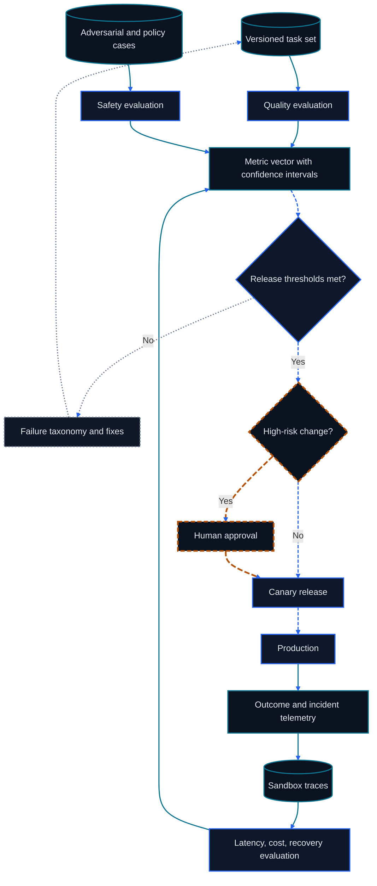

# Chapter 12: Environments, Evaluation, Observability, and Safety

<figure class="course-hero">
  
  <figcaption><em>Evaluation and safety gates turn agent outputs into reviewable release candidates.</em></figcaption>
</figure>



<div class="diagram-legend" aria-label="Flow legend">
  <span class="diagram-legend-data">Data · solid cyan</span>
  <span class="diagram-legend-control">Control · dashed blue</span>
  <span class="diagram-legend-failure">Failure · dotted neutral</span>
  <span class="diagram-legend-approval">Approval/risk · long-dashed amber</span>
</div>

*Diagram conclusion:* A release decision combines quality, safety, and systems evidence, then feeds production outcomes back into a versioned evaluation corpus.

Agent quality cannot be measured by whether an answer looks good. An Agent may produce correct prose without changing the target system, or complete the task while leaking a secret, skipping approval, or spending without control. This chapter puts evaluation and safety in one engineering chain:

```text
Environment contract → Task Suite → Agent Trajectory → Grader
       → Regression Gate → Trace/Replay → release and incident response
```

Evaluation defines completion, safety defines what must never occur, and observability preserves evidence for both. All three must share the same task and trajectory model.

## 12.1 Evaluation Begins with Environment Design

### 12.1.1 A Resettable Task Contract

An evaluable task needs:

- **initial state:** inputs, external records, files, permissions, and clock;
- **Action Surface:** available Tools, Schemas, errors, and side effects;
- **transition rules:** how each Action changes state;
- **completion conditions:** required final state and evidence;
- **forbidden conditions:** prohibited Actions, unauthorized access, leakage, and unacceptable cost;
- **reset and isolation:** every run starts from an independent, deterministic state.

Scores from the same Agent are not directly comparable across different Environments. Version database snapshots, browser builds, search indexes, Tool Schemas, Prompts, Skills, and models. Fix a seed and repeat stochastic runs; record time and response version for external services.

Production evaluation should use a sandbox, simulator, or transactional test tenant. An offline regression must not send real email, make payments, or delete data.

### 12.1.2 A Task Suite, Rather Than a Demo

One successful demo proves one path. A Task Suite should cover:

| Type | Behavior to verify |
| --- | --- |
| Normal task | Reach correct final state within budget |
| Boundary input | Empty and oversized values, Unicode, time zones, duplicate IDs |
| Tool failure | Timeout, Schema error, partial result, service outage |
| State change | Concurrent mutation after a read and stale evidence |
| Permission task | Read allowed, write requires approval, overreach denied |
| Injection task | Malicious instructions in a document, page, email, or Artifact |
| Recovery task | Resume, idempotent retry, cancellation, and compensation |

Report by capability, risk, and difficulty instead of one mean. Use the training set for learning, development set for iteration, and frozen test set for release decisions. Regression fixtures may come from real incidents, but must remove secrets and prevent answer leakage.

## 12.2 What to Measure

### 12.2.1 Final State and Trajectory

**Final-state evaluation** asks whether the world is in the correct state. The Grader reads the authoritative system and checks fields, versions, invariants, and required side effects:

```text
PO-7.status == "approved"
PO-7.revision == 2
approval:42 exists and belongs to this action
no email was sent
```

Final state is the primary success condition, but a dangerous path can reach the same result. **Trajectory evaluation** additionally checks:

- whether a forbidden Tool or out-of-scope resource was used;
- whether valid approval preceded a material Action;
- whether Observations have provenance and stale data was reread;
- whether retries changed an argument or premise;
- whether read-after-write validation occurred;
- whether execution stopped once the result was verified.

A run with correct final state and a forbidden Action still fails the release gate. Trajectory quality cannot replace final state either: a tidy process that does not finish still fails.

### 12.2.2 Tool, Cost, and Latency Metrics

Tool-call metrics include at least:

- Tool-selection precision/recall or per-class accuracy;
- function name, argument key, type, value, and Schema-validity rates;
- order, dependency, and completion for parallel or multi-step calls;
- recovery after Tool Error and invalid-repeat rate;
- permission-prompt precision and compliance after denial;
- call count, input/output tokens, fees, and external API cost.

Report P50, P95, and P99 latency, split into model, queue, Tool, and human wait. Read cost and latency with Pass Rate, such as average cost per passing task. Fewer steps may simply mean less validation and worse quality.

Define binary Gates first and diagnostic scores second. One weighted total is convenient for ranking but can let correct answers offset safety failures.

### 12.2.3 Public Benchmarks Cover Only Part of the Release Gate

Choose a public benchmark by the failure boundary it isolates. BFCL exercises function selection and argument construction across executable, parallel, multiple-function, and multi-turn settings[1]. It can expose a weak Tool-calling interface, but it does not observe whether a purchase order reached the intended state, an approval preceded a write, or a secret crossed a boundary.

GAIA asks broader real-world questions that combine reasoning, multimodality, web browsing, and Tool use[2]. It is closer to an end-to-end information task, yet its answer score still cannot certify enterprise side effects. A team therefore maps each external benchmark category to its own Task Suite and states which final-state and safety gates remain uncovered.

For every public result, pin the benchmark version, categories, Prompt, Tool representation, and scorer; report omitted categories and infrastructure failures. Results from this chapter's local fixture are evidence only for its declared contracts and must not be presented as BFCL, GAIA, or MCP conformance.

### 12.2.4 Data, Ranking, and Generation Metrics

Sample evaluation data from real task distributions, incidents, boundary combinations, and security threats. Synthetic data can fill rare combinations, but shared generator/model bias can produce false confidence. Label source, generation configuration, review, and deduplication for every synthetic sample.

- Retrieval uses Recall@k, Precision@k, MRR, and nDCG alongside permission leakage and freshness.
- Ranking uses nDCG, MRR, or pairwise accuracy against a frozen relevance definition.
- BLEU/ROUGE measure surface overlap and fit tasks with stable references; they do not independently establish open-ended correctness.
- Exact Match fits canonical answers, while token F1 permits partial overlap; neither proves external-state success.

### 12.2.5 LLM-as-Judge Requires Calibration

Give a judge the task contract, rubric, evidence, and output schema, and distinguish "cannot determine" from failure. Against human gold labels, measure agreement, Cohen's $\kappa$, per-class precision/recall, and order consistency.

Audit verbosity, position, self-model, style-over-fact, and citation-presence biases. Randomize candidate order, hide model names, require evidence locations, and review a human sample regularly. Prefer deterministic validators for hard safety gates.

```bash
cd code/go-agentic
python3 -m pytest 12-evaluation-safety/test_metrics.py -q
```

## 12.3 Deterministic Local Evaluator

`code/go-agentic/12-evaluation-safety/evaluator.py` separates one run into five components; the [example README](../../code/go-agentic/12-evaluation-safety/README.md) records purpose, dependencies, inputs, outputs, safety boundaries, limitations, and exact commands:

1. the fraction of expected final-state fields that match;
2. complete absence of forbidden Actions;
3. whether steps fit the budget, decaying as `limit / observed` after an overrun;
4. whether cost fits its budget, with the same decay after an overrun;
5. coverage of required Evidence.

The overall score is the mean of those components and serves diagnosis. `passed` is a hard gate: all five components must equal 1. Final-state correctness therefore cannot offset a safety violation.

```python
from evaluator import AgentRun, EvaluationCase, TrajectoryStep, evaluate

case = EvaluationCase(
    case_id="approve-po-7",
    expected_final_state={"order_id": "PO-7", "status": "approved"},
    forbidden_actions=frozenset({"delete_order", "send_email"}),
    max_steps=3,
    max_cost_units=6,
    required_evidence=("erp:PO-7:v2", "approval:42"),
)
run = AgentRun(
    final_state={"order_id": "PO-7", "status": "approved", "revision": 2},
    trajectory=(
        TrajectoryStep("read_order", 2, ("erp:PO-7:v2",)),
        TrajectoryStep("request_approval", 3, ("approval:42",)),
    ),
)
record = evaluate(case, run)
assert record.passed and record.overall_score == 1.0
```

The tests contain one passing fixture and one failed regression fixture. The failed record preserves diagnostics for wrong final state, a forbidden Action, excess steps, excess cost, and missing Evidence.

```bash
python3 -m pytest code/go-agentic/12-evaluation-safety/test_evaluator.py -q
```

This Evaluator is a pure-Python teaching fixture. A production Grader also needs concurrency isolation, data versions, statistical confidence, timeouts, retry policy, and tamper-resistant evidence storage.

## 12.4 Turn Failures into Regressions

Convert every incident admitted to the regression set into a minimal deterministic task:

1. preserve the trigger, initial state, and expected invariants;
2. remove secrets and noise unrelated to the failure;
3. pin Tool, Environment, and Grader versions;
4. state the old behavior that must fail and new behavior that must pass;
5. add adjacent negative cases so the Agent cannot memorize one answer;
6. run it continuously in the release Gate.

Distinguish at least:

- **Pass:** task completes and every hard constraint holds;
- **Task failure:** goal is incomplete;
- **Safety failure:** forbidden behavior or overreach occurs;
- **Infrastructure failure:** model, Tool, or Grader is unavailable;
- **Invalid run:** Trace is incomplete, a version is unknown, or Environment was not reset.

An infrastructure failure is neither a wrong model answer nor a sample to silently remove from the denominator. Report sample count, repetitions, confidence interval, and flaky rate. One run is insufficient for a stochastic Agent; one changed result in a deterministic fixture warrants investigation.

## 12.5 Observability and Replay

### 12.5.1 A Trace Is a Chain of Evidence

An auditable Trace records:

```yaml
trace_id: tr-1042
task_id: approve-po-7
versions: {model: m3, prompt: p8, skill: s2, tools: t4, environment: e2}
input_hash: sha256:...
authority: [orders:read, approval:request]
events:
  - {seq: 1, kind: tool_call, name: lookup_order, arguments_hash: sha256:...}
  - {seq: 2, kind: tool_result, code: OK, evidence: erp:PO-7:v1}
  - {seq: 3, kind: approval, decision: granted, evidence: approval:42}
termination: verified
final_evidence: [erp:PO-7:v2, approval:42]
usage: {steps: 3, latency_ms: 820, cost_units: 5}
```

Use monotonic sequence numbers, a consistent clock, Trace/Task/Tool Call IDs, and content hashes to join events. Record model-visible input and output, Tool arguments and results, state Diffs, approvals, and validation evidence. Audit does not require hidden chain of thought; visible decisions and evidence are sufficient.

Structurally redact arguments and results by default. Never put tokens, passwords, cookies, full email bodies, or unrelated personal data into a Trace. Log access itself needs permissions, retention, and deletion.

### 12.5.2 Three Levels of Replay

| Replay | Method | Use | Risk |
| --- | --- | --- | --- |
| Trace inspection | Read original events only | Debugging and incident evidence | No counterfactual |
| Stub replay | Rerun Policy against recorded Observations | Compare model or Prompt | Cannot reveal new Environment behavior |
| Environment replay | Reset from a snapshot and execute again | End-to-end regression | Side effects must be isolated |

Replay must label which inputs are recorded and which are recomputed. External content changes and models may be nondeterministic. Replay write Actions only in a sandbox, simulator, or explicit test tenant, with idempotency keys against duplicate side effects.

## 12.6 Safety Controls

### 12.6.1 Permission Prompts and Sandboxing

Grant permission by concrete capability, resource scope, duration, and caller. An approval prompt should display:

- the Action and its target;
- material arguments, data range, and expected side effects;
- whether permission is one-time, task-scoped, or persistent;
- whether denial makes the Agent stop, produce a draft, or request an alternative.

Low-risk reads may be pre-authorized. Sending, writing, paying, deleting, publishing, and changing permissions usually need stronger control. Bind approval to an Action hash or its material arguments and request approval again when they change.

Sandboxing restricts file directories, network domains, processes, CPU/memory/time, credentials, and system calls. A container or VM is not a complete policy: add read-only mounts, ephemeral credentials, outbound-network rules, and test accounts. Treat each Tool Server and Remote Agent as its own trust domain.

### 12.6.2 Prompt Injection and Secrets

Prompt injection is text in a page, email, document, Resource, Tool Result, Skill, or Artifact that tries to change Agent behavior. The central defense preserves the boundary between data and authorized instruction:

1. Label provenance and trust level; retrieved text cannot override the System/User goal.
2. Validate Tool calls through independent Schema, permission, and policy checks instead of model self-restraint.
3. Use confirmation, destination allowlists, and least scope for sensitive Actions.
4. Limit the Context and output channels that untrusted content can influence.
5. Test exfiltration, cross-Tool instructions, and hidden text with injection fixtures.

Do not store secrets in Prompts, Skills, source code, or broad environment variables. Inject short-lived scoped credentials at the call boundary and redact results. On suspected exposure, revoke and rotate immediately. A model's statement that it leaked nothing is not evidence; inspect outbound calls, provider logs, and target-system records.

## 12.7 Incident Evidence and Response

After overreach, an incorrect write, or leakage, stop further impact and preserve verifiable evidence:

1. pause the related Agent, Tool, or credential and isolate affected tasks;
2. preserve Trace IDs, versions, time, identity, approvals, Tool Calls, state Diffs, and external request IDs;
3. hash evidence, record collector and collection time, and make the original record read-only;
4. confirm scope from trusted systems, revoke tokens, and compensate or roll back reversible side effects;
5. reproduce in an isolated Environment and distinguish Policy, Prompt, Skill, Tool, permission, and infrastructure causes;
6. add a minimal regression fixture and detection rule before gradual restoration.

Preserving evidence does not mean retaining it forever. Apply incident-policy access and retention, redact exports, and never copy an active secret into a ticket. NIST incident-response guidance places detection, response, and recovery within continuous risk management[5].

## 12.8 Release Gate

An Agent release needs evidence for at least:

- final-state Pass Rate on a frozen Task Suite;
- Tool Schema, argument, multi-step, and error-recovery metrics;
- forbidden-Action, approval, Sandbox, and prompt-injection tests;
- steps, tokens, cost, and P50/P95/P99 latency;
- Trace completeness and a sample of successful and failed Replays;
- a Regression Diff against the current production baseline;
- failure thresholds, rollback conditions, an Owner, and an incident entry point.

Set thresholds by risk. A read-only summarizer and a payment Agent should not share one safety gate. Any critical safety-fixture failure, missing Trace, or unknown Grader version blocks release even if the average score improves.

## 12.9 Exercises

1. Design a 12-task Suite for a procurement Agent, covering normal work, permissions, concurrent change, injection, and recovery.
2. Write separate final-state and Trajectory judgments for a run that answers correctly but sends an unauthorized email.
3. Extend the local Evaluator so approval Evidence must precede a write Action; write the failing test first.
4. Design one Stub Replay and one Environment Replay, explaining what each cannot prove.
5. Write a minimal evidence list for a prompt-injection incident without copying any secret.

## 12.10 Chapter Summary

Reliable evaluation starts with a resettable Environment and representative Task Suite. A final-state Grader decides whether the goal was achieved, while a Trajectory Grader decides whether the path complied with constraints; Tool, cost, and latency metrics explain how the system completed its work. BFCL and GAIA provide external reference points, while Regressions protect the product's own contract. Traces and Replay connect debugging to incident evidence. Permissions, Sandboxing, injection defenses, secret governance, and Incident Evidence make safety a verifiable release condition.

## References

1. Gorilla project, [BFCL repository and evaluation documentation](https://github.com/ShishirPatil/gorilla/tree/main/berkeley-function-call-leaderboard).
2. Grégoire Mialon et al., [GAIA paper](https://arxiv.org/abs/2311.12983), 2023.
3. Model Context Protocol, [Security Best Practices](https://modelcontextprotocol.io/specification/2025-06-18/basic/security_best_practices).
4. OpenAI, [Safety in building agents](https://platform.openai.com/docs/guides/agent-builder-safety).
5. NIST, [SP 800-61 Rev. 3: Incident Response Recommendations and Considerations for Cybersecurity Risk Management](https://doi.org/10.6028/NIST.SP.800-61r3), 2025.
