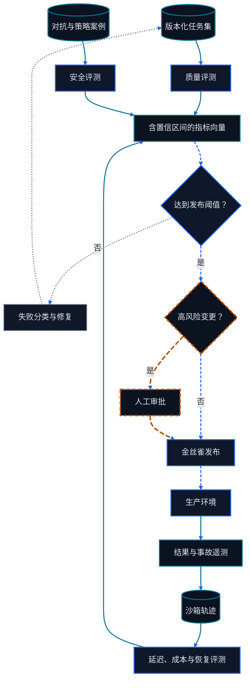

# 第十二章 环境、评测、可观测性与安全

<figure class="course-hero">
  
  <figcaption><em>评估与安全闸门把智能体输出转化为可审查的发布候选。</em></figcaption>
</figure>



<div class="diagram-legend" aria-label="流程图例">
  <span class="diagram-legend-data">数据 · 青色实线</span>
  <span class="diagram-legend-control">控制 · 蓝色虚线</span>
  <span class="diagram-legend-failure">失败 · 中性色点线</span>
  <span class="diagram-legend-approval">审批/风险 · 琥珀色长虚线</span>
</div>

*图示结论：* 发布决策必须合并质量、安全与系统证据，并把生产结果反馈到版本化评测语料中。

Agent 的质量不能用“回答看起来不错”衡量。它可能给出正确文本却没有改变目标系统，也可能完成任务却泄露秘密、跳过批准或花费失控。本章把评估与安全放进同一条工程链：

```text
Environment 契约 → Task Suite → Agent Trajectory → Grader
       → Regression Gate → Trace/Replay → 发布与事件响应
```

评估定义什么算完成，安全定义什么绝不能发生，可观测性保存二者的证据。三者必须共享同一个任务和轨迹模型。

## 12.1 评估从 Environment 设计开始

### 12.1.1 可重置的任务契约

一个可评估任务需要：

- **初始状态**：输入、外部记录、文件、权限和时钟；
- **Action Surface**：可用 Tool、Schema、错误和副作用；
- **转换规则**：每个 Action 如何改变状态；
- **完成条件**：应达到的最终状态和必要证据；
- **禁止条件**：禁止 Action、越权访问、泄漏和不可接受成本；
- **重置与隔离**：每次运行从独立、确定的状态开始。

同一个 Agent 在不同 Environment 下得到的分数不可直接比较。数据库快照、浏览器版本、搜索索引、Tool Schema、Prompt、Skill 和模型都要版本化。涉及随机性时固定 Seed 并重复运行；涉及外部服务时记录时间和响应版本。

生产评估优先使用沙箱、仿真器或事务性测试租户。不要让离线回归发送真实邮件、付款或删除数据。

### 12.1.2 Task Suite 而不是 Demo

单个成功 Demo 只能证明一个路径。Task Suite 应覆盖：

| 类型 | 要验证的行为 |
| --- | --- |
| 正常任务 | 在预算内达到正确最终状态 |
| 边界输入 | 空值、超长值、Unicode、时区、重复 ID |
| Tool 失败 | 超时、Schema 错误、部分结果、服务中断 |
| 状态变化 | 读取后数据被并发修改，证据过期 |
| 权限任务 | 只读允许、写入需批准、越权必须拒绝 |
| 注入任务 | 文档、网页、邮件或 Artifact 中含恶意指令 |
| 恢复任务 | 断点续跑、幂等重试、取消和补偿 |

按能力、风险和难度分层报告，不要只给一个平均数。训练集用于学习，开发集用于迭代，冻结测试集用于发布判断；回归 Fixture 来自真实故障，但必须清理秘密并防止答案泄漏。

## 12.2 应该测量什么

### 12.2.1 最终状态与 Trajectory

**Final-state evaluation** 回答“世界是否处于正确状态”。Grader 应直接读取权威系统，检查字段、版本、不变量和必要副作用。例如：

```text
PO-7.status == "approved"
PO-7.revision == 2
approval:42 exists and belongs to this action
no email was sent
```

最终状态是主要成功条件，但相同结果可能由危险路径得到。**Trajectory evaluation** 还检查：

- 是否调用禁止 Tool 或访问范围外资源；
- 关键 Action 前是否有有效批准；
- Observation 是否有来源，过期后是否重读；
- 重试是否改变参数或依据；
- 是否执行读后校验；
- 是否在达到结果后及时终止。

最终状态正确而执行了禁止 Action，发布门仍应失败。Trajectory 分数也不能取代最终状态：步骤看起来规范但没有完成任务，同样失败。

### 12.2.2 Tool、成本与时延指标

Tool-call 指标至少包括：

- Tool 选择的 Precision/Recall 或每类 Accuracy；
- 函数名、参数键、类型、值和 Schema 合法率；
- 并行或多步调用的顺序、依赖和完成率；
- Tool Error 后的恢复率，以及无效重复调用率；
- 权限提示的准确率、拒绝后的遵从率；
- 调用次数、输入/输出 Token、费用和外部 API 成本。

时延报告 P50、P95 和 P99，并拆分模型、队列、Tool 和人工等待。成本与时延要与 Pass Rate 联合观察，例如“每个通过任务的平均成本”，否则减少步骤可能只是减少验证并降低质量。

先定义二值 Gate，再提供诊断分数。一个加权总分便于排序，却可能让安全失败被正确答案抵消。

### 12.2.3 公共 Benchmark 只能覆盖发布门的一部分

选择公共 Benchmark 时，应先看它隔离了哪类失败边界。BFCL 在可执行、并行、多函数和多轮设置中检查函数选择与参数构造[1]。它能暴露薄弱的 Tool Calling 接口，却看不到采购单是否进入目标状态、写操作前是否取得批准，或秘密是否越过边界。

GAIA 用结合推理、多模态、网页浏览与 Tool 使用的真实问题覆盖更宽的能力面[2]。它更接近端到端信息任务，但答案分数仍不能认证企业副作用。团队因此要把每个外部 Benchmark 类别映射到自己的 Task Suite，并明确哪些 Final-State Gate 与 Safety Gate 尚未覆盖。

每项公开结果都要固定 Benchmark 版本、类别、Prompt、Tool 表示和评分器，并报告略过的类别与基础设施失败。本章本地 Fixture 的结果只证明其声明的契约，不得被表述为 BFCL、GAIA 或 MCP 一致性成绩。

### 12.2.4 数据、排序与生成指标

评测集应从真实任务分布、已知事故、边界组合和安全威胁中分层采样。合成数据可填补稀有组合，但生成器与被测模型共享偏差时，会制造虚假的高分。所有合成样本要标记来源、生成配置、审查结果和去重方法。

- Retrieval 用 Recall@k、Precision@k、MRR 和 nDCG，并同时报告权限泄漏与 Freshness。
- 排序任务使用 nDCG、MRR 或 Pairwise Accuracy，先冻结 Relevance 定义。
- 生成任务的 BLEU/ROUGE 对字面重合敏感，适合有稳定参考的翻译或摘要，不能独立评价开放任务正确性。
- Exact Match 适合可规范化答案，Token F1 容许部分重合，二者都不证明外部状态成功。

### 12.2.5 LLM-as-Judge 需要校准

Judge Prompt 要提供任务契约、Rubric、证据和格式，并分开“无法判断”与“失败”。与人工金标比较 Agreement、Cohen's $\kappa$、各类 Precision/Recall 以及不同顺序下的一致性。

常见偏差包括长度偏好、位置偏好、自家模型偏好、风格代替事实、引用存在代替引用正确。随机交换候选顺序、隐去模型名、要求证据定位，并定期抽样人工复核。硬安全门应优先使用确定性 Validator。

```bash
cd code/go-agentic
python3 -m pytest 12-evaluation-safety/test_metrics.py -q
```

## 12.3 确定性本地 Evaluator

`code/go-agentic/12-evaluation-safety/evaluator.py` 把一个运行记录分成五个分量；[示例 README](../../code/go-agentic/12-evaluation-safety/README.md)列出目的、依赖、输入输出、安全边界、限制和精确命令：

1. 期望最终字段的匹配比例；
2. 是否完全没有禁止 Action；
3. 步数是否在预算内，超限时按 `limit / observed` 衰减；
4. Cost 是否在预算内，超限时同样衰减；
5. 必要 Evidence 的覆盖比例。

总体分数是五项均值，用于诊断。`passed` 是硬门：五项都必须等于 1。这样最终状态不能抵消安全违规。

```python
from evaluator import AgentRun, EvaluationCase, TrajectoryStep, evaluate

case = EvaluationCase(
    case_id="approve-po-7",
    expected_final_state={"order_id": "PO-7", "status": "approved"},
    forbidden_actions=frozenset({"delete_order", "send_email"}),
    max_steps=3,
    max_cost_units=6,
    required_evidence=("erp:PO-7:v2", "approval:42"),
)
run = AgentRun(
    final_state={"order_id": "PO-7", "status": "approved", "revision": 2},
    trajectory=(
        TrajectoryStep("read_order", 2, ("erp:PO-7:v2",)),
        TrajectoryStep("request_approval", 3, ("approval:42",)),
    ),
)
record = evaluate(case, run)
assert record.passed and record.overall_score == 1.0
```

测试包含一个通过 Fixture 和一个回归失败 Fixture。失败记录保留错误最终字段、禁止 Action、超限步骤、超限成本和缺失 Evidence 的诊断。

```bash
python3 -m pytest code/go-agentic/12-evaluation-safety/test_evaluator.py -q
```

这个 Evaluator 是教学用的纯 Python Fixture。生产 Grader 还需要并发隔离、数据版本、统计置信度、超时、重试策略和防篡改证据存储。

## 12.4 把失败变成 Regression

每个进入回归集的事件应变成最小、确定的任务：

1. 保存触发条件、初始状态和期望不变量；
2. 去除秘密和与故障无关的噪声；
3. 固定 Tool、Environment 和 Grader 版本；
4. 写出应失败的旧行为与应通过的新行为；
5. 加入相邻负例，防止只记住一个答案；
6. 在发布 Gate 中持续运行。

至少分开以下结果：

- **Pass**：完成且所有硬约束满足；
- **Task failure**：未完成目标；
- **Safety failure**：触发禁止行为或越权；
- **Infrastructure failure**：模型、Tool 或 Grader 不可用；
- **Invalid run**：Trace 缺失、版本不明或 Environment 未重置。

基础设施失败不应计作模型答错，也不能悄悄从分母删除。报告样本数、重复次数、置信区间和 Flaky Rate。对非确定 Agent，单次运行不够；对确定 Fixture，一次结果变化就应触发调查。

## 12.5 Observability 与 Replay

### 12.5.1 Trace 是证据链

一条可审计 Trace 应记录：

```yaml
trace_id: tr-1042
task_id: approve-po-7
versions: {model: m3, prompt: p8, skill: s2, tools: t4, environment: e2}
input_hash: sha256:...
authority: [orders:read, approval:request]
events:
  - {seq: 1, kind: tool_call, name: lookup_order, arguments_hash: sha256:...}
  - {seq: 2, kind: tool_result, code: OK, evidence: erp:PO-7:v1}
  - {seq: 3, kind: approval, decision: granted, evidence: approval:42}
termination: verified
final_evidence: [erp:PO-7:v2, approval:42]
usage: {steps: 3, latency_ms: 820, cost_units: 5}
```

使用单调序号、统一时钟、Trace/Task/Tool Call ID 和内容哈希关联事件。记录模型可见输入输出、Tool 参数与结果、状态 Diff、批准和验证证据。审计不要求保存隐藏 Chain-of-Thought；保存可见决定和证据即可。

默认对参数和结果做结构化脱敏。不要把 Token、密码、Cookie、完整邮件或无关个人数据写进 Trace。日志访问本身需要权限、保留期和删除流程。

### 12.5.2 Replay 的三种层次

| Replay | 做法 | 用途 | 风险 |
| --- | --- | --- | --- |
| Trace inspection | 只读取原始事件 | 调试与事件取证 | 缺少反事实 |
| Stub replay | 用录制 Observation 重跑 Policy | 比较模型/Prompt | 无法发现新 Environment 行为 |
| Environment replay | 从快照重置并重新执行 | 端到端回归 | 必须隔离副作用 |

Replay 必须注明哪些输入是录制的，哪些重新计算。外部内容会变化，模型也可能非确定。写操作只能在沙箱、仿真器或明确的测试租户回放；用幂等键防止重复副作用。

## 12.6 Safety Controls

### 12.6.1 Permission Prompt 与 Sandboxing

权限按具体能力、资源范围、持续时间和调用方授予。批准提示应展示：

- 将执行的动作和目标；
- 关键参数、数据范围和预计副作用；
- 是单次、当前任务还是持续授权；
- 拒绝后 Agent 会停止、改为草稿还是请求替代路径。

低风险只读操作可以预授权；发送、写入、付款、删除、公开发布和权限变更通常需要更强控制。把审批绑定到 Action Hash 或关键参数，参数改变后重新批准。

Sandboxing 限制文件目录、网络域名、进程、CPU/内存/时间、凭证和系统调用。容器或 VM 不是完整策略：还需要只读挂载、临时凭证、出站网络规则和测试账户。Tool Server 与 Remote Agent 也应视为独立信任域。

### 12.6.2 Prompt Injection 与 Secrets

Prompt Injection 来自网页、邮件、文档、Resource、Tool Result、Skill 或 Artifact 中企图改变 Agent 行为的文本。核心防线是保持“数据”与“授权指令”的边界：

1. 给内容标注来源与信任级别，不让检索文本覆盖 System/User 目标。
2. Tool 调用经过独立 Schema、权限和策略检查，不靠模型自我约束。
3. 对敏感 Action 使用确认、目标 Allowlist 和最小 Scope。
4. 限制不可信内容可影响的 Context 与输出通道。
5. 用注入 Fixture 测试数据外传、跨 Tool 指令和隐藏文本。

不要把秘密放进 Prompt、Skill、源代码或宽泛环境变量。使用短期、分 Scope 的凭证，在调用边界注入；结果中脱敏；怀疑泄漏时立即撤销和轮换。模型说“我没有泄漏”不是证据，要检查出站调用、Provider 日志和目标系统记录。

## 12.7 Incident Evidence 与响应

发生越权、错误写入或泄漏时，先阻止继续影响，再保留可验证证据：

1. 暂停相关 Agent、Tool 或凭证，隔离受影响任务；
2. 保存 Trace ID、版本、时间、身份、批准、Tool Call、状态 Diff 和外部请求 ID；
3. 对证据做哈希并记录采集者与采集时间，原始记录设为只读；
4. 从可信系统确认影响范围，撤销 Token，补偿或回滚可逆副作用；
5. 在隔离 Environment 中复现，区分 Policy、Prompt、Skill、Tool、权限和基础设施根因；
6. 增加最小回归 Fixture 和检测规则，再逐步恢复服务。

证据保存不等于无限保留。按事件响应政策控制访问和期限，导出前脱敏；不要在工单中复制活跃秘密。NIST 的事件响应建议强调把检测、响应和恢复纳入持续风险管理[5]。

## 12.8 发布 Gate

一次 Agent 发布至少需要以下证据：

- 冻结 Task Suite 上的 Final-state Pass Rate；
- Tool Schema、参数、多步和错误恢复指标；
- 禁止 Action、批准、Sandbox 和 Prompt Injection 测试；
- 步骤、Token、Cost 与 P50/P95/P99 时延；
- Trace 完整率和一组成功/失败 Replay；
- 与当前生产基线的 Regression Diff；
- 失败阈值、回滚条件、Owner 和事件处置入口。

按风险分层设阈值。只读摘要 Agent 与付款 Agent 不应共享同一安全门。任何关键安全 Fixture 失败、Trace 缺失或 Grader 版本不明，都应阻止发布，即使平均分提高。

## 12.9 练习

1. 为采购 Agent 设计 12 个任务的 Suite，覆盖正常、权限、并发变化、注入和恢复。
2. 为一个“答案正确但发送了未授权邮件”的运行分别写 Final-state 与 Trajectory 判定。
3. 扩展本地 Evaluator，使批准 Evidence 必须早于写 Action；先写失败测试。
4. 设计一次 Stub Replay 和一次 Environment Replay，说明各自不能证明什么。
5. 写一个 Prompt Injection 事件的最小证据清单，确保不复制任何秘密。

## 12.10 本章小结

可靠评估从可重置 Environment 和有代表性的 Task Suite 开始。Final-state Grader 判断目标是否实现，Trajectory Grader 判断路径是否合规，Tool、成本和时延指标解释系统如何完成。BFCL 和 GAIA 提供外部参照，Regression 保护自己的产品契约。Trace 与 Replay 连接调试和取证；权限、Sandbox、Injection 防护、秘密治理和 Incident Evidence 则把安全变成可验证的发布条件。

## 参考文献

1. Gorilla 项目，[BFCL 仓库与评测文档](https://github.com/ShishirPatil/gorilla/tree/main/berkeley-function-call-leaderboard)。
2. Grégoire Mialon et al., [GAIA 论文](https://arxiv.org/abs/2311.12983), 2023.
3. Model Context Protocol, [Security Best Practices](https://modelcontextprotocol.io/specification/2025-06-18/basic/security_best_practices).
4. OpenAI, [Safety in building agents](https://platform.openai.com/docs/guides/agent-builder-safety).
5. NIST, [SP 800-61 Rev. 3: Incident Response Recommendations and Considerations for Cybersecurity Risk Management](https://doi.org/10.6028/NIST.SP.800-61r3), 2025.
