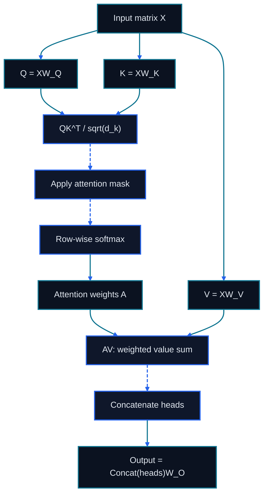

# Chapter 17: Transformer Mathematics

<figure class="course-hero">
  
  <figcaption><em>Attention builds context by weighting relationships across representations.</em></figcaption>
</figure>



<div class="diagram-legend" aria-label="Flow legend">
  <span class="diagram-legend-data">Data · solid cyan</span>
  <span class="diagram-legend-control">Control · dashed blue</span>
</div>

*Diagram conclusion:* Scaled dot-product attention derives relation weights from queries and keys, then uses those weights to combine values before head projection.

The first half treated the model as a decision component inside an agent loop. This chapter opens that box to answer engineering questions: why long context costs more, why similar tools can be confused, and why KV caching accelerates generation.

## 17.1 From Tokens to Vectors

For vocabulary size $V$ and hidden width $d$, an embedding matrix $E\in\mathbb{R}^{V\times d}$ maps token ID $t$ to $x=E_t$. A vector is not a readable list of meanings; information is distributed across dimensions and layers.

For agents, remember that schemas, paths, and code are tokenized; budgets are measured in tokens; and equivalent wording can create different compute and attention patterns.

### 17.1.1 Tokenization and BPE

A tokenizer maps bytes or characters into IDs from a finite vocabulary. BPE repeatedly applies frequent adjacent merges learned from training data. It is an engineering trade-off between vocabulary size and sequence length, not a semantic word splitter. Chinese text, source code, URLs, whitespace, and unfamiliar identifiers may have very different token densities, so character counts cannot replace measurement with the deployed tokenizer.

Special tokens mark message boundaries, tool calls, termination, or padding. A chat template compiles `system/user/assistant/tool` structure into those tokens. If serving uses a template different from fine-tuning, the model may leak delimiters, fail to stop, or interpret a tool result as a user instruction.

## 17.2 Scaled Dot-Product Attention

For $X\in\mathbb{R}^{n\times d}$:

$$Q=XW_Q,\quad K=XW_K,\quad V=XW_V$$

$$\operatorname{Attention}(Q,K,V)=\operatorname{softmax}\left(\frac{QK^T}{\sqrt{d_k}}+M\right)V$$

$QK^T$ creates an $n\times n$ score matrix. Scaling prevents premature softmax saturation. In an autoregressive model, the causal mask $M$ sets future scores to $-\infty$.

Run the dependency-free experiment:

```bash
cd code/go-agentic
python3 -m pytest 17-transformer-math -q
```

Edit `attention.py` and verify that future positions remain zero while each visible row sums to one.

## 17.3 MHA, MQA, and GQA

- **MHA:** each query head has its own key/value heads; expressive but cache-heavy.
- **MQA:** all query heads share one key/value pair; small cache with a possible quality trade-off.
- **GQA:** groups of query heads share key/value heads, balancing quality and serving efficiency.

Autoregressive inference stores K/V for every layer and token, so cache memory grows linearly with sequence length and batch size.

## 17.4 Position, RoPE, and Long Context

Attention alone is order-agnostic. RoPE rotates query and key vectors by position so relative distance affects their dot product. A model advertising a 128K window does not necessarily use all positions equally well: training distribution, extrapolation, retrieval accuracy, and lost-in-the-middle behavior still matter.

## 17.5 FFN, Residual Paths, and Normalization

One simplified block is:

$$h'=h+\operatorname{Attention}(\operatorname{Norm}(h))$$

$$h''=h'+\operatorname{FFN}(\operatorname{Norm}(h'))$$

Residual paths preserve information and gradients, normalization stabilizes scale, and the FFN performs nonlinear token-wise transformation. Much of a model's parameter count lives in the FFN, not only attention.

### 17.5.1 Output Heads Define the Learning Signal

A language-model head projects hidden states to vocabulary logits; a value head predicts a scalar; a reward head scores a sequence or process. These heads are small but change the loss and observable signal. Tool calls are usually structured tokens emitted by the language-model head: the model has not executed a function merely because it produced function-shaped text.

## 17.6 Complexity and Agent Decisions

Standard attention scores grow roughly quadratically with sequence length, while KV cache grows linearly. Therefore, do not preload everything merely because the context window is not full. Use JIT retrieval, summarize tool output, track prefill and decode separately, and remember that evidence being present does not prove the model used it.

## 17.7 Decoding Is Constrained Search

For next-token logits $z_i$, temperature $T$ changes distribution sharpness:

$$p_i=\frac{\exp(z_i/T)}{\sum_j\exp(z_j/T)}$$

- **Greedy decoding** chooses the largest probability at each step; stable, but not globally optimal.
- **Beam search** keeps several prefixes; useful with stable sequence scores, but prone to safe, similar candidates.
- **Top-k** keeps $k$ candidates; **top-p** keeps the smallest set reaching a probability-mass threshold; **min-p** removes tokens that are too weak relative to the best token.
- **Contrastive decoding** penalizes generic candidates also favored by a weaker model; it helps only when the strong/weak pair separates quality.

Agent action schemas benefit from **constrained decoding**. A JSON schema, grammar, or finite-state rule becomes the legal token set at each step. This guarantees syntax, not semantic validity, authority, or correct external state. Business validation must still run after schema validation.

## 17.8 Tokenizer and Decoding Lab

```bash
cd code/go-agentic
python3 -m pytest 17-transformer-math/test_tokenizer_decoding.py -q
```

`tokenizer_decoding.py` demonstrates ordered BPE-style merges, stable top-k/top-p candidate sets, and finite-state constrained generation. It is deliberately not a production tokenizer; it exposes the boundary between decoding policy and semantic validation.

## 17.9 Mastery Standard

You should be able to explain how tokenizers and chat templates affect agents, calculate a $2\times2$ attention example, compare MHA/MQA/GQA, distinguish language-model and value heads, and choose a decoding-plus-validation design for free text, tool calls, and verifiable structured output.
