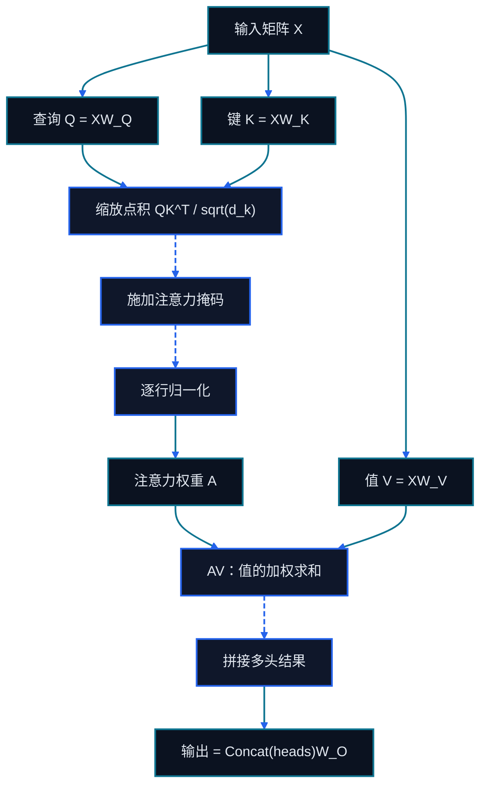

# 第十七章 Transformer 数学基础

<figure class="course-hero">
  
  <figcaption><em>注意力通过为表征之间的关系分配权重来构建上下文。</em></figcaption>
</figure>



<div class="diagram-legend" aria-label="流程图例">
  <span class="diagram-legend-data">数据 · 青色实线</span>
  <span class="diagram-legend-control">控制 · 蓝色虚线</span>
</div>

*图示结论：* 缩放点积注意力由查询与键计算关系权重，再用这些权重组合值并完成多头投影。

前半程把模型当作 Agent Loop 中的一个决策部件。本章开始打开这个黑盒，但目标仍然是工程判断：为什么长 Context 更贵，为什么模型会混淆相似工具，为什么 KV Cache 能加速生成。

## 17.1 从 Token 到向量

设词表大小为 $V$，隐藏维度为 $d$。Embedding 矩阵 $E\in\mathbb{R}^{V\times d}$ 把 Token ID $t$ 映射为向量 $x=E_t$。向量不是一个可直接阅读的“含义列表”；意义分布在维度与层之间。

对 Agent 而言，重要结论有三个：

1. Tool Schema、路径和代码也会被 Tokenize；
2. Context 预算按 Token 而非字符计算；
3. 同一含义的不同表达可能产生不同的计算和注意模式。

### 17.1.1 Tokenization 与 BPE

Tokenizer 将字节或字符序列变成有限词表的 ID。BPE 的核心是反复合并训练语料中高频的相邻片段：它不是语义分词器，而是在词表大小与序列长度之间做工程折中。中文、代码、URL、空白和陌生标识符的 Token 密度可能差异很大，所以不能用字符数代替实际 Token 计数。

特殊 Token 定义消息边界、工具调用、终止或 Padding。Chat Template 将 `system/user/assistant/tool` 结构编译为这些 Token。模板与微调时不一致时，模型可能泄漏分隔符、无法停止，或把 Tool Result 当成用户指令。

## 17.2 Scaled Dot-Product Attention

对输入矩阵 $X\in\mathbb{R}^{n\times d}$：

$$Q=XW_Q,\quad K=XW_K,\quad V=XW_V$$

$$\operatorname{Attention}(Q,K,V)=\operatorname{softmax}\left(\frac{QK^T}{\sqrt{d_k}}+M\right)V$$

$QK^T$ 产生 $n\times n$ 的关联分数。$\sqrt{d_k}$ 防止高维点积过大让 Softmax 过早饱和。自回归模型中，因果遮罩 $M$ 将未来位置的分数设为 $-\infty$。

本章的离线实验直接展示遮罩后每行概率和为 1：

```bash
cd code/go-agentic
python3 -m pytest 17-transformer-math -q
```

打开 `17-transformer-math/attention.py`，改变分数，观察“未来位置始终为 0”和“大分数不等于绝对确定”这两个性质。

## 17.3 MHA、MQA 与 GQA

Multi-Head Attention 把隐藏维度分成多个头，让不同子空间学习不同关系。但自回归推理需要为每层、每个 Token 保留 K/V，显存随序列长度和 Batch 线性增长。

- **MHA：** 每个 Query 头有自己的 K/V 头，表达力强，Cache 大。
- **MQA：** 所有 Query 头共享一组 K/V，Cache 小，可能损失部分质量。
- **GQA：** 多个 Query 头共享一组 K/V，在质量与推理效率之间折中。

## 17.4 位置、RoPE 与长上下文

Attention 本身不知道顺序。RoPE 通过按位置旋转 Q/K 向量，把相对距离编入点积。“支持 128K Context”不代表每个位置都被同样好地利用；长上下文还要检查训练分布、位置外推、检索命中和“中间遗忘”。

## 17.5 FFN、Residual 与 Normalization

每个 Transformer Block 通常包含 Attention 和逐 Token FFN。简化表达是：

$$h'=h+\operatorname{Attention}(\operatorname{Norm}(h))$$

$$h''=h'+\operatorname{FFN}(\operatorname{Norm}(h'))$$

Residual 为梯度和信息提供直路；Normalization 稳定数值尺度；FFN 进行非线性特征变换。大量参数常在 FFN 而不只是 Attention 中。

### 17.5.1 输出头决定学习信号

语言建模头将隐状态投影为词表 Logit；价值头输出标量估计；Reward Head 对序列或过程打分。头部很小，却改变损失和可观测信号。工具调用通常仍由语言建模头生成结构化 Token，不要把它误解为模型内部真的执行了函数。

## 17.6 复杂度与 Agent 工程决策

标准 Attention 的分数矩阵随序列长度近似二次增长，而 KV Cache 随长度线性增长。因此：

- 不要用“窗口还没满”作为全量预加载的理由；
- 对工具输出进行 JIT 检索、摘要和结构化保留；
- 对长任务同时记录 Prefill 和 Decode 成本；
- 模型“看到了”某段证据，不等于它“使用了”该证据。

## 17.7 解码是一个受约束的搜索问题

模型给出每个下一 Token 的 Logit $z_i$，温度 $T$ 改变分布尖锐度：

$$p_i=\frac{\exp(z_i/T)}{\sum_j\exp(z_j/T)}$$

- **Greedy** 每步选最大概率，稳定但不保证全局最优。
- **Beam Search** 保留多个前缀，适合稳定序列评分，但容易偏好安全和相似的候选。
- **Top-k** 只保留概率最高的 $k$ 个 Token；**Top-p** 保留累积质量达阈值的最小集合；**Min-p** 相对于最优 Token 剪掉过小概率。
- **Contrastive Decoding** 惩罚弱模型也很偏好的平庸候选；适用性取决于强弱模型是否真能分离质量。

Agent 的 Action Schema 需要 **Constrained Decoding**：将 JSON Schema、语法或有限状态约束编译成当前可选 Token 集合。它可以保证语法形式，但不保证参数语义、权限或外部状态正确，仍需 Schema 后的业务验证。

## 17.8 Tokenizer 与解码实验

```bash
cd code/go-agentic
python3 -m pytest 17-transformer-math/test_tokenizer_decoding.py -q
```

`tokenizer_decoding.py` 展示有序 BPE 合并、稳定的 Top-k/Top-p 候选集和有限状态受限生成。它不是生产 Tokenizer，而是用最小例子显示“解码策略”与“语义验证”的边界。

## 17.9 掌握标准

你应能解释 Tokenizer 与 Chat Template 为何影响 Agent，手算一个 $2\times2$ Attention 例子，比较 MHA/MQA/GQA，区分语言建模头与价值头，并为自由文本、Tool Call 和可验证结构选择合理解码与验证组合。
