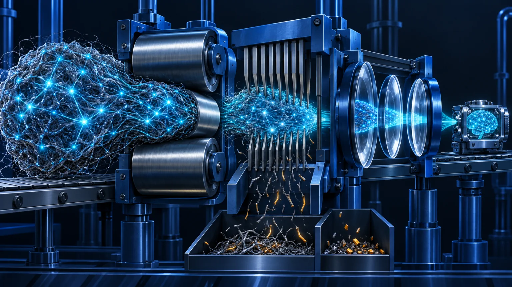

# Chapter 18: Pretraining, Optimization, and Model Compression

<figure class="course-hero">
  
  <figcaption><em>Training and compression trade compute and size against retained capability.</em></figcaption>
</figure>

This chapter builds a resource ledger instead of requiring you to train a large model: how data becomes gradients, why AdamW stores multiple parameter-sized states, and whether compression saves storage, bandwidth, or compute.

## 18.1 Pretraining Data Pipeline

An auditable pipeline records licensing, filtering, deduplication, sensitive-data handling, quality tiers, tokenization, mixture weights, dataset versions, and holdouts. More data is not automatically better: duplicates, leakage, and low-quality samples change the learned distribution.

Autoregressive training minimizes:

$$\mathcal{L}_{\mathrm{NLL}}=-\sum_t \log p_\theta(x_t\mid x_{<t})$$

Next-token prediction does not guarantee truth, tool success, or task completion. Post-training, environments, and verifiers supply those missing signals.

## 18.2 AdamW Updates

Adam maintains first and second moments:

$$m_t=\beta_1m_{t-1}+(1-\beta_1)g_t$$

$$v_t=\beta_2v_{t-1}+(1-\beta_2)g_t^2$$

AdamW decouples weight decay:

$$\theta_{t+1}=(1-\eta\lambda)\theta_t-\eta\frac{\hat m_t}{\sqrt{\hat v_t}+\epsilon}$$

Mixed-precision training may hold low-precision weights, gradients, FP32 master weights, and two moment tensors. A checkpoint that fits for inference may therefore be far too large to train on one device.

## 18.3 Learning Rate, Batch, and Checkpoints

Warmup reduces unstable early steps; decay makes later updates finer. Gradient accumulation increases effective batch size but does not remove each micro-batch's activation memory. A resumable checkpoint needs model, optimizer, scheduler, random-number, and data-iterator state.

## 18.4 Compression Methods

| Method | Changes | Main benefit | Main risk |
| --- | --- | --- | --- |
| Quantization | Bits per weight/activation | Storage, memory, bandwidth | Outliers and kernel support |
| Pruning | Weights or structures | Parameters or compute | Unstructured sparsity may not accelerate |
| Distillation | Trains a smaller student | Latency and cost | Capability and tail-behavior loss |
| LoRA | Trains low-rank updates | Training memory and deployment flexibility | Base weights still load |

Theoretical compression is not end-to-end acceleration. Kernels, hardware, batch size, sequence length, and data movement determine the realized result.

## 18.5 Offline Resource Ledger

```bash
cd code/go-agentic
python3 -m pytest 18-training-compression -q
```

`resource_estimator.py` exposes parameters, gradients, master weights, moments, and activations separately. Compare a 7B and 70B model, then explain why weight quantization and optimizer-state sharding solve different problems.

## 18.6 SFT Data Mechanics

SFT is more than putting conversations in a dataset. A production pipeline defines how the chat template represents roles, tool calls, and tool results; whether loss is computed only on assistant completions; how sequence packing avoids cross-example attention; and how multi-task mixture weights prevent a large source from erasing a small critical task.

Packing improves token utilization, not data quality. Audit boundaries among system policy, user input, tool observations, and target behavior before optimizing throughput.

## 18.7 LoRA, QLoRA, and PEFT

For frozen $W\in\mathbb{R}^{d_{out}\times d_{in}}$, LoRA learns a low-rank update:

$$W'=W+\frac{\alpha}{r}BA$$

where $A\in\mathbb{R}^{r\times d_{in}}$ and $B\in\mathbb{R}^{d_{out}\times r}$, yielding $r(d_{in}+d_{out})$ trainable parameters. QLoRA quantizes the frozen base before training adapters. It reduces memory, but deployment still depends on quantization format, target modules, merge error, and kernel support.

PEFT is useful for fast experiments and tenant-specific adapters; it is not automatically more accurate than full fine-tuning. Evaluate tool-schema compliance, stopping, refusals, and recovery separately from generic loss.

## 18.8 MoE Routing and Load Balance

Mixture-of-Experts replaces the FFN with several experts and routes each token to a top-k subset. Active parameters per token stay small, while total weights, expert-parallel communication, and routing complexity remain.

Hot experts can overflow capacity, drop or reroute tokens, and determine tail latency. Training uses a load-balancing auxiliary objective; operations should track token fractions, overflow, all-to-all time, and node skew for every expert.

## 18.9 Forgetting, Alignment Tax, and Training Diagnostics

SFT may improve a target style while erasing rare capabilities (catastrophic forgetting) or introducing excessive refusal and conservatism (alignment tax). Keep fixed retention, safety, format, tool-use, and domain evaluation suites instead of following training loss alone.

Diagnose in order: data and masks, learning rate and gradient norms, mixed-precision overflow, checkpoint recovery, then evaluation drift. Lowering the learning rate can hide a broken mask or leaked data without correcting it.

```bash
cd code/go-agentic
python3 -m pytest 18-training-compression/test_training_recipes.py -q
```

## 18.10 Failure Modes and Mastery

You should be able to draw the data-to-checkpoint pipeline; explain AdamW state, completion masks, packing, LoRA parameter counts, and MoE load skew; and report capability, safety, format, memory, latency, and throughput for a tuning or compression decision.

## 18.11 Primary Sources

These papers anchor the adapter mechanisms in Section 18.7. Use them to verify which tensors are frozen or trained; deployment and Agent-quality claims still require measurements on the target workload.

- [Hu et al. (2021), LoRA method](https://arxiv.org/abs/2106.09685) separates a frozen pretrained weight from trainable low-rank update matrices.
- [Dettmers et al. (2023), QLoRA method](https://arxiv.org/abs/2305.14314) trains LoRA adapters through a frozen quantized base and analyzes the memory-saving quantization design.
