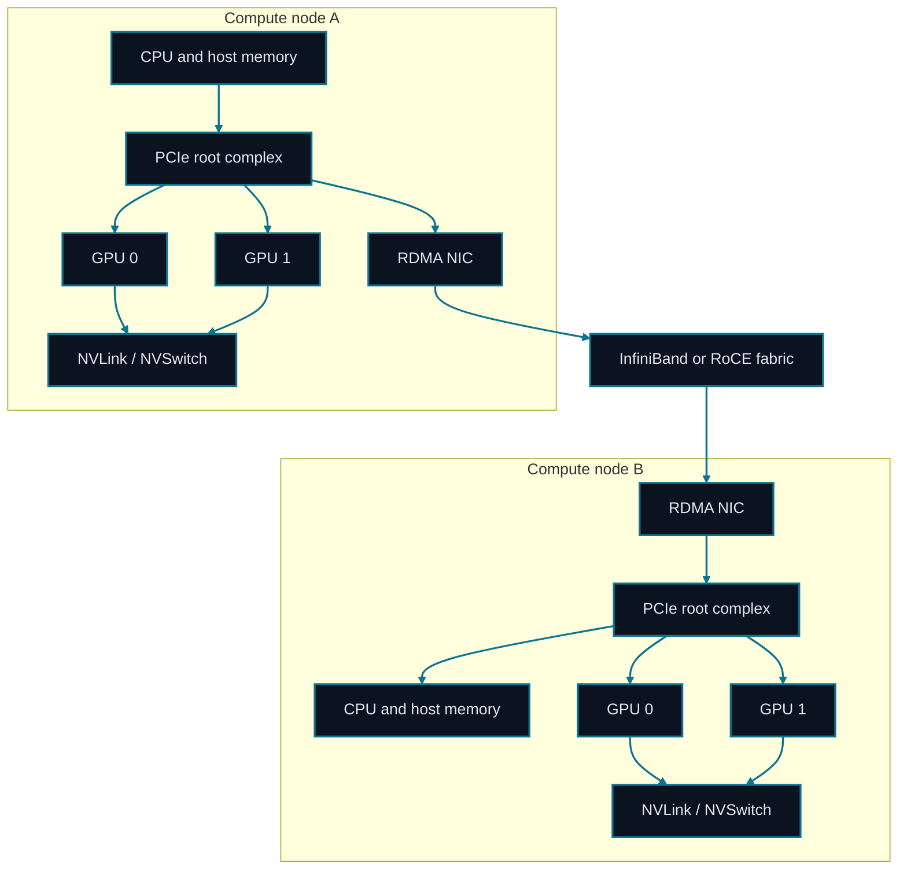

# Chapter 20: GPU Systems and High-Speed Interconnects

<figure class="course-hero">
  
  <figcaption><em>GPU system performance depends on the topology and bandwidth between compute units.</em></figcaption>
</figure>



<div class="diagram-legend" aria-label="Flow legend">
  <span class="diagram-legend-data">Data · solid cyan</span>
</div>

*Diagram conclusion:* Collective performance follows the physical path: NVLink serves local GPU traffic, while PCIe and the RDMA fabric bound cross-node transfers.

Large-model systems are not only FLOPS comparisons. Data moves among host memory, GPU HBM, GPUs inside a node, and remote nodes. A kernel with modest arithmetic can still spend most of its time waiting for bytes.

## 20.1 Compute Roof and Memory Wall

Arithmetic intensity measures operations per byte moved:

$$\text{time}\geq\max\left(\frac{\text{operations}}{\text{compute rate}},\frac{\text{bytes moved}}{\text{bandwidth}}\right)$$

The Roofline model expresses the attainable throughput ceiling as:

$$P_{attainable}=\min(P_{peak},\ I\times BW)$$

Here $I$ is arithmetic intensity and $BW$ is memory bandwidth. Their intersection, $P_{peak}/BW$, is the ridge point: workloads below it tend to be memory-bound; those above it may become compute-bound. This guides diagnosis but never replaces measurement.

Large batched matrix multiplication can be compute-heavy; token-by-token decode, KV-cache reads, and collectives are often bandwidth-bound.

## 20.2 GPU Memory Hierarchy

Registers/shared memory hold tiles and local accumulations; HBM holds weights, activations, KV cache, and optimizer state; host RAM supports offload and input pipelines; storage persists datasets and checkpoints. Free capacity alone does not imply speed—access patterns, fragmentation, synchronization, and copies matter.

## 20.3 PCIe, NVLink, and InfiniBand

PCIe is the general host/device fabric. NVLink/NVSwitch provides high-bandwidth intra-node GPU paths. InfiniBand supports high-speed inter-node networking, while RDMA reduces CPU intervention and copies. Always inspect the actual topology: a product label does not prove that two specific devices have a direct fast path.

## 20.4 Collective Communication

Data parallelism typically all-reduces gradients. Ideal ring all-reduce traffic per device is:

$$2\frac{N-1}{N}S$$

With more devices, per-device traffic approaches $2S$. Real efficiency depends on the slowest link, latency, congestion, and overlap with compute.

## 20.5 MFU and Profiling

Model FLOPS utilization compares useful model work with the device peak available over the same interval:

$$MFU=\frac{\text{model FLOPs}}{\text{devices}\times\text{elapsed time}\times\text{peak FLOP/s per device}}$$

Low MFU does not necessarily mean idle GPUs. Use a timeline and profiler evidence to separate compute kernels, HBM traffic, collectives, CPU/data-loader stalls, allocation, and synchronization gaps. Optimize the dominant term, then remeasure end-to-end throughput; a faster kernel does not guarantee a faster Agent workload.

## 20.6 Hardware and Cost Selection

Record model fit, precision-kernel maturity, HBM capacity and bandwidth, intra/inter-node topology, power, availability, and total cost per useful task. A first cloud estimate is:

$$C=N_{device}\times T_{hour}\times Price_{device/hour}$$

Storage, networking, CPU, failed reruns, and idle reservations are additional. For online Agents, divide cost by successful requests or useful output tokens and inspect P95/P99 latency. The lowest device-hour price need not produce the lowest task cost.

## 20.7 Offline Performance and Topology Ledger

```bash
cd code/go-agentic
python3 -m pytest 20-gpu-topology -q
```

`topology.py` converts bytes and Gbit/s into ideal transfer time and ring traffic. `performance.py` verifies Roofline ceilings, MFU, bottleneck classification, and accelerator budgets. Build a table for each link: theoretical bandwidth, observed bandwidth, payload, call frequency, and whether communication overlaps compute.

## 20.8 Mastery Standard

Use Roofline and profiler evidence to identify whether a stage is limited by compute, HBM, PCIe, intra-node fabric, or inter-node networking; calculate MFU and cost; and defend hardware choices with order-of-magnitude evidence.
