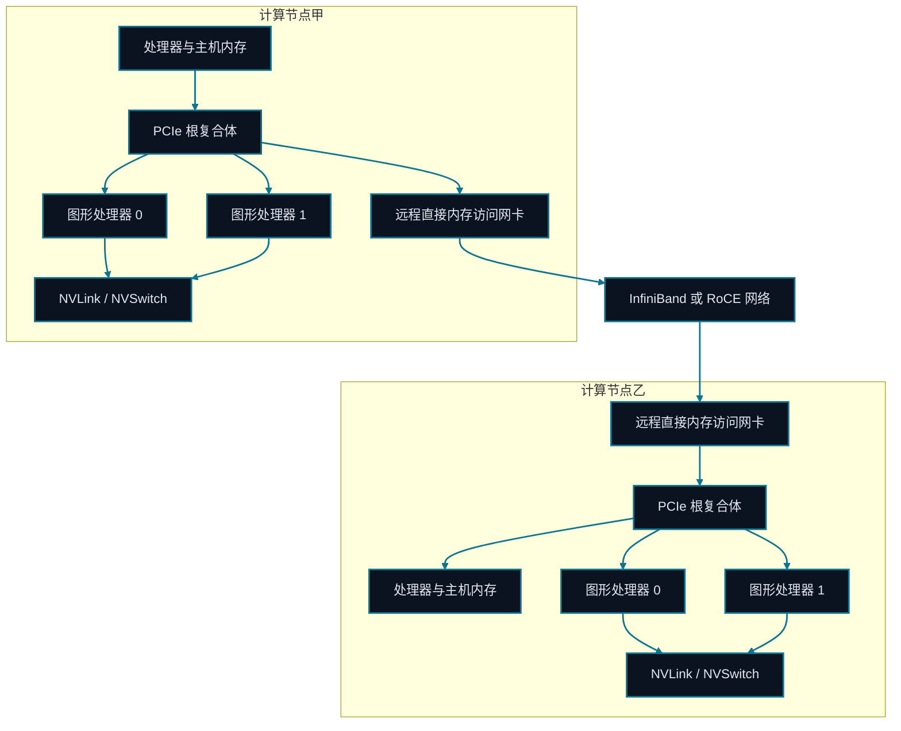

# 第二十章 GPU 系统与高速互联

<figure class="course-hero">
  
  <figcaption><em>GPU 系统性能取决于计算单元之间的拓扑与带宽。</em></figcaption>
</figure>



<div class="diagram-legend" aria-label="流程图例">
  <span class="diagram-legend-data">数据 · 青色实线</span>
</div>

*图示结论：* 集合通信性能取决于物理路径：节点内图形处理器流量走 NVLink，跨节点传输则受 PCIe 与远程直接内存访问网络约束。

大模型系统不只是 FLOPS 比较。数据必须在 CPU 内存、GPU HBM、同机 GPU 和跨机节点之间流动。一个内核即使计算量不大，也可能因为等数据而慢。

## 20.1 计算屋顶与内存墙

算术强度是每搬运一字节数据完成的计算量。低算术强度工作负载通常受带宽限制，高强度才可能接近芯片的理论计算峰值。

$$\text{time}\geq\max\left(\frac{\text{operations}}{\text{compute rate}},\frac{\text{bytes moved}}{\text{bandwidth}}\right)$$

Roofline 把它改写成可达吞吐上界：

$$P_{attainable}=\min(P_{peak},\ I\times BW)$$

其中 $I$ 是算术强度，$BW$ 是内存带宽。两条上界的交点 $P_{peak}/BW$ 叫 Ridge Point：工作负载低于它通常是 Memory-bound，高于它才可能是 Compute-bound。这是定位方向，不是替代实测的承诺值。

LLM 中的大矩阵乘在大 Batch 时容易提高算术强度；逐 Token Decode、KV Cache 读取和集合通信更容易被带宽限制。

## 20.2 GPU 内存层次

| 层次 | 特点 | LLM 中的作用 |
| --- | --- | --- |
| Registers / Shared Memory | 容量小、延迟低 | Tile、局部累加、FlashAttention |
| HBM | 容量大、高带宽 | 权重、激活、KV Cache、优化器状态 |
| Host RAM | 更大但跨 PCIe 较慢 | Offload、Checkpoint、数据加载 |
| Storage | 持久但延迟高 | 数据集、Checkpoint、轨迹 |

“还有显存”不等于“不会慢”；访存模式、碎片、同步和数据复制同样重要。

## 20.3 PCIe、NVLink 与 InfiniBand

- **PCIe** 连接 CPU、GPU 与外设，通用但带宽和拓扑受主机限制。
- **NVLink/NVSwitch** 提供机内 GPU 高带宽通路，对 Tensor Parallel 和大量集合通信很重要。
- **InfiniBand** 面向跨机高速网络；RDMA 减少 CPU 介入和额外复制。

总线名称不能代替拓扑图。两张 GPU 即使都支持 NVLink，也要检查它们是否真正直连，集合通信是否跨 NUMA 或网卡。

## 20.4 Collective Communication

Data Parallel 需要 All-Reduce 梯度。理想 Ring All-Reduce 中，每个设备处理的流量约为：

$$2\frac{N-1}{N}S$$

$N$ 是设备数，$S$ 是 Payload。设备增加时每卡流量接近 $2S$，但最慢链路、延迟、拥塞和与计算的重叠决定真实效率。

## 20.5 MFU 与性能剖析

模型 FLOPS 利用率（MFU）比较“模型真正完成的计算”与设备同期理论峰值：

$$MFU=\frac{\text{model FLOPs}}{\text{devices}\times\text{elapsed time}\times\text{peak FLOP/s per device}}$$

MFU 低不等于 GPU 空闲。先用时间线和 Profile 证据把时间分成计算内核、HBM 访问、集合通信、CPU/DataLoader 等待、内存分配和同步空洞。随后只优化占主导的一项，并再次测量端到端吞吐；单个内核加速不保证整个 Agent 工作负载更快。

## 20.6 硬件与成本选择

硬件选型至少同时记录：模型是否能放下、目标精度内核是否成熟、HBM 容量/带宽、机内与跨机拓扑、功耗、可获得性，以及每个有效任务的总成本。云上粗略预算为：

$$C=N_{device}\times T_{hour}\times Price_{device/hour}$$

它还未包含存储、网络、CPU、失败重跑和空闲配额。对在线 Agent，应把成本继续除以成功请求或有效输出 Token，并同时观察 P95/P99；最便宜的卡时不一定带来最低的任务成本。

## 20.7 离线性能与拓扑账本

```bash
cd code/go-agentic
python3 -m pytest 20-gpu-topology -q
```

`topology.py` 将 Byte、Gbit/s 和理想 Ring 流量转换为可检查的秒数和字节数；`performance.py` 验证 Roofline 上界、MFU、瓶颈分类和加速器预算。为你的模型写一张拓扑表：每条链路的理论带宽、可观测带宽、Payload、调用频率和能否与计算重叠。

## 20.8 掌握标准

你应能用 Roofline 和 Profile 判断一个阶段主要受计算、HBM、PCIe、机内互联还是跨机网络限制，计算 MFU 与成本，并用数量级证据而非硬件名称解释选型。
