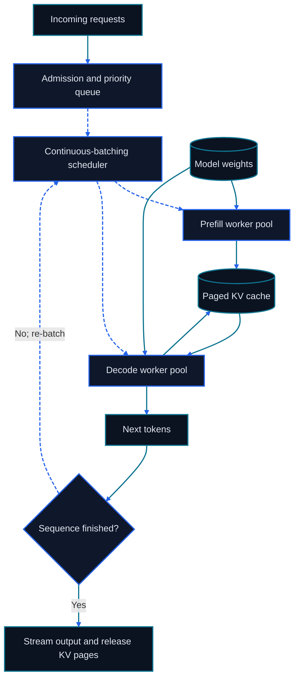

# Chapter 21: High-Performance LLM Inference

<figure class="course-hero">
  
  <figcaption><em>Efficient inference coordinates batching, memory, scheduling, and parallel execution.</em></figcaption>
</figure>



<div class="diagram-legend" aria-label="Flow legend">
  <span class="diagram-legend-data">Data · solid cyan</span>
  <span class="diagram-legend-control">Control · dashed blue</span>
</div>

*Diagram conclusion:* High-throughput inference depends on continuous re-batching and paged KV ownership across distinct prefill and decode work.

Agent calls are heterogeneous: long prompts with short outputs, long decode sequences, and repeated prefills after tool results. An inference engine must manage compute, KV cache, batching, and tail latency together.

## 21.1 Prefill and Decode

Prefill processes input tokens in parallel and creates KV cache. Decode emits one token per step and repeatedly reads weights and cache. Report time to first token, inter-token latency, request throughput, and token throughput separately.

The full request lifecycle also includes gateway queueing and authentication, tokenization, scheduling, prefix-cache lookup, prefill, decode, detokenization, streaming, and cleanup. A tool call pauses generation and its result may trigger another prefill. Instrument every stage to distinguish model, queue, and external-tool latency.

```text
Gateway → Queue → Tokenize → Schedule → Prefill → Decode → Stream
                              ↑                  ↓
                              └── Tool result ← Tool call
```

## 21.2 FlashAttention

Naive attention may materialize large score and probability matrices in HBM. FlashAttention tiles the operation into on-chip memory and uses online softmax to merge blocks, reducing HBM traffic while preserving exact attention semantics. It primarily solves an IO problem; it does not make all attention arithmetic linear.

## 21.3 KV-Cache Capacity

For a decoder-only model:

$$2\times L\times B\times S\times H_{kv}\times D_h\times b$$

The factor 2 represents K and V. The remaining terms are layers, batch, sequence length, KV heads, head dimension, and bytes per value. GQA/MQA, cache precision, tiering, and context policy all change the ledger.

## 21.4 Continuous Batching and Paged Attention

Static batches wait for the longest member. Continuous batching admits and removes requests between decode steps. Paged attention stores cache in fixed blocks, reducing contiguous-allocation requirements and fragmentation. vLLM combines these mechanisms, but model support, kernels, quantization, concurrency, and tail latency still require workload-specific measurement.

## 21.5 Quantization and Speculative Decoding

Quantization can improve bandwidth-bound decode, but only with suitable kernels and acceptable tool/structured-output quality. Speculative decoding uses a smaller model to draft tokens and a larger model to verify them; speedup depends on acceptance rate, parallel verification, and draft-model overhead.

Capacity policy also needs admission control. When cache, concurrency, or tail latency crosses a threshold, decide whether to queue, reject, truncate context, or route to another model. Log every degradation because it can change tool arguments, structured output, and task success.

## 21.6 Capacity Lab

```bash
cd code/go-agentic
python3 -m pytest 21-inference-capacity -q
```

`capacity.py` calculates KV-cache bytes and maximum batch under a cache budget. Build separate ledgers for 4K and 128K workloads instead of hiding them inside one average.

## 21.7 Mastery Standard

Separate prefill from decode, explain FlashAttention's IO savings, calculate KV cache, describe continuous batching and paging, and compare serving configurations using P50/P95 latency, throughput, memory, and quality.

## 21.8 Primary Sources

These papers define the algorithmic claims behind the attention and serving mechanisms. They do not replace workload-specific measurements of kernels, cache pressure, scheduling, and tail latency.

- [Dao et al. (2022), FlashAttention method](https://arxiv.org/abs/2205.14135) derives an exact tiled attention algorithm that reduces reads and writes between on-chip memory and HBM.
- [Kwon et al. (2023), vLLM and PagedAttention](https://arxiv.org/abs/2309.06180) describes block-based KV-cache management and the serving system built around it.
