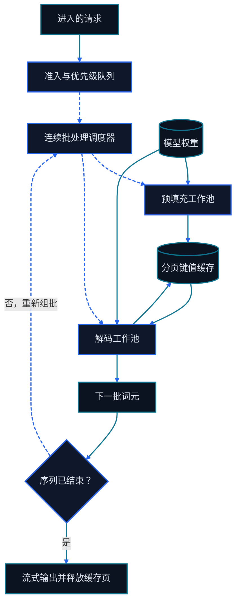

# 第二十一章 高性能 LLM 推理

<figure class="course-hero">
  
  <figcaption><em>高效推理需要协调批处理、内存、调度与并行执行。</em></figcaption>
</figure>



<div class="diagram-legend" aria-label="流程图例">
  <span class="diagram-legend-data">数据 · 青色实线</span>
  <span class="diagram-legend-control">控制 · 蓝色虚线</span>
</div>

*图示结论：* 高吞吐推理依赖持续重新组批，以及预填充与解码阶段之间清晰的分页键值缓存所有权。

Agent 的模型调用不是同质请求：有的 Prompt 长、输出短，有的需要很多 Decode，还有工具返回后的反复 Prefill。推理引擎必须同时管理计算、KV Cache、Batch 和尾延迟。

## 21.1 Prefill 与 Decode

- **Prefill** 并行处理输入 Token，生成每层 KV Cache，更容易用满矩阵乘计算。
- **Decode** 每次生成一个新 Token，重复读取权重和 KV Cache，通常更受带宽限制。

因此要分开报告 Time to First Token、Inter-Token Latency、请求吞吐和 Token 吞吐。单一“平均延迟”会隐藏用户等待和系统容量的差异。

完整请求生命周期还包括：网关排队与鉴权、Tokenization、调度、Prefix Cache 查询、Prefill、Decode、Detokenization、流式传输和完成清理。工具调用会暂停模型生成，工具结果返回后可能触发新的 Prefill。给每个阶段独立打点，才能区分“模型慢”“排队慢”和“外部工具慢”。

```text
Gateway → Queue → Tokenize → Schedule → Prefill → Decode → Stream
                              ↑                  ↓
                              └── Tool result ← Tool call
```

## 21.2 FlashAttention

普通 Attention 可能把大的 $n\times n$ 分数和概率矩阵写回 HBM。FlashAttention 通过 Tiling 在片上存储中分块计算，使用 Online Softmax 合并分块结果，减少 HBM 读写，同时保持精确 Attention 语义。

它解决的首先是 IO 问题，不是把 Attention 的所有理论计算变成线性。

## 21.3 KV Cache 容量

对 Decoder-only 模型，简化 KV Cache 大小为：

$$2\times L\times B\times S\times H_{kv}\times D_h\times b$$

2 代表 K 和 V，$L$ 是层数，$B$ 是 Batch，$S$ 是已缓存序列长度，$H_{kv}$ 是 KV 头数，$D_h$ 是 Head Dimension，$b$ 是每元素字节数。

GQA/MQA、低精度 Cache、分层 Cache 和上下文管理都可以改变这份账本。

## 21.4 Continuous Batching 与 Paged Attention

静态 Batch 要等整批请求结束，短请求会被长请求拖住。Continuous Batching 在 Decode 步之间动态加入或移除请求。Paged Attention 将 KV Cache 分成固定块，减少需要连续大内存和由此产生的碎片。

vLLM 把这些机制组合为服务引擎，但选型时仍要测试模型支持、内核、量化格式、并发负载和长尾延迟，而不是只看默认 Benchmark。

## 21.5 量化与推测解码

量化降低权重或激活的字节数，在带宽受限的 Decode 中可能改善吞吐，但需要匹配硬件内核并检查 Agent 的结构化输出与工具选择质量。

推测解码让小模型先提议多个 Token，大模型一次验证；收益取决于接受率、验证并行性和额外模型成本。

容量策略还要定义 Admission Control：当 KV Cache、并发或尾延迟达到阈值时，是排队、拒绝、截断上下文，还是路由到另一模型。任何降级都必须显式记录，因为它可能改变工具参数、结构化输出和任务成功率。

## 21.6 容量实验

```bash
cd code/go-agentic
python3 -m pytest 21-inference-capacity -q
```

`capacity.py` 计算 KV Cache 字节数和给定 Cache 预算下的最大 Batch。为一个 4K 与 128K Context 负载分别建立账本，不要把两者放在同一平均值里。

## 21.7 掌握标准

你应能分开 Prefill 和 Decode，说明 FlashAttention 减少的 IO，手算 KV Cache，解释 Continuous Batching/Paged Attention，并用 P50/P95 延迟、吞吐、显存和质量四组证据比较推理配置。

## 21.8 一手资料

以下论文界定了 Attention 与推理服务机制的算法论断。实际选型仍需针对目标工作负载测量内核、Cache 压力、调度和尾延迟。

- [Dao 等（2022），FlashAttention 方法](https://arxiv.org/abs/2205.14135) 给出精确的分块 Attention 算法，以减少片上存储与 HBM 之间的读写。
- [Kwon 等（2023），vLLM 与 PagedAttention](https://arxiv.org/abs/2309.06180) 描述按块管理 KV Cache 的方法及围绕它构建的推理服务系统。
