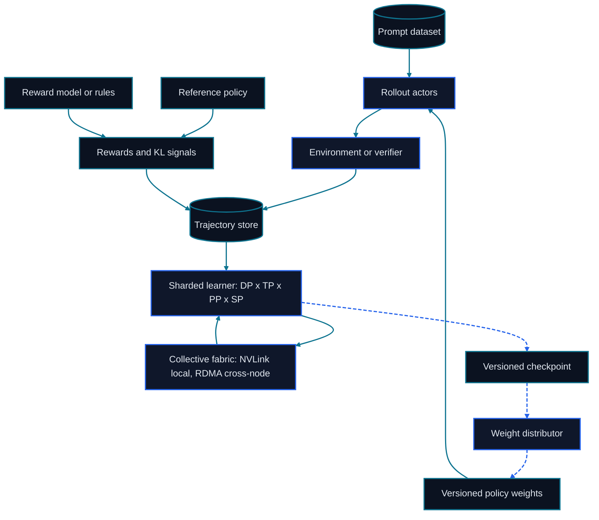

# Chapter 22: Distributed Training and RLHF Infrastructure

<figure class="course-hero">
  
  <figcaption><em>Distributed training infrastructure coordinates model state, gradients, and feedback at scale.</em></figcaption>
</figure>



<div class="diagram-legend" aria-label="Flow legend">
  <span class="diagram-legend-data">Data · solid cyan</span>
  <span class="diagram-legend-control">Control · dashed blue</span>
</div>

*Diagram conclusion:* Distributed RLHF separates rollout from sharded optimization and closes the loop only through versioned trajectories, checkpoints, and weight distribution.

When model, activation, or optimizer state no longer fits one device, the question changes from algorithm choice to state partitioning and communication. Distribution trades communication, synchronization, orchestration, and failure handling for capacity and throughput.

## 22.1 Three Basic Parallel Dimensions

Data parallelism splits batches and reduces gradients. Tensor parallelism splits layer matrices and needs frequent low-latency collectives. Pipeline parallelism splits layers and introduces stage scheduling and bubbles. Real systems combine them according to the memory gap and physical topology.

Long-context training may also use sequence/context parallelism to split activations and attention work along the sequence. When dimensions are independent:

$$N=DP\times TP\times PP\times SP$$

“3D parallelism” commonly means a DP/TP/PP composition, not a fixed recipe. Place TP/SP inside low-latency, high-bandwidth domains where possible; DP tolerates inter-node placement better; and balance PP stages by parameters, activation traffic, and measured layer time.

## 22.2 ZeRO

Stage 1 shards optimizer state, Stage 2 also shards gradients, and Stage 3 also shards parameters and gathers them when needed. Sharding reduces resident state but adds communication and temporary buffers. Capacity plans must reserve room for activations, collective buckets, workspaces, and fragmentation.

## 22.3 FSDP

FSDP full-shards parameters, gradients, and optimizer state around module boundaries and gathers current-module parameters for forward/backward work. Wrap policy, prefetch, activation checkpointing, mixed precision, and state-dict strategy affect both memory and communication. ZeRO-3 and FSDP share a full-sharding goal but differ in integration and checkpoint boundaries.

## 22.4 RLHF Service Topology

```text
Prompt Dataset
    ↓
Rollout / Actor → Environment / Verifier → Reward
    ↓                                  ↓
Trajectory Store ← Reference / Critic ←┘
    ↓
Policy Update → Checkpoint → Evaluation Gate
```

The bottleneck may be rollout, tools, verifiers, or checkpoint transfer rather than optimization. Track versions, queue depth, throughput, tail latency, failure rate, and lineage at every service.

When rollout and training workers are separate, updated weights need versioned publication, shard aggregation or partitioning, transport, loading, and acknowledgement. Full synchronization is simple but expensive; incremental or asynchronous updates are faster but create policy staleness. Bind each trajectory to the policy version that generated it and reject untraceable or excessively stale samples.

## 22.5 Communication and Budget Ledger

Ideal per-device ring all-reduce traffic is about $2(N-1)S/N$. Parallel dimensions invoke different collectives: DP synchronizes gradients, TP/SP exchanges tensors within layers, and PP sends activations. Record payload, frequency, participants, physical links, overlap, and wait time for every collective instead of reporting one aggregate communication percentage.

Device-hours and a first budget estimate are:

$$H_{device}=N_{device}\times T_{hour},\qquad C=H_{device}\times Price_{device/hour}$$

Scaling out is economical only when shorter completion time, lower failure risk, or opportunity cost offsets lost parallel efficiency.

## 22.6 Checkpoints and Fault Tolerance

Distributed checkpoints must handle shard formats, changed world size, atomic publication, integrity checks, and data-iterator position. Distinguish locally retryable worker faults from globally inconsistent state; otherwise a seemingly valid checkpoint may mix different training steps.

## 22.7 Offline Parallelism and Sharding Ledger

```bash
cd code/go-agentic
python3 -m pytest 22-distributed-training -q
```

`distributed_memory.py` separates parameters, gradients, master weights, and moments across ZeRO stages. `parallelism.py` checks world size, sequence shards, synchronization traffic, and device-hours. Add a 20% non-model reserve and observe the difference between theoretically fitting and operating reliably.

## 22.8 Mastery Standard

Build model-state, activation, communication, and cost ledgers; explain what data/tensor/pipeline/sequence parallelism and sharding methods partition; and mark queue and version boundaries among rollout, environment, reward, weight sync, checkpoint, and evaluation services.

## 22.9 Primary Sources

The sources below define the two sharding interfaces discussed in this chapter. Compare their state lifecycle and integration boundary before translating either one into a memory estimate.

- [Rajbhandari et al. (2019), ZeRO method](https://arxiv.org/abs/1910.02054) develops staged partitioning of optimizer state, gradients, and parameters.
- [PyTorch FSDP documentation](https://docs.pytorch.org/docs/stable/fsdp.html) specifies the maintained API, sharding strategies, synchronization behavior, and state-dictionary options for Fully Sharded Data Parallel.
