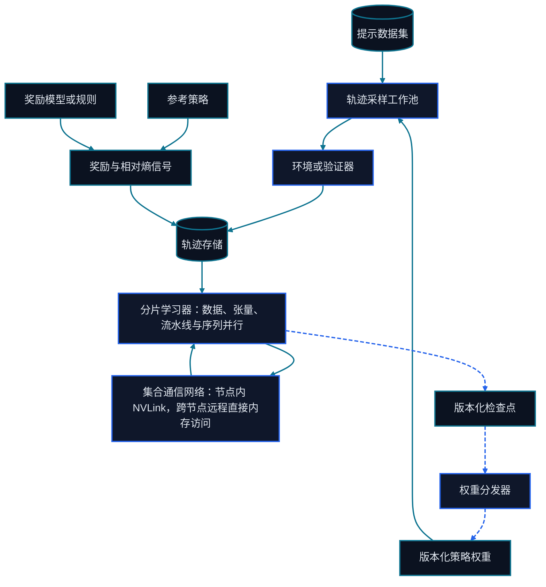

# 第二十二章 分布式训练与 RLHF 基础设施

<figure class="course-hero">
  
  <figcaption><em>分布式训练基础设施在大规模环境中协调模型状态、梯度与反馈。</em></figcaption>
</figure>



<div class="diagram-legend" aria-label="流程图例">
  <span class="diagram-legend-data">数据 · 青色实线</span>
  <span class="diagram-legend-control">控制 · 蓝色虚线</span>
</div>

*图示结论：* 分布式人类反馈强化学习将轨迹采样与分片优化解耦，并只通过版本化轨迹、检查点和权重分发闭合循环。

当模型、激活或优化器状态无法放进一张卡时，问题就从“使用哪个算法”变成“如何切分状态和通信”。分布式不会免费扩展；它用通信、同步、编排和容错换取容量与吞吐。

## 22.1 三种基本并行

| 方式 | 切分对象 | 主要通信 | 主要气泡/风险 |
| --- | --- | --- | --- |
| Data Parallel | 数据 Batch | 梯度 All-Reduce/Reduce-Scatter | 通信随模型状态增长 |
| Tensor Parallel | 单层矩阵 | 层内频繁 Collective | 对低延迟高带宽链路敏感 |
| Pipeline Parallel | 模型层 | Stage 间激活 | 微批调度与 Pipeline Bubble |

实际大模型会组合多种并行。选择顺序应该从内存缺口和物理拓扑出发，而不是追求更多并行维度。

长上下文还可使用 **Sequence/Context Parallel**，沿序列维度切分激活与 Attention 工作。若四个维度彼此独立，总设备数可写成：

$$N=DP\times TP\times PP\times SP$$

“3D Parallel”通常指 DP、TP、PP 的组合，不代表固定配置。TP/SP 应优先放在低延迟、高带宽域内；DP 更能容忍跨节点；PP 的 Stage 划分还要平衡参数量、激活量和每层耗时。

## 22.2 ZeRO

- **Stage 1：** 分片优化器状态；
- **Stage 2：** 再分片梯度；
- **Stage 3：** 再分片参数，计算前按需 All-Gather。

分片降低每卡常驻状态，但可能增加通信、临时 Buffer 和对调度的敏感度。容量计算必须预留激活、通信 Bucket、内核 Workspace 和碎片，不能让理论模型状态占满 HBM。

## 22.3 FSDP

FSDP 以模块为边界对参数、梯度和优化器状态进行全分片，前向/反向时收集当前模块需要的参数。Wrap Policy、Prefetch、Activation Checkpointing、Mixed Precision 和 State Dict 策略会同时影响内存和通信。

ZeRO-3 与 FSDP 在“全分片”上相似，但集成、调度、Checkpoint 格式和框架边界不同。不应只按一张对比表选型，而要用真实模型、序列长度和拓扑测量。

## 22.4 RLHF 服务拓扑

大规模 PPO/GRPO 往往同时运行：

```text
Prompt Dataset
    ↓
Rollout / Actor → Environment / Verifier → Reward
    ↓                                  ↓
Trajectory Store ← Reference / Critic ←┘
    ↓
Policy Update → Checkpoint → Evaluation Gate
```

瓶颈可能不在训练，而在采样、工具环境、Verifier 或 Checkpoint 传输。为每个服务记录版本、队列深度、吞吐、尾延迟、失败率和数据血缘。

Rollout Worker 与训练 Worker 若分离，更新后的权重必须经过版本化发布、分片/聚合、传输、加载和确认。全量同步简单但昂贵；增量或异步同步更快，却会产生 Policy Staleness。每条轨迹至少绑定生成它的 Policy Version，训练端设置最大可接受版本差并拒绝无法追踪的样本。

## 22.5 通信与预算账本

Ring All-Reduce 每卡理想流量仍约为 $2(N-1)S/N$。但并行组合中的 Collective 不同：DP 同步梯度，TP/SP 在层内交换张量，PP 传递激活。为每个 Collective 记录 Payload、频率、参与设备、链路、能否重叠和等待时间，而不是只汇总“通信占比”。

设备小时与粗略预算为：

$$H_{device}=N_{device}\times T_{hour},\qquad C=H_{device}\times Price_{device/hour}$$

扩卡只有在完成时间、失败概率或机会成本改善足以覆盖并行效率损失时才划算。

## 22.6 Checkpoint 与容错

分布式 Checkpoint 要解决分片格式、并行度变更、原子发布、完整性校验和训练数据位置。一个 Worker 失败时，首先要区分“本地可重试”与“全局状态已不一致”，否则可能生成表面可用但实际混合了不同 Step 的 Checkpoint。

## 22.7 离线并行与分片账本

```bash
cd code/go-agentic
python3 -m pytest 22-distributed-training -q
```

`distributed_memory.py` 分开参数、梯度、Master Weights 和 Moments，展示 ZeRO 0–3 的理想每卡状态；`parallelism.py` 检查并行世界大小、序列分片、同步流量与设备小时。请额外加入 20% 非模型存储预留，观察“理论能放下”与“可靠运行”的差距。

## 22.8 掌握标准

你应能列出状态、激活、通信和成本账本，说明 Data/Tensor/Pipeline/Sequence Parallel、ZeRO 与 FSDP 分别切什么，并为 RLHF 系统标出采样、环境、Reward、权重同步、Checkpoint 和评测之间的队列与版本边界。

## 22.9 一手资料

以下资料界定了本章讨论的两种分片接口。将方法写入显存账本前，应先比较它们的状态生命周期与框架集成边界。

- [Rajbhandari 等（2019），ZeRO 方法](https://arxiv.org/abs/1910.02054) 提出对优化器状态、梯度和参数进行分阶段切分。
- [PyTorch FSDP 官方文档](https://docs.pytorch.org/docs/stable/fsdp.html) 说明 Fully Sharded Data Parallel 的现行 API、分片策略、同步行为与 State Dict 选项。
