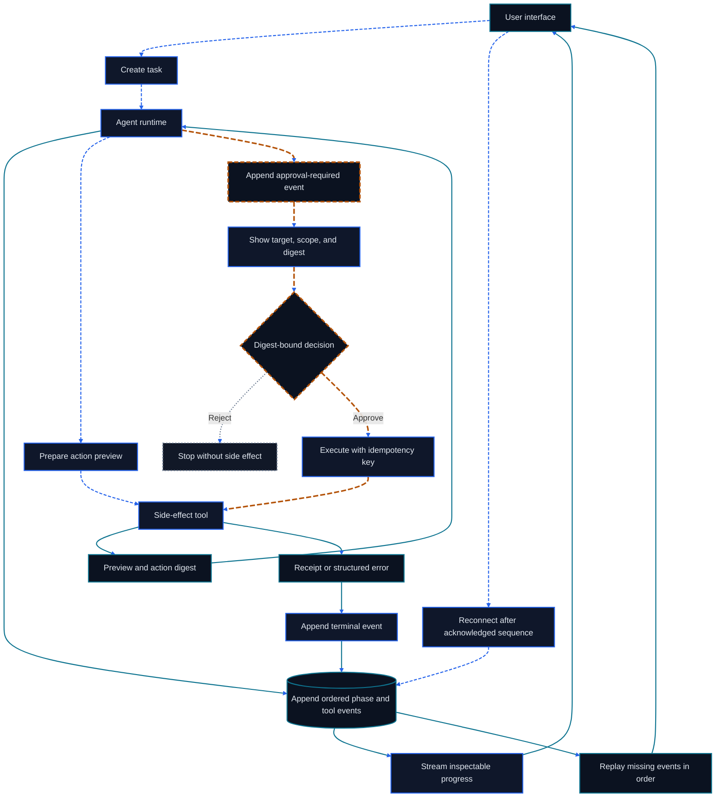

# Chapter 23: Agentic UI and Human in the Loop

<figure class="course-hero">
  
  <figcaption><em>Agentic interfaces make consequential actions inspectable and subject to human approval.</em></figcaption>
</figure>



<div class="diagram-legend" aria-label="Flow legend">
  <span class="diagram-legend-data">Data · solid cyan</span>
  <span class="diagram-legend-control">Control · dashed blue</span>
  <span class="diagram-legend-failure">Failure · dotted neutral</span>
  <span class="diagram-legend-approval">Approval/risk · long-dashed amber</span>
</div>

*Diagram conclusion:* A trustworthy UI is a projection of durable ordered events, and every consequential action crosses a digest-bound approval and idempotency boundary.

A correct backend may still be untrustworthy when users cannot understand progress, anticipate side effects, or stop execution. Agentic UI turns long-running, tool-rich, partially autonomous work into understandable, controllable, and recoverable interaction.

## 23.1 Choose the Right Surface

Chat fits clarification and short work; canvas/artifact views fit editable reports and code; workflow views fit stable stages and approvals; dashboards fit queues, cost, and SLOs; collaboration views fit shared review and handoff. Multiple surfaces may coexist, but task state and artifact versions need one source of truth.

Choose frameworks from the state model: server streaming, reconnect, cancellation, structured forms, accessible components, and shared schemas. React, Vue, or server rendering can all implement Agentic UI; framework names do not replace a consistent event protocol and real backend state.

## 23.2 Generative UI and Schema Boundaries

Generative UI should not let a model emit arbitrary HTML or JavaScript. Let it choose from an allowlisted component catalog and fill validated properties:

```json
{"component":"approval-card","props":{"action":"send_email","target":"supplier@example.com"}}
```

The server validates component names, field types, enums, lengths, and permissions against a versioned schema. Unknown components, scripts, handlers, and dangerous URLs are denied by default. The model proposes presentation intent; the application owns rendering, authorization, and side effects. Schema evolution needs compatibility or explicit migration.

## 23.3 Progress Is Not a Spinner

Show the current phase, completed milestones, active tool, pending user action, elapsed time/budget, and cancellation. Do not invent precise percentages when total work is unknown; show stages, activity, and recent evidence instead.

```text
Plan created    ✓
Contract search ✓  3 sources
ERP check          …  reading PO-2048
Outbound email     ○  approval required
```

## 23.4 Tool Streams and Progressive Disclosure

The default layer shows what happened, the result, and whether a side effect occurred. Expansion reveals parameters, raw output, timing, retries, and trace IDs. Debug logs and user UI are different products with different detail, privacy, and retention requirements. Multi-agent streams should expose responsibility contracts, handoff artifacts, acceptance results, and escalation reasons—not only role avatars.

## 23.5 Streaming, Reconnect, and Backpressure

Give each event an envelope with `task_id`, monotonic `sequence`, unique `event_id`, `type`, `schema_version`, and timestamp. The client persists its last acknowledged cursor and reconnects by asking for later events. The server deduplicates by event ID and publishes a retention window; do not assume a WebSocket stays connected forever.

High-frequency tokens, logs, and progress may be sampled or coalesced. Approval requests, permission changes, artifact versions, errors, and Completed/Failed/Cancelled terminal events must not be dropped. Under backpressure, reduce display frequency instead of growing an unbounded buffer.

## 23.6 Evidence and Context Visibility

Attach sources, locations, and retrieval times to key claims. Distinguish external evidence, agent inference, user-confirmed facts, and unverified assumptions. Hidden chain-of-thought need not be shown, but action-relevant reasons, evidence, and system rules must be inspectable.

## 23.7 Approval Gates

An approval card states the action, target, exact preview, evidence, uncertainty, reversibility, and decision scope. Allow edit, reject, one-time approval, or a narrowly scoped rule. Never ask after execution or bundle unrelated side effects into one approval.

## 23.8 Errors, Recovery, and Undo

Explain the failed step, completed work, side effects, and available retry/edit/rollback/handoff actions. When true undo is impossible, offer a compensating action and link it to the original action. Under stream backpressure, coalesce visual updates but never drop approvals, state transitions, or terminal results.

## 23.9 Accessibility and Trust

Do not encode state only with color. Streaming must not steal screen-reader focus; summarize frequent state changes in a restrained `aria-live` region instead of announcing every token. Approvals and cancellation must be keyboard accessible. Users must be able to pause auto-scroll. Do not present uncalibrated confidence as probability; prefer verified, partially verified, and unverified labels.

## 23.10 Event-Model Lab

```bash
cd code/go-agentic
python3 -m pytest 23-agentic-ui -q
```

`events.py` reduces plan, progress, tool, evidence, approval, error, retry, cancellation, and completion events into UI state. `stream.py` verifies ordering, replay cursors, duplicate suppression, approval fields, and terminal states. A production frontend may use any framework, but event semantics must be backed by runtime state and audit records.

## 23.11 Mastery Standard

Draw the UI state flow for a long task, define a replayable event envelope and safe component schema, design approval and undo for every side effect, and let a user judge progress, evidence, errors, and next actions without reading raw logs.
