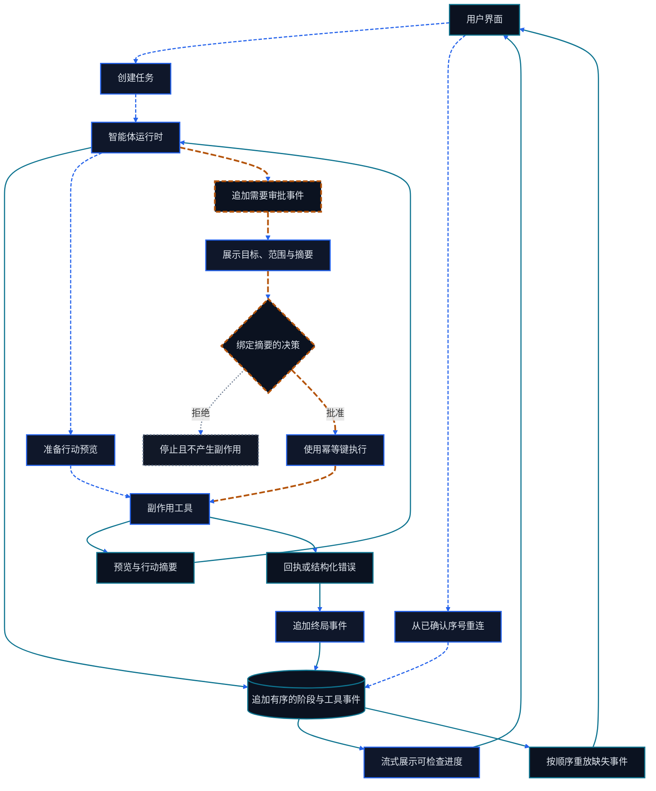

# 第二十三章 Agentic UI 与人在回路

<figure class="course-hero">
  
  <figcaption><em>智能体界面让关键行动可检查，并接受人类审批。</em></figcaption>
</figure>



<div class="diagram-legend" aria-label="流程图例">
  <span class="diagram-legend-data">数据 · 青色实线</span>
  <span class="diagram-legend-control">控制 · 蓝色虚线</span>
  <span class="diagram-legend-failure">失败 · 中性色点线</span>
  <span class="diagram-legend-approval">审批/风险 · 琥珀色长虚线</span>
</div>

*图示结论：* 可信界面是持久有序事件的投影，每个关键行动都必须跨过绑定行动摘要的审批与幂等边界。

一个 Agent 后端即使能正确执行，用户也可能因为看不懂进度、不知道将要发生什么、无法阻止副作用而不信任它。Agentic UI 的任务是将长时程、多工具、部分自主的执行变成可理解、可控和可恢复的交互。

## 23.1 先选对交互表面

| 表面 | 适合任务 | 关键风险 |
| --- | --- | --- |
| Chat | 目标澄清、短任务、对话式修改 | 重要产物埋在消息流中 |
| Canvas / Artifact | 报告、代码、表格和可编辑结果 | 用户与 Agent 编辑冲突 |
| Workflow | 有稳定阶段和审批节点的业务流程 | 过度固定化本应动态的 Loop |
| Dashboard | 多任务、队列、成本、SLO 和运营 | 只展示数量，没有决策入口 |
| Collaboration | 多人审批、评审和交接 | 权限、版本与责任不清 |

一个产品可以组合多个表面，但必须为“任务状态”和“产物版本”建立单一事实源。

选框架时先看状态模型：是否支持服务端流、断线恢复、可取消请求、结构化表单、可访问组件和前后端共享 Schema。React、Vue 或服务端渲染都能实现 Agentic UI；框架名称不能替代一致的事件协议和真实后端状态。

## 23.2 Generative UI 与 Schema 边界

Generative UI 不是让模型任意生成 HTML/JavaScript，而是让它从受控组件目录中选择组件并填写经过验证的属性：

```json
{"component":"approval-card","props":{"action":"send_email","target":"supplier@example.com"}}
```

服务端必须用版本化 Schema 校验组件名、字段类型、枚举、长度和权限；未知组件、脚本、事件处理器与危险 URL 默认拒绝。模型负责提出界面意图，应用负责渲染、权限和副作用。Schema 变化需要向后兼容或显式迁移，不能让旧会话悄悄改变含义。

## 23.3 进度不是 Loading Spinner

长任务至少展示：当前阶段、已完成里程碑、当前工具、等待用户的事项、已用时间/预算，以及取消入口。不要伪造精确的“73%”；如果总工作量不确定，就展示阶段、活动和最近证据。

```text
计划已建立 ✓
合同检索   ✓  3 份来源
ERP 核对     …  正在读取 PO-2048
外发邮件   ○  需要你审批
```

## 23.4 工具流与渐进式披露

默认层只展示“做了什么、结果如何、是否产生副作用”。展开后再显示参数、原始输出、耗时、重试和 Trace ID。日志不应既当调试数据又当用户界面；两者对详细度、敏感信息和保留时间的要求不同。

多 Agent 流不要只显示角色头像。显示责任契约、交接产物、验收结果和为什么重试或升级，用户才能判断多 Agent 是否真的创造了价值。

## 23.5 流式传输、重连与背压

把每个事件设计成带 `task_id`、单调递增 `sequence`、唯一 `event_id`、`type`、`schema_version` 和时间戳的 Envelope。客户端持久化最后确认的 Cursor，重连时请求“从 Cursor 之后重放”；服务端按 `event_id` 幂等去重，并明确事件保留窗口。不要依赖“WebSocket 一直不断”。

高频 Token、日志和进度可采样或合并；审批请求、权限变化、产物版本、错误和 Completed/Failed/Cancelled 终局事件不可丢。慢客户端触发背压时，优先降低展示频率，而不是让无界缓冲耗尽内存。

## 23.6 证据与 Context 可见性

对关键结论提供可点击的 Source、定位和获取时间。区分：

- 外部证据；
- Agent 的推断；
- 用户已确认事实；
- 仍未验证的假设。

不需暴露模型隐藏推理，但必须暴露行动所需的可审查理由、证据和系统规则。

## 23.7 审批门

好的审批卡应同时告诉用户：

1. 将执行什么；
2. 对谁或什么系统生效；
3. 将发送或修改的完整预览；
4. 依据和不确定性；
5. 是否可撤销；
6. 允许修改、拒绝、仅允许本次或为同类低风险动作建立受限规则。

审批不能在行动已执行后才出现，也不能把多个不相关副作用捆绑为一次“全部同意”。

## 23.8 错误、恢复与撤销

错误页要回答四件事：哪一步失败、什么已经成功、是否产生了副作用、接下来可以重试/修改/回滚/交给人。如果不能撤销，就提供补偿动作，并保留原始动作与补偿动作的关联 ID。

Streaming UI 还要处理背压：工具事件过快时合并可视更新，但不能丢掉审批、状态转换和终局结果。

## 23.9 可访问性与信任

- 状态不只靠颜色；
- 流式更新不抢占屏幕阅读器焦点；
- 高频状态用节制的 `aria-live` 摘要，不逐 Token 播报；
- 所有审批和取消可用键盘完成；
- 用户可暂停自动滚动并回看证据；
- 置信度不伪装成精确真实概率，应说明来源、校准方法或改用“已验证/部分验证/未验证”。

## 23.10 事件模型实验

```bash
cd code/go-agentic
python3 -m pytest 23-agentic-ui -q
```

`events.py` 将 Plan、Progress、Tool Call、Evidence、Approval、Error、Retry、Cancel 和 Complete 事件归约为 UI State；`stream.py` 验证顺序、重放 Cursor、重复抑制、审批字段和终局状态。实际前端可以更换，但事件语义必须由后端状态与审计记录支撑。

## 23.11 掌握标准

你应能为长任务画出从创建到完成的 UI 状态图，定义可重放的事件 Envelope 与安全组件 Schema，为每个副作用设计审批与撤销，并让用户在不读原始日志的情况下判断进度、证据、错误和下一步。
