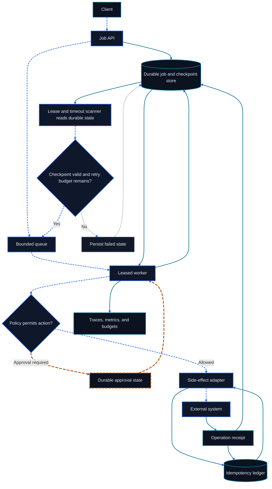

# Chapter 24: Production Runtime and Platform Engineering

<figure class="course-hero">
  
  <figcaption><em>Production agent platforms combine observability, policy, redundancy, and recovery.</em></figcaption>
</figure>



<div class="diagram-legend" aria-label="Flow legend">
  <span class="diagram-legend-data">Data · solid cyan</span>
  <span class="diagram-legend-control">Control · dashed blue</span>
  <span class="diagram-legend-failure">Failure · dotted neutral</span>
  <span class="diagram-legend-approval">Approval/risk · long-dashed amber</span>
</div>

*Diagram conclusion:* Production durability comes from persisted jobs, leases, checkpoints, approvals, and idempotency receipts that let queued work recover safely.

A loop that works in a notebook is not yet a production runtime. Production must queue bursts, survive restarts, persist cancellation and approval, isolate tenants, and enforce latency and cost budgets.

## 24.1 Durable Jobs, Not HTTP Requests

A long task needs a stable job ID, tenant ID, idempotency key, status, attempts, checkpoint, budgets, and audit trace. HTTP may create the job but should not own its lifetime.

```text
queued → running → waiting_for_approval → running → succeeded
   └──→ cancelled       running → failed → queued (bounded retry)
```

Terminal states cannot jump arbitrarily back to running. Retry is a controlled transition that retains the previous error and checkpoint.

## 24.2 Queues, Concurrency, and Rate Limits

Queues decouple admission from execution. Limit concurrency by model, tool, tenant, risk class, and resource pool—not only worker count. Separate request rate, model token/concurrency quotas, external API limits, human approval capacity, and per-job tool/time/cost budgets. Reject, defer, or degrade early instead of allowing an unbounded queue.

## 24.3 Checkpoint, Cancellation, and Recovery

Persist completed steps, remaining plan, evidence references, external IDs, budgets, and side effects—not only one large prompt. Cancellation is a protocol: stop new work, interrupt interruptible tools, record existing side effects, compensate when needed, and then enter cancelled state.

## 24.4 Idempotency and the Exactly-Once Illusion

A worker can execute a side effect and fail before acknowledgement. Retries can then duplicate mail, orders, or payments. Give side-effecting tools business idempotency keys and persist external operation IDs rather than relying on end-to-end exactly-once execution.

## 24.5 Multi-Tenancy and Secrets

Tenant boundaries span jobs, queues, context, memory, indexes, caches, traces, artifacts, and credentials. Tenant context must be runtime-controlled on every storage and tool operation. Secrets never enter prompts, traces, or errors; adapters fetch credentials at execution time.

## 24.6 Autoscaling and Backpressure

Scale on queue wait, runnable jobs, model quota, GPU utilization, tool limits, and approval backlog. CPU-only scaling may create more workers that all block on the same model. Propagate backpressure to admission and show queue state, expected wait, and cancellation to users.

## 24.7 SLOs, Cost, and Releases

Track queue P95, time to first useful progress, completion latency, success and recovery rates, token/tool/compute cost, and unapproved high-risk actions (target zero). Release prompts, models, tools, and runtimes through frozen task suites, shadow/canary traffic, versioned traces, and tested rollback. State-schema changes need migrations and compatibility windows.

## 24.8 Runtime State-Machine Lab

```bash
cd code/go-agentic
python3 -m pytest 24-production-runtime -q
```

`runtime.py` demonstrates tenant-scoped idempotent submission, constrained transitions, checkpoints, cancellation, and bounded retry. It is a testable semantic reference for a real queue/database implementation, not a production queue itself.

## 24.9 Mastery Standard

Define a durable state machine for a long task, explain idempotency, cancellation, recovery, multi-tenancy, and backpressure boundaries, and manage releases with success, tail-latency, cost, and safety metrics.
