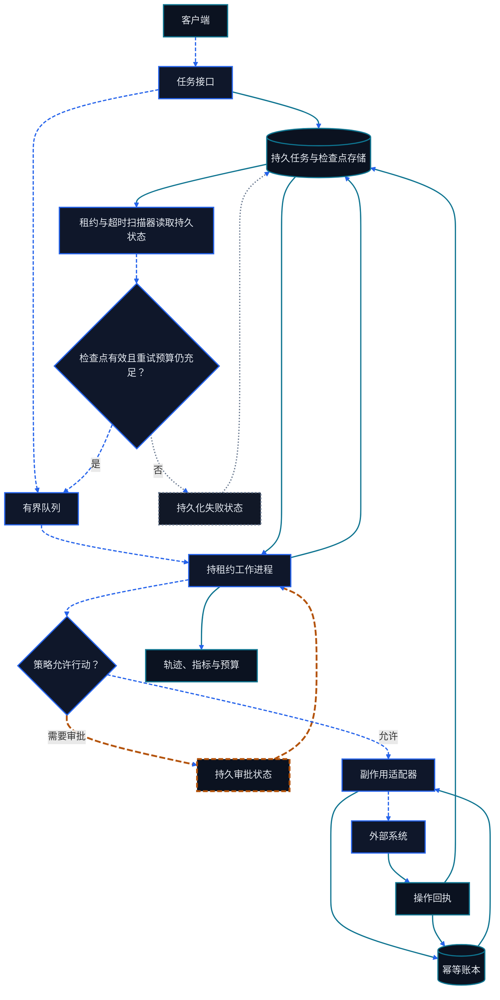

# 第二十四章 生产 Runtime 与平台工程

<figure class="course-hero">
  
  <figcaption><em>生产级智能体平台融合可观测性、策略、冗余与恢复能力。</em></figcaption>
</figure>



<div class="diagram-legend" aria-label="流程图例">
  <span class="diagram-legend-data">数据 · 青色实线</span>
  <span class="diagram-legend-control">控制 · 蓝色虚线</span>
  <span class="diagram-legend-failure">失败 · 中性色点线</span>
  <span class="diagram-legend-approval">审批/风险 · 琥珀色长虚线</span>
</div>

*图示结论：* 生产持久性来自已落盘的任务、租约、检查点、审批与幂等回执，它们使排队工作能够安全恢复。

一个能在笔记本里完成任务的 Loop，距离生产 Runtime 还有一组系统问题：请求激增时如何排队，进程重启后如何继续，取消与审批如何成为持久状态，不同租户如何隔离，成本和延迟如何被预算约束。

## 24.1 Durable Job 而非 HTTP 请求

长任务应有稳定 Job ID、Tenant ID、Idempotency Key、状态、尝试次数、检查点、预算和审计轨迹。HTTP 请求可以创建 Job，但不应拥有 Job 的生命周期。

```text
queued → running → waiting_for_approval → running → succeeded
   └──→ cancelled       running → failed → queued (bounded retry)
```

终局状态不允许随意跳回 Running。重试必须是受控状态转换，并保留上一次错误和检查点。

## 24.2 队列、并发与限流

队列将接收任务与执行速度解耦。并发限制不只是 Worker 数量，还要按模型、Tool、Tenant、风险等级和资源池限制。

限流要区分：

- 入口请求率；
- 模型 Token/并发配额；
- 外部 API 限额；
- 高风险动作的人工审批容量；
- 单个任务的最大 Tool Call、时间和成本。

超过容量时要早拒绝、延迟或降级，而不是让队列无界增长。

## 24.3 检查点、取消与恢复

检查点只保留恢复所需的结构化状态：已完成步骤、未完成计划、关键证据引用、外部资源 ID、预算和副作用。不要只存一个超长 Prompt。

取消是协议，不是直接杀进程：停止新动作，等待或中断可中断工具，记录已经发生的副作用，执行必要补偿，最后进入 Cancelled。

## 24.4 幂等性与 Exactly-Once 幻觉

分布式系统中，Worker 可能执行成功但在确认前崩溃。Runtime 会重试，于是同一封邮件、订单或付款可能重复。与其依赖端到端 Exactly Once，不如让副作用 Tool 接受业务幂等键，并在系统记录中保存外部操作 ID。

## 24.5 多租户与 Secrets

租户边界必须贯穿 Job、Queue、Context、Memory、Vector Index、Cache、Trace、Artifact 和密钥。不只在 API 入口校验 Tenant ID，每次持久化查询和 Tool 调用都应带上不可由模型修改的租户上下文。

Secrets 不进入 Prompt、Trace 或错误消息。Tool Adapter 按租户和权限在执行时获取凭据，并将模型可见的参数与真实认证信息分离。

## 24.6 自动扩缩容与背压

扩容信号应包括队列等待时间、可运行 Job、模型配额、GPU 利用率、Tool 限流和审批积压。仅按 CPU 扩容可能创建更多 Worker，却一起阻塞在同一模型或 API。

背压传播路径应从瓶颈一直回到接入层，让用户看到排队、预计等待和取消选项。

## 24.7 SLO、成本与发布

为每类任务定义：

- 排队时间 P95；
- 首个可用进度事件时间；
- 端到端完成时间；
- 成功率与恢复成功率；
- 每任务 Token、Tool 和计算成本；
- 高风险动作未经审批执行数（目标必须为 0）。

发布新 Prompt、Model、Tool 或 Runtime 版本时使用固定 Task Suite、Shadow/Canary、版本化 Trace 和可验证回滚。状态 Schema 变更还需要迁移与双读策略。

## 24.8 Runtime 状态机实验

```bash
cd code/go-agentic
python3 -m pytest 24-production-runtime -q
```

`runtime.py` 演示按 Tenant 隔离的幂等提交、受限状态转换、检查点、取消与有界重试。它不是生产队列，而是为任何队列/数据库实现提供可测语义。

## 24.9 掌握标准

你应能为长任务定义持久状态机，说明幂等、取消、恢复、多租户和背压边界，并用成功率、尾延迟、成本和安全指标管理发布。
