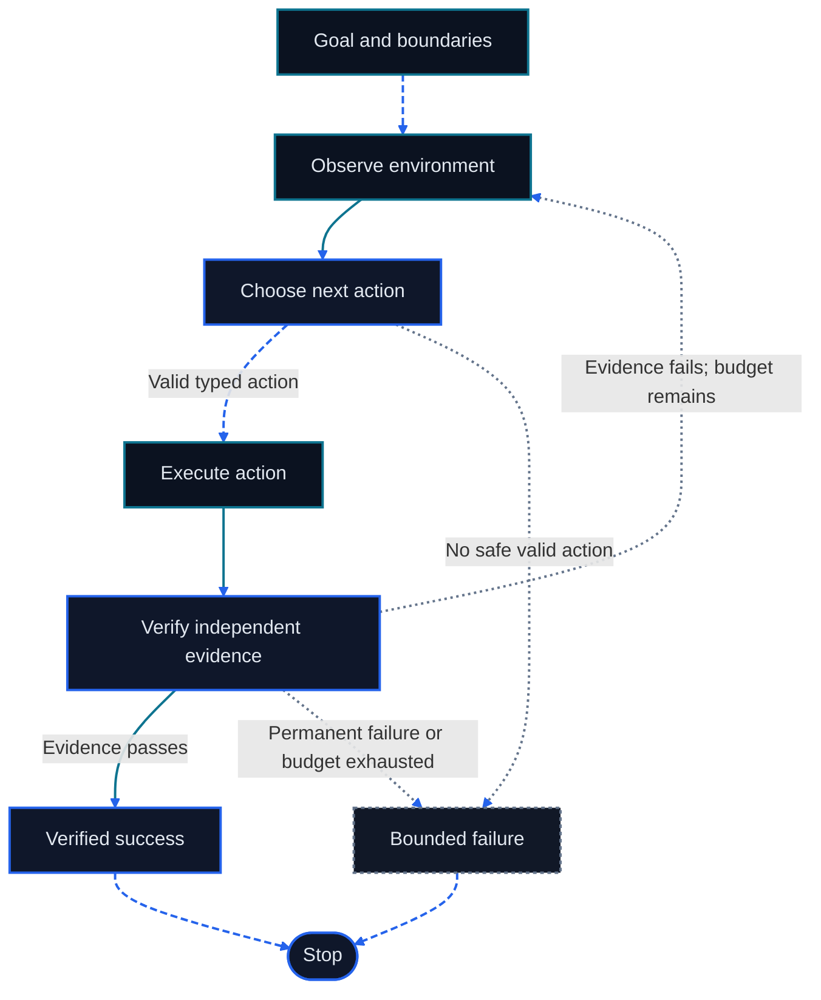

<div align="right">
  <a href="./第四章%20智能体经典范式构建.md">中文</a> | English
</div>

# Chapter 4: Agent Design Patterns and Loops

<figure class="course-hero">
  
  <figcaption><em>Reliable agents repeatedly observe, decide, act, and verify.</em></figcaption>
</figure>



<div class="diagram-legend" aria-label="Flow legend">
  <span class="diagram-legend-data">Data · solid cyan</span>
  <span class="diagram-legend-control">Control · dashed blue</span>
  <span class="diagram-legend-failure">Failure · dotted neutral</span>
</div>

*Diagram conclusion:* A reliable loop advances only through typed actions and independent verification, with explicit success and bounded-failure exits.

Classic agent patterns are not isolated product recipes. They are control choices inside the same Observation—Action—Verification loop: when to plan, how to route, which actions may run in parallel, how to correct a failure, and when to stop. This chapter places those choices in an explicit state machine and verifies its transition semantics with a Python fixture that needs no network or API key.

By the end of this chapter, you should be able to:

- describe an agent loop through states, inputs, outputs, and transition conditions;
- locate ReAct, Plan-and-Execute, Reflection, routing, parallelization, and evaluator-optimizer inside one loop;
- distinguish evaluation, verification, retry, and termination;
- assign bounded retry budgets to failure classes;
- run and explain the deterministic plan—execute—verify example.

## 4.1 Put the Patterns Back into One Loop

### 4.1.1 The Minimal State Machine

The minimal loop from the first three chapters can be expanded into six observable states. The policy still chooses only the next step; the harness stores state, dispatches tools, enforces budgets, and accepts evidence from the Environment.


| State | Reads | Produces | Allowed next state |
| --- | --- | --- | --- |
| `plan` | Task, boundaries, prior feedback | One or more ordered Actions | `execute` or `terminated` |
| `execute` | Action, tool schema, authority | Structured Observation | `execute`, `verify`, or `terminated` |
| `verify` | Task success criteria, current evidence | `ok` plus actionable feedback | `succeeded`, `retry`, or `terminated` |
| `retry` | Failure class, remaining budget | Explicit retry decision | `plan` |
| `succeeded` | Independently passing evidence | Verified result | Terminal |
| `terminated` | Stop reason and final evidence | Bounded-failure result | Terminal |

State must come from the harness rather than model narration. A model may propose completion, but only a verifier can produce the success transition. A model may ask to try again, but only the budget and error policy can allow `retry`.

### 4.1.2 State Is the Control Plane; Messages Are the Data Plane

Message history stores the task, plan, tool calls, and observations. The state machine decides which messages may trigger execution. Separating them has three direct benefits: calls that are invalid in the current state can be rejected, transitions can be replayed from a trace, and budgets or authority can be tightened without changing the model prompt.

Minimal run state includes at least:

```text
task
current_state
attempt
retry_budget
plan
observations
verification
termination_reason
```

Do not bury these fields only inside a natural-language summary. Summaries are useful context; typed state is useful for execution and tests.

## 4.2 Nine Patterns Are Nine Control Choices

### 4.2.1 Choose a Planning Horizon from the Evidence Rate

Consider a failed nightly export whose first Observation contains only `column count mismatch`. A short-horizon policy decides to inspect the current header, performs that read, and uses the returned columns to choose the next Action. This ReAct-shaped loop works well because each cheap probe changes what should happen next. The trace needs the evidence reference, typed Action, and resulting Observation; it does not need private chain-of-thought text.

A plan-first policy instead creates explicit subtasks such as “snapshot the input schema, compare it with the export contract, update the mapping, run a sample export, then check row count and checksum.” Plan-and-Solve supports this separation of plan creation from subtask execution. It does not by itself establish a runtime protocol for replanning from tool feedback.

Go Agentic adds that protocol as a Harness rule. Before dispatching each planned Action, compare its preconditions with the newest Observation. If the input schema changed after the snapshot, mark the remaining steps stale and return to `plan`; if the preconditions still hold, execute the next subtask. Verification remains a separate transition after execution.

| Evidence pattern | Planning choice | Harness control |
| --- | --- | --- |
| Each observation materially changes the next probe | Decide one Action at a time | Deduplicate probes and enforce a step budget |
| Dependencies are known and intermediate checks are cheap | Create several ordered subtasks | Record preconditions and checkpoint after each result |
| Approval or execution is expensive | Prepare a reviewable plan before acting | Freeze authorized scope and invalidate stale steps |

### 4.2.2 Routing and Parallelization Change Execution Shape

**Routing** occurs in `plan` or before `execute`. It chooses a tool set, model configuration, or fixed subflow from the task type, data boundary, or required capability. Route output should be a finite enum and retain confidence or a refusal reason; the “other” branch needs a safe default.

**Parallelization** applies only to actions proven independent, usually read-only retrieval. Searching code while querying read-only metadata may be safe; two Actions that write the same file are not. The harness should assign stable IDs to parallel calls, await the required results, merge Observations in a deterministic order, and preserve partial failures.

The dependency test is simple: if Action B's input, authority decision, or correctness depends on Action A's output, A and B must run serially.

### 4.2.3 Reflection, Evaluator-Optimizer, and Verification Change Feedback

These three concepts are often blended together, but they carry different authority.

| Mechanism | Question | Output | May declare success? |
| --- | --- | --- | --- |
| Reflection | “Why did the previous attempt fail to advance?” | Revised hypothesis, plan, or Action | No |
| Evaluator | “How does the candidate score against a rubric?” | Score, gaps, improvement feedback | Only when the rubric itself is the acceptance criterion |
| Optimizer | “How can feedback produce a better candidate?” | New candidate | No |
| Verification | “Does environment evidence satisfy success criteria?” | Auditable pass or failure | Yes |

An **evaluator-optimizer** improves a candidate through `execute → verify/evaluate → retry → plan/optimize`. **Reflection** converts a failed Observation into a testable correction for the next attempt. Neither may replace “the task is satisfied” with “this looks better.” Code changes still need tests, database migrations still need queries, and releases still need a health check or approval.

## 4.3 Retry and Termination Bound the Loop

### 4.3.1 Classify Before Retrying

| Failure class | Example | Decision |
| --- | --- | --- |
| Transient | Rate limit, temporary timeout | Retry the same Action within time and count budgets |
| Correctable | Invalid arguments, failing test | Send feedback to `plan`, revise the Action, then retry |
| Permanent | Missing file with no alternative path | Stop and preserve evidence |
| Authority or safety | Out-of-scope path, missing approval | Deny; continue only after an explicit approval condition is met |
| Unknown | Exception that cannot be classified reliably | Use a conservative default: stop or escalate to a human |

`retry_budget=2` means two retries after the first attempt, so the total attempt limit is three. Counts, total duration, tokens, tool cost, and consecutive identical errors can all be budgets. Backoff only reduces pressure from transient faults; it cannot repair wrong arguments or an authority denial.

### 4.3.2 Termination Conditions Have Priority

Check conditions in a fixed order before every transition:

1. revoked authority, a policy prohibition, or a non-recoverable error stops immediately;
2. independently passing evidence stops with `succeeded`;
3. exhausted step, retry, time, or cost budget stops with bounded failure;
4. only other correctable failures enter `retry`.

Final prose is not a fifth success condition. It only presents existing state and evidence to the user.

### 4.3.3 Common Anti-Patterns

| Anti-pattern | Observable symptom | Correction |
| --- | --- | --- |
| Infinite Reflection | The same plan is rewritten without new evidence | Reflect only on new feedback and consume budget |
| Plan as truth | Old steps run after the environment changes | Add preconditions and permit replanning |
| Fake parallelism | Concurrent writes target the same resource | Build read/write sets and a dependency graph |
| Model self-verification | The answer claims success without a test or query | Bind success transitions to an independent verifier |
| Indiscriminate retry | Authority denials or bad arguments are replayed unchanged | Choose retry, correction, or stop by failure class |
| Hidden routing | Free text silently switches authority or model | Use a finite route schema and record the decision |
| Lost partial failure | Parallel aggregation retains only successful items | Return independent status and error for every call |

## 4.4 Deterministic Fixture: Plan—Execute—Verify

The code lives in `code/go-agentic/04-loop-patterns/`; the [example README](../../code/go-agentic/04-loop-patterns/README.md) records inputs, outputs, safety boundaries, limitations, and exact commands. It uses only the Python standard library; its pytest tests do not access a network, model API, or environment variable.

```bash
python3 -m pytest code/go-agentic/04-loop-patterns/test_loop.py -q
```

The core interface separates policy from control:

```python
result = run_loop(
    task="produce a verified candidate",
    plan=plan,
    execute=execute,
    verify=verify,
    retry_budget=1,
)
```

The Planner receives `attempt` and prior `feedback`. The Executor returns Observation text for each item in the current plan. The Verifier reads only the current attempt's outputs and returns `Verification(ok, feedback)`. The harness records every `Transition`.

The exact state trace in the successful test is:

```text
plan → execute → verify → retry → plan
     → execute → execute → verify → succeeded
```

The first verification returns `missing test evidence`, which becomes input to the second plan. That plan adds `check`; the environment returns `tests:pass`, and only then does the verifier allow success. Another test keeps verification failing: `retry_budget=2` produces three attempts and two `retry` transitions before `terminated`. An empty plan stops immediately with `invalid_plan`, preventing an actionless spin.

This fixture does not import the Chapter 1 example. It preserves the same terminology and responsibility boundaries while independently demonstrating a richer control state.

## 4.5 Design Order

When adding patterns to a new task, decide in this order:

1. write the success evidence and mandatory stop conditions;
2. define states and legal transitions;
3. choose a short-horizon or multi-step plan;
4. add parallelism only for independent Actions;
5. map evaluation feedback to a correctable next step;
6. assign retry, stop, or approval policy to each failure class;
7. test success, recovery, and budget-exhaustion traces with a deterministic policy.

Pattern count is not a maturity metric. The smallest verifiable control graph is usually easier to operate, audit, and improve.

## 4.6 Chapter Summary

- Classic patterns share one plan—execute—verify—retry state machine.
- ReAct and Plan-and-Execute choose the planning horizon; Routing and Parallelization choose execution shape.
- Reflection and evaluator-optimizer produce improvement feedback; Verification owns the success decision.
- Retry must consume a bounded budget by failure class; Termination must cover success, safety, and resource limits.
- The deterministic fixture proves replanning, verification, budget exhaustion, and empty-plan termination.

## Exercises

1. Draw a state machine for “inspect three configuration files and repair inconsistencies.” Mark which reads may run in parallel and which writes must run serially.
2. Convert a five-step Plan-and-Execute plan into a short-horizon ReAct loop. Compare the state and recovery points each must retain.
3. Define retry, replanning, approval, or stop policies for `TIMEOUT`, `INVALID_ARGUMENTS`, `PERMISSION_DENIED`, and `TEST_FAILED`.
4. Change the fixture so the second verification still fails and the third passes. Write the expected state sequence first, then adjust the budget and run the tests.
5. Design an evaluator rubric and an independent verifier. Explain why a high evaluator score need not satisfy the verifier.

## Mastery Standard

You meet this chapter's standard when you can place ReAct, Plan-and-Execute, Reflection, Routing, Parallelization, and evaluator-optimizer in one state machine; identify the input, executor, evidence, and budget for every transition; distinguish evaluation from verification; and predict the exact successful and bounded-failure traces from the tests.

## Pattern Evidence Map

| Control decision | Source used | Boundary retained in this chapter |
| --- | --- | --- |
| Interleave decisions and actions | Yao et al. (2022), [arXiv record 2210.03629](https://arxiv.org/abs/2210.03629) | Each environment result becomes evidence for the next short-horizon decision |
| Plan before execution | Wang et al. (2023), [arXiv record 2305.04091](https://arxiv.org/abs/2305.04091) | Create an explicit plan, then carry out its subtasks |
| Turn evaluation into another attempt | Shinn et al. (2023), [arXiv record 2303.11366](https://arxiv.org/abs/2303.11366); Madaan et al. (2023), [arXiv record 2303.17651](https://arxiv.org/abs/2303.17651) | Feedback informs retry state but cannot certify success by itself |
| Schedule independent actions | Chen et al. (2023), [arXiv record 2312.04511](https://arxiv.org/abs/2312.04511) | Parallel execution requires explicit dependencies and joined observations |
| Frame risk at the organization level | NIST, [AI risk-management resources](https://www.nist.gov/itl/ai-risk-management-framework) | Guidance for governing, mapping, measuring, and managing AI risk; assigning runtime verification, approval, and stopping to the Harness is Go Agentic's design rule |
