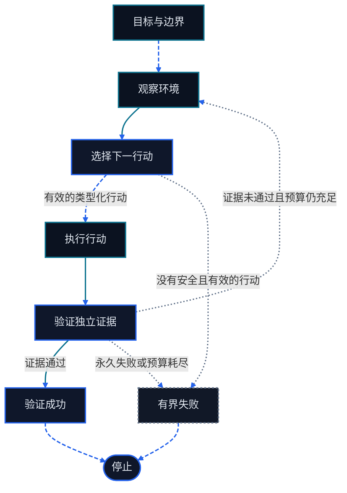

<div align="right">
  中文 | <a href="./Chapter4-Building-Classic-Agent-Paradigms.md">English</a>
</div>

# 第四章 Agent 设计模式与 Loop

<figure class="course-hero">
  
  <figcaption><em>可靠的智能体持续执行观察、决策、行动与验证。</em></figcaption>
</figure>



<div class="diagram-legend" aria-label="流程图例">
  <span class="diagram-legend-data">数据 · 青色实线</span>
  <span class="diagram-legend-control">控制 · 蓝色虚线</span>
  <span class="diagram-legend-failure">失败 · 中性色点线</span>
</div>

*图示结论：* 可靠闭环只通过类型化行动与独立验证推进，并显式进入成功或有界失败终态。

经典 Agent 模式不是彼此隔离的产品配方。它们是在同一个 Observation—Action—Verification Loop 中，对“何时规划、怎样选路、哪些行动并行、失败后如何修正、何时停止”作出的控制选择。本章把这些选择放进一个显式状态机，并用无需网络和 API Key 的 Python Fixture 验证转移语义。

学完本章，你应能：

- 用状态、输入、输出和转移条件描述 Agent Loop；
- 在同一循环中定位 ReAct、Plan-and-Execute、Reflection、路由、并行化与 evaluator-optimizer；
- 区分评价、验证、重试和终止；
- 为失败类型分配有限重试预算；
- 运行并解释确定性的 plan—execute—verify 示例。

## 4.1 把模式放回同一个循环

### 4.1.1 最小状态机

前三章的最小循环可以展开为六种可观察状态。策略仍只决定下一步；Harness 保存状态、分派工具、执行预算并接受 Environment 的证据。


| 状态 | 读取 | 产生 | 允许的下一状态 |
| --- | --- | --- | --- |
| `plan` | 任务、边界、上一轮反馈 | 一个或多个有序 Action | `execute` 或 `terminated` |
| `execute` | Action、工具 Schema、权限 | 结构化 Observation | `execute`、`verify` 或 `terminated` |
| `verify` | 任务成功标准、当前证据 | `ok` 与可操作反馈 | `succeeded`、`retry` 或 `terminated` |
| `retry` | 失败类别、剩余预算 | 明确的重试决定 | `plan` |
| `succeeded` | 独立通过的证据 | 已验证结果 | 终态 |
| `terminated` | 停止原因与最后证据 | 有界失败结果 | 终态 |

状态必须来自 Harness，而不是模型自述。模型可以提议“完成”，但只有 verifier 能产生成功转移；模型可以请求再试，但只有预算和错误策略能允许 `retry`。

### 4.1.2 状态是控制面，消息是数据面

消息历史保存任务、计划、工具调用和观察；状态机决定哪些消息可以触发执行。把两者分开有三个直接收益：可以拒绝不符合当前状态的调用，可以从轨迹重放转移，也可以在不改模型 Prompt 的情况下收紧预算或权限。

最小运行状态至少包括：

```text
task
current_state
attempt
retry_budget
plan
observations
verification
termination_reason
```

不要把这些字段只埋在一段自然语言摘要中。摘要适合提供上下文，类型化状态适合执行和测试。

## 4.2 九种模式是九个控制选择

### 4.2.1 根据证据变化速度选择规划视野

设想夜间数据导出失败，第一条 Observation 只有 `column count mismatch`。短视野策略先决定读取当前 Header，执行这次读取，再根据返回的列选择下一个 Action。这种 ReAct 形态适合每次低成本探查都会改变下一步的任务。轨迹需要保存证据引用、类型化 Action 与返回的 Observation，无需暴露私有思维链文本。

另一种策略会先生成显式子任务：“保存输入 Schema 快照、与导出契约比较、更新 Mapping、运行样本导出，最后检查行数和 Checksum。”Plan-and-Solve 支持把计划生成与子任务执行分开，但它本身没有建立根据 Tool Feedback 动态重规划的 Runtime Protocol。

Go Agentic 将该能力定义为 Harness 规则。分派每个计划 Action 前，都要把它的前置条件与最新 Observation 比较。如果输入 Schema 在快照后发生变化，就把剩余步骤标记为过期并回到 `plan`；如果前置条件仍成立，才执行下一个子任务。执行完成后还要单独进入 Verification 转移。

| 证据模式 | 规划选择 | Harness 控制 |
| --- | --- | --- |
| 每次 Observation 都显著改变下一次探查 | 每次只决定一个 Action | 对探查去重并执行步数预算 |
| 依赖关系已知，且中间检查成本低 | 生成多个有序子任务 | 记录前置条件，并在每次结果后设置检查点 |
| 批准或执行成本高 | 行动前准备可审查计划 | 固定获准范围，并让过期步骤失效 |

### 4.2.2 Routing 与 Parallelization 改变执行形状

**Routing** 在 `plan` 或 `execute` 前，根据任务类型、数据边界或所需能力选择工具组、模型配置或固定子流程。路由输出应是有限枚举，并保留置信度或拒绝原因；“其他”分支必须有安全默认值。

**Parallelization** 只适用于能证明彼此独立的行动，通常是只读检索。例如，同时搜索代码和查询只读元数据是可行的；两个都会写同一文件的 Action 不能安全并行。Harness 应给并行调用分配稳定 ID，等待所需结果，按确定顺序合并 Observation，并把部分失败保留下来。

依赖判断可以写成：若 Action B 的输入、权限判断或正确性依赖 Action A 的输出，则 A 与 B 必须串行。

### 4.2.3 Reflection、Evaluator-Optimizer 与 Verification 改变反馈

这三个概念经常被混用，但它们拥有不同权限。

| 机制 | 问题 | 输出 | 是否能宣告成功 |
| --- | --- | --- | --- |
| Reflection | “上一轮为什么没有推进？” | 修正后的假设、计划或 Action | 否 |
| Evaluator | “候选结果在量表上表现如何？” | 分数、缺口、改进反馈 | 仅当量表本身就是验收标准时 |
| Optimizer | “根据反馈怎样产生更好候选？” | 新候选 | 否 |
| Verification | “环境证据是否满足成功条件？” | 可审计的通过或失败 | 是 |

**Evaluator-optimizer** 在 `execute → verify/evaluate → retry → plan/optimize` 路径上反复改进候选。**Reflection** 把失败 Observation 变成下一轮可检验的修正。二者都不能把“看起来更好”替代为“已经满足任务”。代码修改仍需测试，数据库迁移仍需查询，发布仍需健康检查或批准。

## 4.3 Retry 与 Termination 使循环有界

### 4.3.1 先分类，再重试

| 失败类别 | 例子 | 决定 |
| --- | --- | --- |
| 瞬时 | 限流、临时超时 | 在时间与次数预算内重试同一 Action |
| 可修正 | 参数不合法、测试失败 | 把反馈送回 `plan`，修改 Action 后再试 |
| 永久 | 文件不存在且无替代路径 | 停止并保留证据 |
| 权限或安全 | 越界路径、缺少批准 | 拒绝；满足明确审批条件后才能继续 |
| 未知 | 无法可靠分类的异常 | 使用保守默认值：停止或升级人工处理 |

`retry_budget=2` 表示第一次尝试后最多再试两次，因此总尝试上限是三次。次数、总时长、Token、工具成本和连续相同错误都可以成为预算。退避只能降低瞬时故障压力，不能修复错误参数或权限拒绝。

### 4.3.2 终止条件有优先级

每轮转移前按固定顺序检查：

1. 权限撤销、策略禁止或不可恢复错误立即停止；
2. 独立证据通过则以 `succeeded` 停止；
3. 步数、重试、时间或成本预算耗尽则以有界失败停止；
4. 其余可修正失败才进入 `retry`。

最终文本不是第五种成功条件。它只是把已有状态和证据呈现给用户。

### 4.3.3 常见反模式

| 反模式 | 可观察症状 | 修正 |
| --- | --- | --- |
| 无限 Reflection | 重复改写同一计划，没有新证据 | 只在新反馈存在时反思，并消耗预算 |
| 计划即真相 | 环境已变化仍执行旧步骤 | 给计划项加前置条件并允许重规划 |
| 伪并行 | 并发写同一资源 | 建立读写集与依赖图 |
| 模型自验 | 回答声称成功，但无测试或查询 | 把成功转移绑定到独立 verifier |
| 无差别重试 | 权限拒绝或参数错误被原样重放 | 按失败类别选择重试、修正或停止 |
| 隐形路由 | 自由文本悄悄切换权限或模型 | 使用有限路由 Schema 并记录决定 |
| 丢失部分失败 | 并行结果只保留成功项 | 每个调用返回独立状态和错误 |

## 4.4 确定性 Fixture：plan—execute—verify

代码位于 `code/go-agentic/04-loop-patterns/`；[示例 README](../../code/go-agentic/04-loop-patterns/README.md)列出输入输出、安全边界、限制和精确命令。Fixture 只依赖 Python 标准库；pytest 测试不访问网络、模型 API 或环境变量。

```bash
python3 -m pytest code/go-agentic/04-loop-patterns/test_loop.py -q
```

核心接口把策略与控制分开：

```python
result = run_loop(
    task="produce a verified candidate",
    plan=plan,
    execute=execute,
    verify=verify,
    retry_budget=1,
)
```

Planner 接收 `attempt` 和上一轮 `feedback`；Executor 对本轮计划逐项返回 Observation 文本；Verifier 只读取本轮输出并返回 `Verification(ok, feedback)`。Harness 记录所有 `Transition`。

成功测试的精确状态轨迹是：

```text
plan → execute → verify → retry → plan
     → execute → execute → verify → succeeded
```

第一次验证返回 `missing test evidence`，该反馈进入第二次规划。第二次计划增加 `check`，环境返回 `tests:pass`，verifier 才允许成功。另一个测试让验证持续失败：`retry_budget=2` 产生三次尝试和两次 `retry`，最后进入 `terminated`。空计划会立即以 `invalid_plan` 停止，防止无行动空转。

该 Fixture 不导入第一章案例。它沿用相同术语和职责边界，但独立展示更丰富的控制状态。

## 4.5 设计顺序

为一个新任务增加模式时，按以下顺序做决定：

1. 写出成功证据和强制停止条件；
2. 定义状态与合法转移；
3. 选择短视野或多步规划；
4. 只为独立 Action 增加并行；
5. 把评价反馈映射为可修正的下一步；
6. 为每类失败分配重试、停止或审批策略；
7. 用确定性策略测试成功、恢复和预算耗尽轨迹。

模式数量不是成熟度指标。最小且可验证的控制图通常更容易运行、审计和改进。

## 4.6 本章小结

- 经典模式共享同一个 plan—execute—verify—retry 状态机。
- ReAct 与 Plan-and-Execute选择规划视野；Routing 与 Parallelization 选择执行形状。
- Reflection 和 evaluator-optimizer 产生改进反馈，Verification 独占成功判定。
- Retry 必须按失败类别消耗有限预算；Termination 必须覆盖成功、安全与资源上限。
- 确定性 Fixture 证明了重规划、验证、预算耗尽与空计划终止。

## 习题

1. 为“检查三个配置文件并修复不一致”画出状态机，标出哪些读取可以并行、哪些写入必须串行。
2. 把一个五步 Plan-and-Execute 计划改成短视野 ReAct 循环，比较两者需要保存的状态和失败恢复点。
3. 为 `TIMEOUT`、`INVALID_ARGUMENTS`、`PERMISSION_DENIED` 和 `TEST_FAILED` 分别定义重试、重规划、审批或停止策略。
4. 修改 Fixture，使第二次验证仍失败、第三次通过；先写预期状态序列，再调整预算并运行测试。
5. 设计一个 evaluator 量表和一个独立 verifier，说明为什么前者的高分不一定满足后者。

## 掌握标准

当你能把 ReAct、Plan-and-Execute、Reflection、Routing、Parallelization 和 evaluator-optimizer 放入同一状态机；能为每条转移指出输入、执行者、证据和预算；能区分评价与验证；并能从测试预测成功与有界失败的精确轨迹时，即达到本章要求。

## 模式证据映射

| 控制决策 | 使用的来源 | 本章保留的边界 |
| --- | --- | --- |
| 交替进行决策与行动 | Yao 等（2022），[arXiv 记录 2210.03629](https://arxiv.org/abs/2210.03629) | 每次 Environment Result 都成为下一次短视野决策的证据 |
| 执行前先规划 | Wang 等（2023），[arXiv 记录 2305.04091](https://arxiv.org/abs/2305.04091) | 生成显式计划，再依次完成其中的子任务 |
| 把评价反馈带入下一次尝试 | Shinn 等（2023），[arXiv 记录 2303.11366](https://arxiv.org/abs/2303.11366)；Madaan 等（2023），[arXiv 记录 2303.17651](https://arxiv.org/abs/2303.17651) | Feedback 更新 Retry State，但本身不能证明成功 |
| 调度相互独立的 Action | Chen 等（2023），[arXiv 记录 2312.04511](https://arxiv.org/abs/2312.04511) | 并行执行需要显式依赖关系与汇合后的 Observation |
| 从组织层面界定风险 | NIST，[AI 风险管理资料](https://www.nist.gov/itl/ai-risk-management-framework) | 为治理、映射、度量和管理 AI 风险提供指导；将运行时 Verification、Approval 与 Stop Condition 交给 Harness 是 Go Agentic 的设计规则 |
