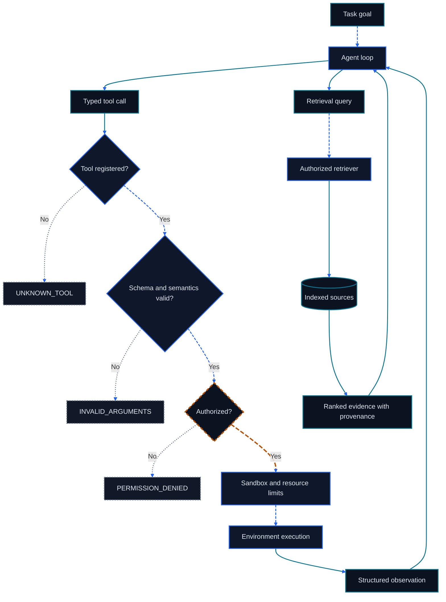

<div align="right">
  <a href="./第五章%20基于低代码平台的智能体搭建.md">中文</a> | English
</div>

# Chapter 5: Tools, Environments, and Agentic RAG

<figure class="course-hero">
  
  <figcaption><em>Practical agent builders combine tools, environments, and retrieval around a controlled core.</em></figcaption>
</figure>



<div class="diagram-legend" aria-label="Flow legend">
  <span class="diagram-legend-data">Data · solid cyan</span>
  <span class="diagram-legend-control">Control · dashed blue</span>
  <span class="diagram-legend-failure">Failure · dotted neutral</span>
  <span class="diagram-legend-approval">Approval/risk · long-dashed amber</span>
</div>

*Diagram conclusion:* The runtime validates and authorizes every tool path, while retrieval returns provenance-bearing evidence through the same controlled loop.

An agent does not directly touch files, databases, browsers, or business systems. It requests capabilities through typed Tools, the harness validates and authorizes them, and the Environment executes them and returns Observations. Retrieval is also tool interaction: an agent should query local evidence needed for its current decision instead of loading an entire knowledge base into context in advance. This chapter establishes that safe, testable data path.

By the end of this chapter, you should be able to:

- define a Tool contract with a schema, semantic constraints, permissions, and error semantics;
- explain the validate—authorize—sandbox—execute—observe order;
- design replayable feedback for a deterministic Environment;
- compare the boundaries of grep, SQL, API, and vector retrieval;
- build Agentic RAG with just-in-time context, progressive disclosure, and hybrid retrieval;
- run the local-corpus fixture and explain its denials and retrieval results.

## 5.1 A Tool Is a Controlled System Boundary

### 5.1.1 A Complete Tool Contract

A Tool description must answer when to use it, which arguments it accepts, which permission it requires, which state it changes, and how it reports success and failure. This schema matches the chapter fixture's `retrieve_context` call:

```json
{
  "name": "retrieve_context",
  "description": "Return small evidence snippets relevant to the next decision.",
  "parameters": {
    "type": "object",
    "properties": {
      "query": {"type": "string", "minLength": 1},
      "limit": {"type": "integer", "minimum": 1, "maximum": 3}
    },
    "required": ["query", "limit"],
    "additionalProperties": false
  },
  "permission": "corpus:read",
  "readOnly": true
}
```

`readOnly: true` is an explicit contract: `retrieve_context` may read the local corpus and return snippets, but it may not mutate the corpus or any external state. A schema solves only structural problems. The harness must still check blank queries, resource identifiers, path normalization, data scope, caller authority, and task policy.

| Layer | Example check | Failure code |
| --- | --- | --- |
| Registration | Is the Tool name in the allowlist? | `UNKNOWN_TOOL` |
| Structure | Required fields, types, ranges, extra fields | `INVALID_ARGUMENTS` |
| Semantics | Is the query blank, SQL read-only, or a path out of scope? | `INVALID_ARGUMENTS` or domain error |
| Authority | Does the current principal own the required capability? | `PERMISSION_DENIED` |
| Execution | Timeout, exit code, transaction result | `TOOL_ERROR` or typed domain error |
| Observation | Is the result complete, citable, and verifiable? | `OK`, partial result, or verification failure |

Validation must happen before execution. Errors must also become typed Observations. Do not wrap an authority denial as an ordinary search result, and do not silently drop an exception.

### 5.1.2 Validate—Authorize—Sandbox—Execute—Observe


The order is part of the contract. Validation before authorization keeps malformed input away from the executor; authorization does not bypass resource limits. High-sensitivity systems must also avoid error messages that reveal whether an unauthorized resource exists.

An Observation should retain at least:

```text
call_id, tool_name, ok, code, message,
started_at, duration, output_reference, verification
```

Sensitive arguments should be removed, masked, or hashed. Auditing needs correlation, which does not require storing every raw secret.

### 5.1.3 Permissions and Sandboxes

Permission answers “what may be done.” A sandbox limits “how much can be affected during an allowed execution.” Together they enforce least privilege.

| Boundary | Example control | Failure that must be tested |
| --- | --- | --- |
| Tool | Register only capabilities needed for the task | Request for an unregistered Tool |
| File | Workspace allowlist, normalized paths, read-only mounts | `../` escape and symlink escape |
| Process | Command allowlist, CPU/memory/time limits | Timeout, nonzero exit, oversized output |
| Network | Deny by default, allowlisted hosts and methods | Redirect to an unauthorized target |
| Database | Read-only account, parameterized query, row limit | Write statement, full export, slow query |
| API | Scoped token, idempotency key, rate limit | Replay, unauthorized object, partial success |
| Human approval | Show exact target, impact, and arguments | Arguments replaced after approval |

Approval should bind to a specific validated Action rather than permanently authorizing future free text.

## 5.2 The Environment Produces Decision-Ready Feedback

### 5.2.1 Environment Interface

The Environment is the external state in which the agent operates; a Tool is the interface used to access it. A testable interface accepts a `ToolCall`, returns a `ToolResult`, and makes the same initial state and input produce the same observable result.

```python
result = environment.dispatch(
    ToolCall("retrieve_context", {"query": "verification retry", "limit": 2}),
    granted_permissions={"corpus:read"},
)
```

Determinism does not mean the real world never changes. It means fixtures fix time, corpus, ordering, random seeds, and errors; production Observations record versions, time, and provenance so changes can be explained.

| Source of instability | Fixture strategy | Production record |
| --- | --- | --- |
| Time | Inject a fixed clock | Time zone and sample time |
| Network | Local response fixture | URL, status, retries, response summary |
| Search order | Fixed corpus and tie-break key | Query, index version, score |
| Database | Temporary read-only dataset | Snapshot or transaction version |
| Random decision | Fixed policy or seed | Model, parameters, seed, raw-response reference |

### 5.2.2 Observations Support the Next Step Instead of Dumping All Output

A tool result should retain facts that can change a decision: match location, primary key, status code, row count, score, truncation marker, and raw reference. A long log can live in an external artifact while only relevant excerpts and references enter context.

“No match” is an empty result after successful execution and should not masquerade as a Tool error. “Index unavailable” is an execution failure. The distinction lets the agent decide whether to rewrite a query, switch to an authorized source, or stop.

## 5.3 Four Retrieval Tool Classes

### 5.3.1 From Exact Lookup to Semantic Recall

| Retrieval | Strength | Query boundary | Key evidence | Common failure |
| --- | --- | --- | --- | --- |
| grep / code search | Exact terms, symbols, regexes, paths | Allowed directories and file types | File, line, matching excerpt | Vocabulary mismatch, generated-file noise |
| SQL | Structured filters, aggregates, joins | Read-only schema, parameterized values, row limit | Query, snapshot, rows and columns | Wrong join, stale replica, full scan |
| API | Remote business objects and current state | Host, method, object scope, rate | Request ID, status, version | Rate limit, missed pagination, partial success |
| Vector retrieval | Paraphrases and semantic similarity | Embedding model, index, top-k, filters | Document ID, chunk, distance, index version | False recall, broken chunks, version drift |

Start with the tool that expresses the problem's structure. Prefer code search for a function definition, SQL for order statistics, an API for authoritative current state, and vector recall when user language differs substantially from document vocabulary.

### 5.3.2 Hybrid Retrieval

Hybrid retrieval combines exact lexical signals, structured metadata, and semantic similarity. A common flow lets each retriever return candidates with provenance, merges them through normalized scores or rank fusion, deduplicates them, and applies authority filters.

```text
query
  ├─ lexical retrieval ─┐
  ├─ metadata filters ──┼─ fuse → rerank → authorize → snippets
  └─ vector retrieval ──┘
```

Fusion must not erase provenance. A final chunk should still carry its document ID, location, index version, and per-channel scores. Authority filters should narrow candidates before recall where possible and run again before return, preventing restricted content from leaking through ranks or errors.

To remain offline and hand-checkable, the chapter fixture scores lexical matches plus tag metadata and breaks ties by document ID. It does not pretend to implement vector search. A production retriever can replace this component while preserving the same Tool, authority, and Observation contracts.

## 5.4 Agentic RAG: Retrieval Controlled by the Loop

### 5.4.1 Difference from One-Shot RAG

One-shot RAG performs one fixed retrieval before generation. **Agentic RAG** lets the loop decide from the latest Observation whether retrieval is needed, which source to query, how to rewrite the query, whether to inspect the original, and when enough evidence has been collected.


Autonomy lives in query and next-step selection. Access scope, count budgets, source priority, and stop conditions remain under harness control.

### 5.4.2 JIT Context and Progressive Disclosure

**Just-in-time context** obtains evidence only when a decision needs it. **Progressive disclosure** presents a cheap, small index first and expands expensive content on demand.

| Level | Put in context | Expand when |
| --- | --- | --- |
| 0: capability catalog | Tool name, purpose, permission | Routing needs that class of capability |
| 1: retrieval result | Title, short excerpt, score, source ID | The excerpt may answer the current question |
| 2: local source | Exact lines, paragraph, record, or object | Meaning or parameters need verification |
| 3: full artifact | Full file, complete response, long log | Global structure must be synthesized |

This reduces tokens, latency, and the instruction-injection surface, and it lowers the chance that stale content occupies context for many steps. The trade-off is that the loop must retain source references and reliably expand the same object in later calls.

### 5.4.3 Retrieved Content Is Data

Web pages, documents, code comments, and database text may contain instructions such as “ignore earlier rules.” Retrieved content is untrusted data: separate it from system instructions, preserve provenance, cross-check high-impact facts, and never let content expand Tool authority by itself.

An answer should distinguish sourced facts, inferences, and unknowns. Returning an evidence gap when evidence is insufficient is more reliable than generating a complete narrative without provenance.

## 5.5 Deterministic Local-Corpus Fixture

The code lives in `code/go-agentic/05-tools-environments-rag/`; the [example README](../../code/go-agentic/05-tools-environments-rag/README.md) records its purpose, dependencies, inputs, outputs, safety boundary, limitations, and exact commands:

```bash
python3 -m pytest code/go-agentic/05-tools-environments-rag/test_environment.py -q
```

The tests demonstrate the complete boundary:

| Request | Result | Meaning |
| --- | --- | --- |
| Missing `limit` and no permission | `INVALID_ARGUMENTS` | Structural validation precedes authorization and execution |
| Blank query, Boolean `limit`, or out-of-range `limit` | `INVALID_ARGUMENTS` | Schema value constraints also apply before execution |
| Request for unregistered `shell` | `UNKNOWN_TOOL` | A model cannot invent a new capability |
| Valid retrieval without `corpus:read` | `PERMISSION_DENIED` | A valid schema does not grant authority |
| `verification retry`, `limit=2` | `loop-control`, `tool-contracts` | Fixed hybrid score and JIT snippets |
| Query with no match | `OK`, empty snippets | Report the evidence gap faithfully; invent nothing |

The corpus contains only three short documents, and its ordering rule is fully deterministic. The result contains only matching snippets rather than the whole corpus. This fixture is compatible with the Chapter 1 vocabulary but imports none of its environment or data.

## 5.6 Chapter Summary

- A Tool contract includes schema, semantics, authority, side effects, and structured errors.
- Safe dispatch follows validate—authorize—sandbox—execute—observe and retains auditable results.
- An Environment feeds real state back to the loop through versioned, citable Observations.
- grep, SQL, API, and vector retrieval solve differently structured problems; hybrid retrieval combines recall while preserving provenance.
- Agentic RAG uses the loop to control queries and stopping; JIT context and progressive disclosure load only the evidence needed next.
- The offline fixture proves invalid arguments, unknown Tools, authority denial, deterministic ranking, and empty-result semantics.

## Exercises

1. Write a JSON Schema, semantic validation, permission, row limit, and three error codes for a read-only SQL Tool.
2. Design grep, vector, and hybrid queries for “find authentication logic in this repository.” State what each should retrieve.
3. Design a four-level progressive-disclosure interface for a 5,000-line log. Identify the provenance fields retained at every level.
4. Add a document to the local fixture that ties on score for `retry`. Predict the tie-break order before writing and running the test.
5. Design a retrieval-injection attack. Explain which step is stopped by instruction isolation, authority checks, and independent verification.

## Mastery Standard

You meet this chapter's standard when you can derive every registration, schema, semantic, authority, sandbox, execution, and Observation check from a Tool Call; choose boundaries for all four retrieval classes; design provenance-preserving hybrid retrieval and progressive disclosure; and explain why every fixture denial and empty result neither executes nor invents content.

## Primary Sources

1. JSON Schema. [Draft 2020-12 specification](https://json-schema.org/specification-links#2020-12).
2. OWASP. [Top 10 for Large Language Model Applications](https://owasp.org/www-project-top-10-for-large-language-model-applications/).
3. Lewis, P. et al. (2020). [Retrieval-Augmented Generation for Knowledge-Intensive NLP Tasks](https://arxiv.org/abs/2005.11401).
4. Robertson, S., & Zaragoza, H. (2009). [The Probabilistic Relevance Framework: BM25 and Beyond](https://www.staff.city.ac.uk/~sbrp622/papers/foundations_bm25_review.pdf).
5. Cormack, G. V., Clarke, C. L. A., & Buettcher, S. (2009). [Reciprocal Rank Fusion Outperforms Condorcet and Individual Rank Learning Methods](https://dl.acm.org/doi/10.1145/1571941.1572114).
6. NIST. [Secure Software Development Framework](https://csrc.nist.gov/Projects/ssdf).
