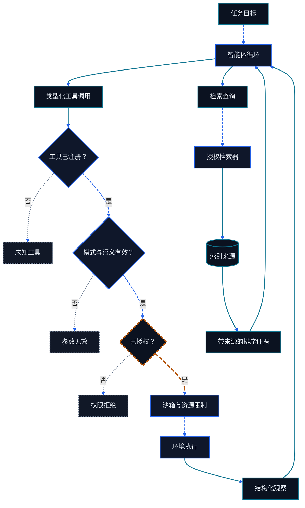

<div align="right">
  中文 | <a href="./Chapter5-Building-Agents-with-Low-Code-Platforms.md">English</a>
</div>

# 第五章 工具、环境与 Agentic RAG

<figure class="course-hero">
  
  <figcaption><em>实用的智能体搭建平台围绕受控核心组合工具、环境与检索。</em></figcaption>
</figure>



<div class="diagram-legend" aria-label="流程图例">
  <span class="diagram-legend-data">数据 · 青色实线</span>
  <span class="diagram-legend-control">控制 · 蓝色虚线</span>
  <span class="diagram-legend-failure">失败 · 中性色点线</span>
  <span class="diagram-legend-approval">审批/风险 · 琥珀色长虚线</span>
</div>

*图示结论：* 运行时校验并授权每条工具路径，检索则通过同一受控循环返回保留来源的证据。

Agent 不直接接触文件、数据库、浏览器或业务系统。它通过类型化 Tool 请求能力，由 Harness 校验和授权，再由 Environment 执行并返回 Observation。检索也是工具交互：Agent 应按当前决策需要查询局部证据，而不是把整个知识库预先塞进上下文。本章建立这条安全、可测试的数据路径。

学完本章，你应能：

- 定义包含 Schema、语义约束、权限和错误语义的 Tool 契约；
- 解释 validate—authorize—sandbox—execute—observe 顺序；
- 为确定性 Environment 设计可重放反馈；
- 比较 grep、SQL、API 与向量检索的边界；
- 用即时上下文、渐进披露和混合检索构建 Agentic RAG；
- 运行本地语料 Fixture 并解释拒绝与检索结果。

## 5.1 Tool 是受控的系统边界

### 5.1.1 一个完整 Tool 契约

Tool 描述必须回答：它何时使用、接受什么参数、需要什么权限、改变什么状态、怎样返回成功和失败。下面的 Schema 与本章 Fixture 的 `retrieve_context` 调用对应：

```json
{
  "name": "retrieve_context",
  "description": "Return small evidence snippets relevant to the next decision.",
  "parameters": {
    "type": "object",
    "properties": {
      "query": {"type": "string", "minLength": 1},
      "limit": {"type": "integer", "minimum": 1, "maximum": 3}
    },
    "required": ["query", "limit"],
    "additionalProperties": false
  },
  "permission": "corpus:read",
  "readOnly": true
}
```

`readOnly: true` 是显式契约：`retrieve_context` 只能读取本地语料并返回片段，不能修改语料或任何外部状态。Schema 只解决结构问题。Harness 仍需检查空白 Query、资源标识、路径规范化、数据范围、调用者权限和任务策略。

| 层 | 检查示例 | 失败代码 |
| --- | --- | --- |
| 注册 | Tool 名是否在允许列表 | `UNKNOWN_TOOL` |
| 结构 | 必需字段、类型、范围、额外字段 | `INVALID_ARGUMENTS` |
| 语义 | Query 是否为空、SQL 是否只读、路径是否越界 | `INVALID_ARGUMENTS` 或领域错误 |
| 权限 | 当前主体是否拥有所需能力 | `PERMISSION_DENIED` |
| 执行 | 超时、退出码、事务结果 | `TOOL_ERROR` 或类型化领域错误 |
| 观察 | 结果是否完整、可引用、可验证 | `OK`、部分结果或验证失败 |

校验必须发生在执行前。错误也必须成为类型化 Observation；不要把权限拒绝包装成普通搜索结果，也不要让异常静默丢失。

### 5.1.2 Validate—Authorize—Sandbox—Execute—Observe


顺序本身属于契约。先校验再授权可以防止无效输入到达执行器；授权通过也不意味着可以绕过资源限制。对高敏感系统，还需避免错误消息泄露未经授权资源是否存在。

一个 Observation 至少应保留：

```text
call_id, tool_name, ok, code, message,
started_at, duration, output_reference, verification
```

敏感参数应删除、掩码或哈希；审计需要可关联性，不等于保存所有原始秘密。

### 5.1.3 权限与沙箱

权限回答“可以做什么”，沙箱限制“即使允许，执行时最多能影响什么”。二者共同使用最小权限原则。

| 边界 | 示例控制 | 必测失败 |
| --- | --- | --- |
| Tool | 只注册本任务需要的能力 | 请求未注册 Tool |
| 文件 | 工作目录白名单、规范化路径、只读挂载 | `../` 越界与符号链接逃逸 |
| 进程 | 命令允许列表、CPU/内存/时间限制 | 超时、非零退出、输出过大 |
| 网络 | 默认拒绝、域名和方法白名单 | 重定向到未授权目标 |
| 数据库 | 只读账户、参数化查询、行数限制 | 写语句、全表导出、慢查询 |
| API | 作用域 Token、幂等键、速率限制 | 重放、越权对象、部分成功 |
| 人工审批 | 精确显示目标、影响和参数 | 批准后参数被替换 |

批准应绑定经过校验的具体 Action，而不是给后续自由文本永久授权。

## 5.2 Environment 产生可决策的反馈

### 5.2.1 Environment 接口

Environment 是 Agent 所在的外部状态，而 Tool 是访问它的接口。一个可测试的接口接收 `ToolCall`，返回 `ToolResult`，并使相同初始状态和输入产生相同可观察结果。

```python
result = environment.dispatch(
    ToolCall("retrieve_context", {"query": "verification retry", "limit": 2}),
    granted_permissions={"corpus:read"},
)
```

确定性不要求真实世界永远不变。它要求 Fixture 固定时间、语料、排序、随机种子和错误；生产 Observation 则记录版本、时间和来源，使变化可解释。

| 不稳定来源 | Fixture 策略 | 生产记录 |
| --- | --- | --- |
| 时间 | 注入固定时钟 | 时区与采样时间 |
| 网络 | 本地响应 Fixture | URL、状态码、重试与响应摘要 |
| 搜索排序 | 固定语料和并列排序键 | Query、索引版本、得分 |
| 数据库 | 临时只读数据集 | 快照或事务版本 |
| 随机决策 | 固定策略或 Seed | 模型、参数、Seed 与原始响应引用 |

### 5.2.2 Observation 要支持下一步，而不是倾倒全部输出

工具结果应保留改变决策的事实：匹配位置、主键、状态码、行数、得分、截断标记和原始引用。超长日志可以存入外部 Artifact，只把相关片段和引用放入上下文。

“没有匹配”是成功执行后的空结果，不应伪装成 Tool 错误；“索引不可用”才是执行失败。区分二者可以让 Agent 决定改写 Query、切换已授权来源或停止。

## 5.3 四类检索工具

### 5.3.1 从精确查找到语义召回

| 检索 | 强项 | Query 边界 | 关键证据 | 常见失败 |
| --- | --- | --- | --- | --- |
| grep / 代码搜索 | 精确词、符号、正则、路径 | 允许的目录与文件类型 | 文件、行号、匹配片段 | 术语不一致、生成文件噪声 |
| SQL | 结构化过滤、聚合、连接 | 只读 Schema、参数化值、行数上限 | 查询、快照、行与列 | 错误连接、陈旧副本、全表扫描 |
| API | 远程业务对象与实时状态 | 域名、方法、对象范围、速率 | 请求 ID、状态码、版本 | 限流、分页遗漏、部分成功 |
| 向量检索 | 同义表达与语义相似 | 嵌入模型、索引、Top-k、过滤器 | 文档 ID、Chunk、距离、索引版本 | 错召回、切块断义、版本漂移 |

先用最能表达问题结构的工具。查函数定义优先使用代码搜索；统计订单优先使用 SQL；读取权威当前状态使用 API；用户措辞与文档术语差异大时再增加向量召回。

### 5.3.2 混合检索

混合检索组合精确词法、结构化元数据和语义相似度。常见流程是各检索器独立返回带来源的候选，再用归一化得分或排名融合合并，最后去重并应用权限过滤。

```text
query
  ├─ lexical retrieval ─┐
  ├─ metadata filters ──┼─ fuse → rerank → authorize → snippets
  └─ vector retrieval ──┘
```

融合不能洗掉来源。最终 Chunk 仍应携带文档 ID、位置、索引版本和各路得分。权限过滤应在召回前尽量缩小候选，并在返回前再次执行，避免通过排名或错误消息泄露受限内容。

本章 Fixture 为保持离线和可手算，使用词法匹配加 Tag 元数据得分，并以文档 ID 打破并列；它没有伪装成真实向量搜索。生产系统可以替换检索器，但应保留相同 Tool、权限和 Observation 契约。

## 5.4 Agentic RAG：由循环控制检索

### 5.4.1 与一次性 RAG 的区别

一次性 RAG 在生成前固定检索一次。**Agentic RAG** 让循环根据最新 Observation 决定：是否需要检索、查询哪个来源、如何改写 Query、是否跟进原文、何时已有足够证据。


自主性位于 Query 和下一步选择中；访问范围、次数预算、来源优先级和停止条件仍由 Harness 控制。

### 5.4.2 JIT Context 与 Progressive Disclosure

**即时上下文（JIT Context）** 只在某次决策需要时获取证据。**渐进披露（Progressive Disclosure）** 先提供便宜的小索引，再按需展开昂贵内容。

| 层级 | 放入上下文 | 何时展开 |
| --- | --- | --- |
| 0：能力目录 | Tool 名、用途、权限 | 路由需要某类能力时 |
| 1：检索结果 | 标题、短片段、得分、来源 ID | 片段可能回答当前问题时 |
| 2：局部原文 | 精确行、段落、记录或对象 | 需要验证含义或参数时 |
| 3：完整 Artifact | 全文件、完整响应、长日志 | 必须综合全局结构时 |

这减少 Token、延迟和指令注入面，也降低旧内容长期占据上下文的概率。代价是循环必须保留来源引用，并能在后续调用中稳定展开同一对象。

### 5.4.3 检索内容是数据

网页、文档、代码注释和数据库文本可能包含“忽略之前规则”之类的指令。检索结果属于不可信数据：将其与系统指令分隔，保留来源，对高影响事实交叉验证，并禁止内容自行扩大 Tool 权限。

回答应区分来源事实、推断和未知项。没有足够证据时返回证据缺口，比生成无来源的完整叙述更可靠。

## 5.5 确定性本地语料 Fixture

代码位于 `code/go-agentic/05-tools-environments-rag/`；[示例 README](../../code/go-agentic/05-tools-environments-rag/README.md)列出目的、依赖、输入输出、安全边界、限制和精确命令：

```bash
python3 -m pytest code/go-agentic/05-tools-environments-rag/test_environment.py -q
```

这些测试展示完整边界：

| 请求 | 结果 | 说明 |
| --- | --- | --- |
| 缺少 `limit` 且无权限 | `INVALID_ARGUMENTS` | 结构校验先于授权和执行 |
| 空 Query、布尔或越界 `limit` | `INVALID_ARGUMENTS` | Schema 值约束也在执行前生效 |
| 请求未注册的 `shell` | `UNKNOWN_TOOL` | 模型不能创造新能力 |
| 合法检索但无 `corpus:read` | `PERMISSION_DENIED` | Schema 正确不代表已授权 |
| `verification retry`, `limit=2` | `loop-control`、`tool-contracts` | 固定混合得分与 JIT 片段 |
| 无匹配 Query | `OK`、空 Snippet | 忠实返回证据缺口，不编造内容 |

语料只有三个短文档，排序规则完全确定。返回值只包含命中的短片段，而不是整个 Corpus。该 Fixture 与第一章术语兼容，但没有导入第一章环境或数据。

## 5.6 本章小结

- Tool 契约包含 Schema、语义、权限、副作用和结构化错误。
- 安全分派遵循 validate—authorize—sandbox—execute—observe，并保留可审计结果。
- Environment 通过版本化、可引用的 Observation 向循环反馈真实状态。
- grep、SQL、API 与向量检索解决不同结构的问题；混合检索合并召回但保留来源。
- Agentic RAG 用循环控制 Query 和停止，JIT Context 与渐进披露只加载下一步需要的证据。
- 离线 Fixture 证明了无效参数、未知 Tool、权限拒绝、确定排序和空结果语义。

## 习题

1. 为一个只读 SQL Tool 写出 JSON Schema、语义校验、权限、行数限制和三种错误代码。
2. 为“搜索仓库中的身份验证逻辑”设计 grep、向量检索和混合检索 Query；说明预期各自找回什么。
3. 把一段 5,000 行日志设计成四级渐进披露接口，并指出每级必须保留的来源字段。
4. 修改本地语料 Fixture，加入一个与 `retry` 同分的文档；先预测并列排序，再写测试验证。
5. 设计一次检索注入攻击，说明指令隔离、权限检查和独立验证分别阻止哪一步。

## 掌握标准

当你能从一个 Tool Call 推导注册、Schema、语义、权限、沙箱、执行和 Observation 的每道检查；能为四类检索选择合适边界；能设计保留来源的混合检索与渐进披露；并能解释 Fixture 每个拒绝和空结果为何不会执行或编造内容时，即达到本章要求。

## 一手资料

1. JSON Schema. [Draft 2020-12 specification](https://json-schema.org/specification-links#2020-12).
2. OWASP. [Top 10 for Large Language Model Applications](https://owasp.org/www-project-top-10-for-large-language-model-applications/).
3. Lewis, P. et al. (2020). [Retrieval-Augmented Generation for Knowledge-Intensive NLP Tasks](https://arxiv.org/abs/2005.11401).
4. Robertson, S., & Zaragoza, H. (2009). [The Probabilistic Relevance Framework: BM25 and Beyond](https://www.staff.city.ac.uk/~sbrp622/papers/foundations_bm25_review.pdf).
5. Cormack, G. V., Clarke, C. L. A., & Buettcher, S. (2009). [Reciprocal Rank Fusion Outperforms Condorcet and Individual Rank Learning Methods](https://dl.acm.org/doi/10.1145/1571941.1572114).
6. NIST. [Secure Software Development Framework](https://csrc.nist.gov/Projects/ssdf).
