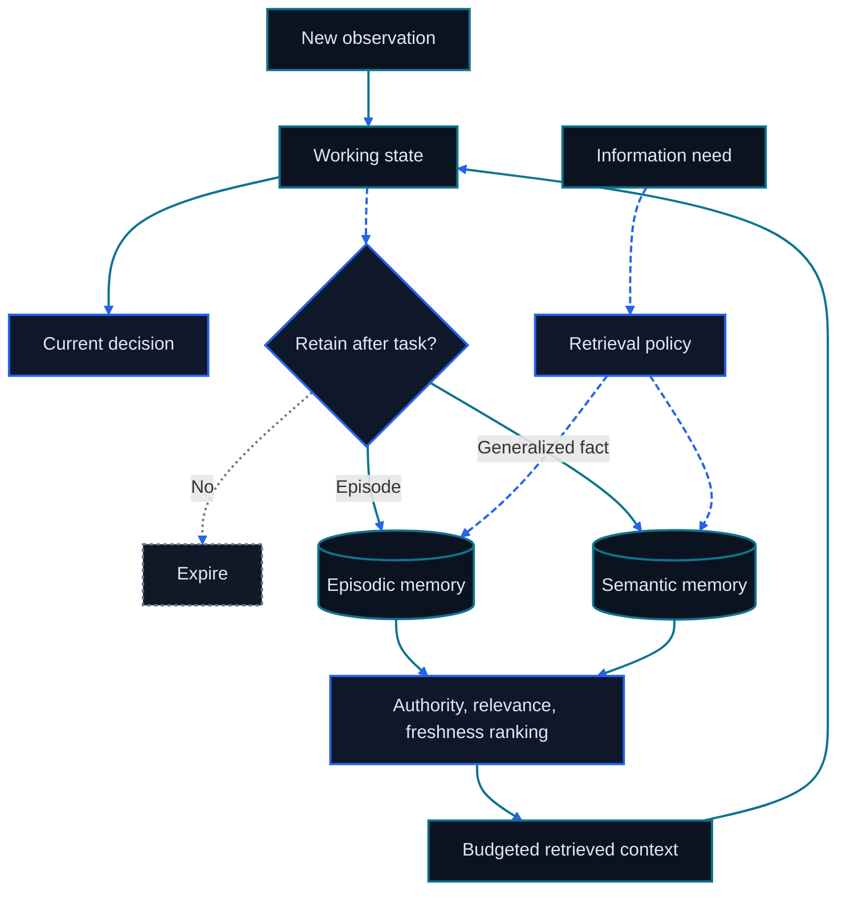

> This chapter is part of the bilingual Go Agentic course. For project attribution and third-party notices, see [Sources and Acknowledgements](../Sources-and-Acknowledgements.md).

# Chapter 8: RAG and Memory Systems

<figure class="course-hero">
  
  <figcaption><em>Useful memory systems separate timescales and retrieve only what the task needs.</em></figcaption>
</figure>



<div class="diagram-legend" aria-label="Flow legend">
  <span class="diagram-legend-data">Data · solid cyan</span>
  <span class="diagram-legend-control">Control · dashed blue</span>
  <span class="diagram-legend-failure">Failure · dotted neutral</span>
</div>

*Diagram conclusion:* Memory is a lifecycle: working state is selectively consolidated, then authority-filtered retrieval returns only decision-relevant context.

An Agent cannot place an entire repository, inbox, document collection, and task history into every model call. It needs retrieval to find current evidence, memory to retain selected experience, and durable external state to represent real-world facts. Treating all three as “memory” creates stale answers and unsafe writes.

This chapter builds the separation, then implements a deterministic local fixture for retrieval, write policy, consolidation, forgetting, provenance, privacy, and versioned external state. The two recurring course cases—login repair and procurement execution—show where each mechanism belongs.

## 8.1 Retrieval, Memory, and External State Are Different Contracts

| System | Question answered | Authority | Typical lifetime | Example |
| --- | --- | --- | --- | --- |
| Retrieval | What evidence is relevant now? | Original source | One decision or turn | Current test, file, email, contract clause |
| Memory | What selected experience may help later? | Derived and correctable | Across turns or sessions | Prior incident, user preference, learned procedure |
| Durable external state | What is true in the operating system? | Business system of record | Until a valid update | Git tree, ERP order status, approval record |

Retrieval is an access operation. RAG is a pattern that retrieves evidence and places it in the generation context. Memory is a lifecycle: decide what to write, retrieve it later, reconcile conflicts, consolidate repetitions, and forget or delete it. External state has its own schema, authorization, transaction, and concurrency rules.

Suppose memory says purchase order `PO-7` is delayed, but the ERP now says `shipped`. The Agent should not “recall” its way around the ERP. It must read the current record, treat the old memory as stale context, and update any derived memory only after validation.

```text
sources ──retrieve──→ evidence for this turn
                           │
                           ↓
                     model decision
                       │         │
             selected lesson   authorized mutation
                       │         │
                       ↓         ↓
                    memory   external state
```

## 8.2 A Practical Memory Taxonomy

The categories describe different jobs rather than storage products.

| Category | Content | Lifetime and update rule | Course example |
| --- | --- | --- | --- |
| Working memory | Current goal, recent observations, scratch results | Short; replace as the task changes | Current login failure and candidate cause |
| Episodic memory | A specific event with time and source | Retain when the event may matter again | “Test run 42 failed before normalization fix” |
| Semantic memory | A generalized fact or stable relationship | Consolidate from evidence; correct on conflict | “Usernames are normalized at the auth boundary” |
| Procedural memory | A reusable method or policy | Version and evaluate like code | “Run focused tests before broad tests” |
| External state | Authoritative operational record | Read/write through its owning system | Current file contents or ERP status |

Working memory often lives in the current Context. Episodic, semantic, and procedural memory may persist outside it. External state remains separate even when a database stores both: a supplier preference inferred from emails and the purchase order’s legally effective delivery date have different authority.

### 8.2.1 History is not automatically memory

A full transcript is an audit trail. It contains repeated searches, obsolete hypotheses, Tool errors, and accidental disclosures. A memory system should select records through a write policy. Keeping everything increases storage, privacy exposure, retrieval noise, and contradiction risk.

## 8.3 Retrieval and RAG Produce Grounded Context

A basic RAG pipeline has two paths:

```text
offline or change-time path
source → parse → chunk → metadata → index

query-time path
question → retrieve → filter freshness/authority → rerank
         → select under token budget → generate → cite/validate
```

Lexical retrieval is strong for exact identifiers such as `PO-7`, filenames, error strings, and API names. Semantic retrieval helps with paraphrases. Metadata filters constrain tenant, date, document type, permission, or version. Hybrid retrieval combines these signals, then reranks the small candidate set.

Agentic retrieval turns the query path into a bounded loop. The Agent may first list repository paths, then search an error string, then read one function. Chapter 9 calls this Just-in-Time Context and progressive disclosure. The source remains authoritative throughout; retrieved text does not become memory merely because it entered Context.

### 8.3.1 Provenance, freshness, and hostile content

Every returned unit should carry enough metadata to audit and refresh it:

```text
source ID or URI
observed/indexed time
validity or version
tenant and permission scope
retrieval score and method
content hash when useful
```

Filter expired and unauthorized candidates before ranking. Require positive relevance before spending Context tokens. Treat retrieved documents as untrusted data: an email or web page that says “ignore your policy” is evidence content, not a higher-priority instruction.

When no source matches, return an honest empty result. Fabricated context is worse than an explicit gap because it hides the need for another search or human input.

### 8.3.2 Advanced Query and Fusion Patterns

- **Multi-query** searches several formulations for recall, with deduplication and a branch limit.
- **Query decomposition** turns a multi-hop question into verifiable subquestions and preserves provenance at every hop.
- **HyDE** retrieves with an embedding of a hypothetical answer; that hypothesis is a search aid, never evidence.
- **Reciprocal Rank Fusion (RRF)** combines ranks as $\sum_j 1/(k+r_j)$ instead of mixing incompatible raw scores.
- **Cross-encoder reranking** jointly reads query and chunk on a small candidate set; often more accurate and slower.

Expansion improves recall while enlarging the permission, injection, staleness, and context-pollution surface. Semantic similarity never authorizes a cross-tenant or cross-ACL result.

### 8.3.3 GraphRAG, REFRAG, and Selection Boundaries

GraphRAG makes entities and relations explicit for multi-hop relationship questions, but every edge still needs provenance to source evidence. REFRAG-style compressed retrieval reduces decode cost for large candidate sets while making explanation and precise citation harder.

Choose exact lexical search for identifiers, dense retrieval for paraphrases, hybrid/RRF when signals complement each other, graphs for evidenced relationships, and compressed retrieval only after measuring a capacity bottleneck.

```bash
cd code/go-agentic
python3 -m pytest 08-memory-rag/test_advanced_retrieval.py -q
```

## 8.4 Memory Starts with a Write Policy

Before persisting a candidate, ask six questions:

1. **Utility:** Will this change a plausible future decision?
2. **Evidence:** Is there a source, timestamp, and confidence basis?
3. **Stability:** Is it durable enough to outlive the current turn?
4. **Scope:** Does it belong to this task, project, user, or organization?
5. **Privacy:** May it be stored, retrieved, exported, and deleted under policy?
6. **Conflict:** Does an existing record need correction or versioning?

Good memory records are small and explicit:

```yaml
id: auth-normalization-rule
kind: semantic
content: Usernames are stripped at the authentication boundary.
source: test-run:login-42
created_at: 2026-09-13T10:20:00+08:00
importance: 4
privacy: internal
```

Secrets should stay in a credential store and be referenced by handle, not copied into memory. Guesses without provenance should remain hypotheses in working state. User corrections should supersede the old record while preserving an audit relationship where policy permits.

### 8.4.1 Read policy is as important as write policy

Memory retrieval should enforce tenant and privacy scope, discard expired records, require query relevance, and limit the result count. Rank relevance before recency; a fresh but unrelated record should not outrank an older relevant one. Return provenance with every hit so the loop can validate consequential claims against the source of truth.

## 8.5 Consolidation and Forgetting Keep Memory Useful

Consolidation turns repeated episodes into a smaller semantic record:

```text
email:1001 ─┐
            ├─→ “PO-7 is due September 11 after a material delay”
email:1008 ─┘             source_ids=[1001, 1008]
```

The new record must preserve source IDs. Before a source body can be forgotten, retain an immutable provenance tombstone containing its ID, kind, original source, creation time, and content hash; that ID remains reserved and cannot be reused. The tombstone keeps the semantic record auditable without retaining the source text. Consolidation is not permission to invent a general rule from one anecdote. Use thresholds for source count, agreement, confidence, or human approval according to impact.

Forgetting has several forms:

- expire working records that have passed their validity time;
- evict low-value records when a capacity budget is exceeded while retaining required provenance tombstones;
- supersede contradicted facts while keeping required audit links;
- delete data in response to retention or privacy policy;
- rebuild indexes and caches so deleted content cannot still be retrieved.

Backups, vector indexes, logs, model-provider traces, and provenance tombstones may have separate retention rules. “Deleted from the primary table” is therefore a claim that needs end-to-end verification. A privacy-erasure policy may also require deleting a tombstone; if so, dependent records must explicitly report that their lineage is no longer resolvable.

## 8.6 Apply the Separation to the Two Course Cases

| Layer | Login/code-repair case | Procurement case |
| --- | --- | --- |
| Retrieval | Failing test, current auth file, repository instructions | Latest email, contract clause, shipment event |
| Working memory | Current failure, hypothesis, next command | Order under review, missing evidence, next check |
| Episodic memory | Previous failed test and accepted fix | Supplier promised a new date in email 1001 |
| Semantic memory | Auth-boundary normalization convention | Validated supplier communication preference |
| Procedural memory | Inspect, edit minimally, run focused test | Verify ERP, approval, and contract before escalation |
| External state | Working tree and actual test result | ERP order status, approval record, sent message ID |

### 8.6.1 Login repair

Searching `FAIL ... username` should retrieve the exact test and implicated source. The Agent may retain an episode about the incident and later consolidate a stable repository convention. The current file and current test result remain external evidence. A memory that says “the test passed yesterday” cannot validate today’s working tree.

### 8.6.2 Procurement execution

The Agent may retrieve emails and contract terms, remember a validated supplier preference, and maintain working notes about missing shipment evidence. The current due date, approval, and order status belong in ERP or another system of record. Any mutation needs authorization, idempotency, and a returned state revision or message ID.

## 8.7 Deterministic Fixture

The local fixture at `code/go-agentic/08-memory-rag/` implements the chapter contracts with the Python standard library. Its [example README](../../code/go-agentic/08-memory-rag/README.md) records purpose, dependencies, inputs, outputs, safety boundaries, limitations, and exact commands.

| Interface | Behavior |
| --- | --- |
| `MemoryStore.write` | Rejects secret or unprovenanced candidates and duplicate IDs |
| `MemoryStore.retrieve` | Filters privacy and expiry, requires relevance, returns provenance |
| `MemoryStore.consolidate` | Creates a semantic record from at least two episodic source IDs |
| `MemoryStore.forget` | Removes expired records, then lowest-value overflow |
| `MemoryStore.resolve_provenance` | Resolves active or forgotten source records through immutable tombstones |
| `ExternalState.write` | Uses an expected revision to reject stale writes |

Run it from the repository root:

```bash
python3 -m pytest code/go-agentic/08-memory-rag/test_memory.py -q
```

The cases are fixed in memory. They do not call a model, network, vector database, or API and require no key. The retrieval test deliberately includes one expired relevant record and one fresh irrelevant record; neither may appear in the result.

## 8.8 Evaluate the System, Not the Demo

| Layer | Useful measures | Critical failure set |
| --- | --- | --- |
| Retrieval | Recall@k, precision@k, MRR/nDCG, latency, freshness | No match, stale match, exact identifier, unauthorized source |
| Generated answer | Citation correctness, groundedness, task accuracy | Conflicting sources, missing evidence, injected instructions |
| Memory write | Useful-write precision, missed-useful-write rate, duplication | Secret, unsupported inference, wrong tenant, user correction |
| Memory read | Downstream task success, contradiction rate, provenance coverage | Irrelevant high-importance item, expired fact, privacy boundary |
| Forget/delete | Removal completeness and reappearance rate | Cache, index, backup, and session search |
| External state | Schema validity, authorization, idempotency, revision conflicts | Concurrent update, retry, partial failure |

Evaluate with time-sliced data so future information cannot leak into past queries. Measure downstream decisions as well as retrieval ranking: a top-ranked passage is useful only if it helps produce a correct, authorized action.

## 8.9 Bounded Comparison: Hermes Memory

Verified against its official documentation on September 13, 2026, Hermes distinguishes persistent Agent notes and a user profile, supports session search for past conversations, documents write-approval controls, and can integrate external memory providers alongside its built-in memory. These are product mechanisms, not a replacement for the taxonomy above.

When evaluating Hermes or another runtime, map each mechanism to a contract: what is written, who can read it, which source supports it, how it is corrected or deleted, and whether it represents derived memory or authoritative external state. Recheck the current [Hermes memory documentation](https://hermes-agent.nousresearch.com/docs/user-guide/features/memory) because these capabilities evolve.

## 8.10 Common Failure Modes

- **Save everything:** retrieval becomes noisy and privacy exposure grows.
- **Memory as truth:** an old summary overrides a current file or ERP record.
- **Similarity without freshness:** an expired record ranks highly because its wording matches.
- **Importance without relevance:** a high-priority but unrelated memory enters Context.
- **Consolidation without lineage:** the system cannot explain or correct a derived fact.
- **Deletion without index cleanup:** supposedly forgotten content remains retrievable.
- **RAG as authorization:** retrieved instructions cause an action beyond the Task boundary.

## 8.11 Chapter Summary

- Retrieval finds evidence for the current decision; RAG places selected evidence into generation.
- Memory is a governed lifecycle for selected experience.
- Working, episodic, semantic, and procedural memory serve different time scales.
- Durable external state remains authoritative and requires transactional controls.
- Provenance, freshness, privacy, consolidation, forgetting, and evaluation are part of the design.
- The login and procurement cases use the same layers but assign authority to different systems.

## Exercises

1. Classify ten items from a recent coding task as retrieval evidence, a memory type, or external state.
2. Design a hybrid query for `PO-7` that uses exact identifiers, date filters, and semantic terms.
3. Write a memory policy that rejects credentials, unsupported guesses, and cross-tenant records.
4. Decide when two supplier emails are sufficient to consolidate a semantic fact and when approval is required.
5. Create a deletion test that checks the primary store, retrieval index, cache, and session search.
6. Extend the deterministic fixture with a corrected memory that supersedes an older record while retaining provenance.

## Mastery Standard

You have mastered this chapter when you can draw separate retrieval, memory, and external-state paths; assign a candidate to working, episodic, semantic, or procedural memory; define write/read/forget policies; and evaluate stale, irrelevant, private, conflicting, and missing evidence without confusing recall with truth.

## Primary Sources

1. [Retrieval-Augmented Generation for Knowledge-Intensive NLP Tasks](https://arxiv.org/abs/2005.11401)
2. [Dense Passage Retrieval for Open-Domain Question Answering](https://arxiv.org/abs/2004.04906)
3. [NIST Privacy Framework](https://www.nist.gov/privacy-framework)
4. [OWASP: Prompt Injection](https://genai.owasp.org/llmrisk/llm01-prompt-injection/)
5. [Hermes Agent official repository](https://github.com/NousResearch/hermes-agent)
6. [Hermes persistent-memory documentation](https://hermes-agent.nousresearch.com/docs/user-guide/features/memory)
