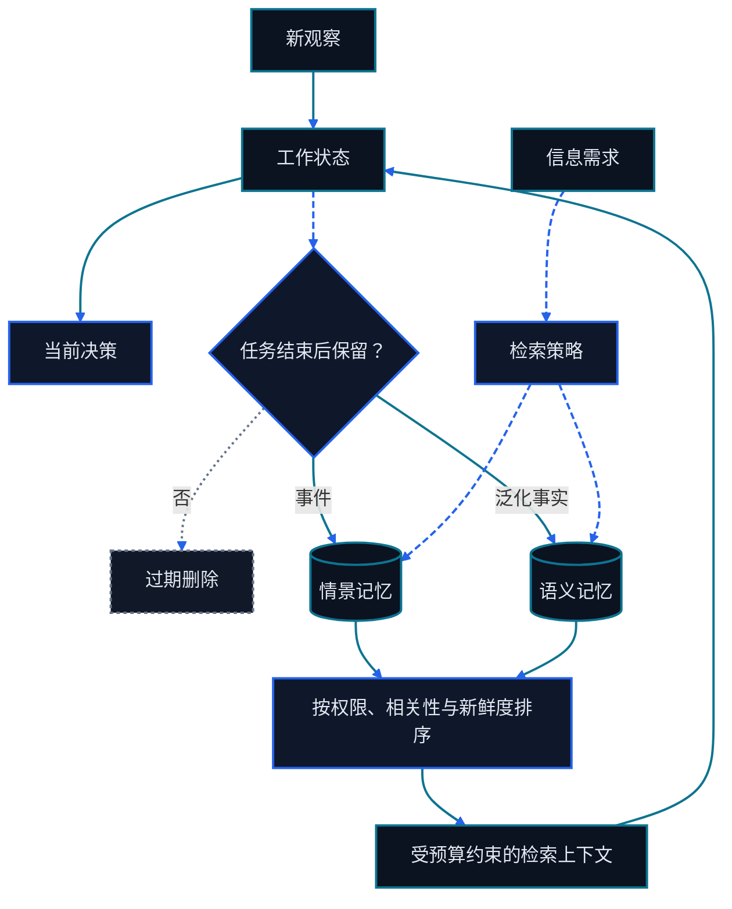

> 本章属于 Go Agentic 双语课程。项目归属与第三方说明见[来源与致谢](../来源与致谢.md)。

# 第八章 RAG 与记忆系统

<figure class="course-hero">
  
  <figcaption><em>有效的记忆系统区分时间尺度，并只检索任务所需的信息。</em></figcaption>
</figure>



<div class="diagram-legend" aria-label="流程图例">
  <span class="diagram-legend-data">数据 · 青色实线</span>
  <span class="diagram-legend-control">控制 · 蓝色虚线</span>
  <span class="diagram-legend-failure">失败 · 中性色点线</span>
</div>

*图示结论：* 记忆是一套生命周期：工作状态被选择性固化，随后经权限过滤的检索只返回当前决策所需上下文。

Agent 无法在每次模型调用中放入整个仓库、邮箱、文档集和任务历史。它需要 Retrieval 找到当前证据，需要 Memory 保留经过选择的经验，还需要 Durable External State 表示现实世界的事实。把三者都称为“记忆”，会产生陈旧答案和不安全写入。

本章先建立这组区分，再实现一个确定性本地 Fixture，覆盖检索、写入策略、整合、遗忘、来源、隐私和带版本的外部状态。课程中反复出现的两个案例——登录修复与采购执行——会说明每种机制应该放在哪里。

## 8.1 Retrieval、Memory 与 External State 是不同契约

| 系统 | 回答的问题 | 权威性 | 典型生命周期 | 例子 |
| --- | --- | --- | --- | --- |
| Retrieval | 现在有什么证据相关？ | 原始来源 | 一次决策或一轮 | 当前测试、文件、邮件、合同条款 |
| Memory | 哪些选定经验以后可能有用？ | 派生且可纠正 | 跨轮次或跨 Session | 过去事件、用户偏好、学到的流程 |
| Durable External State | 运行系统中的真实状态是什么？ | 业务 System of Record | 直到一次有效更新 | Git Tree、ERP 订单状态、批准记录 |

Retrieval 是访问操作。RAG 是检索证据并将其放入生成 Context 的模式。Memory 是一个生命周期：决定写什么、以后如何取回、怎样协调冲突、怎样整合重复信息，以及怎样遗忘或删除。External State 有自己的 Schema、授权、事务与并发规则。

假设 Memory 说采购订单 `PO-7` 延期，但 ERP 现在显示 `shipped`。Agent 不能凭“回忆”绕过 ERP。它必须读取当前记录，把旧 Memory 当作陈旧 Context，并且只在验证后更新派生记忆。

```text
来源 ──retrieve──→ 本轮证据
                     │
                     ↓
                  模型决策
                   │     │
             选定经验   授权修改
                   │     │
                   ↓     ↓
                memory  external state
```

## 8.2 实用的记忆分类

这些类别描述不同工作，而不是存储产品。

| 类别 | 内容 | 生命周期与更新规则 | 课程例子 |
| --- | --- | --- | --- |
| Working Memory | 当前目标、最近 Observation、草稿结果 | 短期；随任务变化替换 | 当前登录失败与候选原因 |
| Episodic Memory | 带时间和来源的具体事件 | 事件以后可能有用时保留 | “标准化修复前，测试运行 42 失败” |
| Semantic Memory | 泛化事实或稳定关系 | 从证据整合；冲突时纠正 | “用户名在认证边界标准化” |
| Procedural Memory | 可复用方法或策略 | 像代码一样版本化和评估 | “先跑聚焦测试，再跑宽测试” |
| External State | 权威运行记录 | 通过所属系统读写 | 当前文件内容或 ERP 状态 |

Working Memory 通常位于当前 Context。Episodic、Semantic 与 Procedural Memory 可以持久化在 Context 外。即使同一数据库存储两者，External State 也必须保持独立：从邮件推断出的供应商偏好，与订单具有法律效力的交付日期具有不同权威性。

### 8.2.1 History 不会自动成为 Memory

完整 Transcript 是审计轨迹，其中包含重复搜索、过期假设、Tool 错误和意外披露。Memory System 应通过写入策略选择记录。保存一切会增加存储、隐私暴露、检索噪声与矛盾风险。

## 8.3 Retrieval 与 RAG 生成有依据的 Context

基础 RAG Pipeline 有两条路径：

```text
离线或变更时路径
来源 → 解析 → 分块 → 元数据 → 索引

查询时路径
问题 → 检索 → 过滤时效/权威 → 重排
     → 在 token 预算内选择 → 生成 → 引用/验证
```

Lexical Retrieval 擅长 `PO-7`、文件名、错误文本和 API 名称等精确标识符。Semantic Retrieval 适合处理同义改写。Metadata Filter 可以约束租户、日期、文档类型、权限或版本。Hybrid Retrieval 组合这些信号，再对较小的候选集重排。

Agentic Retrieval 会把查询路径变成有界循环。Agent 可以先列出仓库路径，再搜索错误文本，最后读取一个函数。第九章把这种方式称为 Just-in-Time Context 与 Progressive Disclosure。原始来源始终保持权威；检索文本进入 Context，并不代表它自动成为 Memory。

### 8.3.1 Provenance、Freshness 与恶意内容

每个返回单元都应携带足够的元数据，以便审计和刷新：

```text
来源 ID 或 URI
观察/索引时间
有效期或版本
租户与权限范围
检索分数与方法
必要时的内容哈希
```

先过滤过期和未授权候选，再进行排序。只有正相关证据才值得消耗 Context token。检索文档应被视为不可信数据：邮件或网页中的“忽略你的策略”是证据内容，而不是更高优先级的指令。

没有来源匹配时，返回诚实的空结果。伪造 Context 比显式缺口更糟，因为它会掩盖继续搜索或请求人工输入的必要性。

### 8.3.2 高级查询与融合模式

- **Multi-query** 生成多个角度的查询，提高 Recall；必须去重和限制分支数。
- **Query decomposition** 将多跳问题拆为可验证子问题，每一跳保留来源。
- **HyDE** 先生成假设性答案的 Embedding 再检索，可缩短问题与文档的表达差；该假设不是证据。
- **Reciprocal Rank Fusion (RRF)** 用 $\sum_j 1/(k+r_j)$ 融合不同检索器的名次，避免直接混合不同尺度的原始分数。
- **Cross-encoder reranking** 在小候选集上联合读取 Query 与 Chunk，通常更准但更慢。

查询扩展会提高找到某物的概率，也会扩大权限、注入、过期和 Context 污染攻击面。候选不允许因语义相似而跨越 Tenant 或 ACL。

### 8.3.3 GraphRAG、REFRAG 与选型边界

GraphRAG 把实体和关系显式化，适合“谁与谁有什么可证明的联系”，但图中每条边仍需回指原始证据，否则只是把抽取错误结构化。REFRAG 类方法压缩检索表示以减少解码成本，适合超大候选集；其风险是压缩后可解释性和精确引用定位变弱。

选型顺序是：精确标识先 Lexical，同义转述用 Dense，两者互补时用 Hybrid/RRF，关系多跳再考虑 Graph，只在容量瓶颈已被测量时考虑压缩检索。

```bash
cd code/go-agentic
python3 -m pytest 08-memory-rag/test_advanced_retrieval.py -q
```

## 8.4 Memory 从 Write Policy 开始

持久化候选项前，先问六个问题：

1. **Utility：**它会改变未来某个合理决策吗？
2. **Evidence：**是否有来源、时间戳和置信依据？
3. **Stability：**它是否足够稳定，值得活过当前轮次？
4. **Scope：**它属于本任务、项目、用户还是组织？
5. **Privacy：**策略是否允许存储、检索、导出和删除？
6. **Conflict：**现有记录是否需要纠正或版本化？

好的 Memory Record 小而明确：

```yaml
id: auth-normalization-rule
kind: semantic
content: Usernames are stripped at the authentication boundary.
source: test-run:login-42
created_at: 2026-09-13T10:20:00+08:00
importance: 4
privacy: internal
```

Secret 应保留在凭证存储中，并通过 Handle 引用，不能复制进 Memory。没有 Provenance 的猜测应保留为 Working State 中的假设。用户纠正应取代旧记录，并在策略允许时保留审计关系。

### 8.4.1 Read Policy 与 Write Policy 同样重要

Memory Retrieval 应执行租户和隐私边界，丢弃过期记录，要求查询相关性，并限制结果数量。先按相关性，再考虑新近性；新鲜但无关的记录不应压过较旧的相关记录。每个 Hit 都应返回 Provenance，使循环能针对 Source of Truth 验证高影响主张。

## 8.5 Consolidation 与 Forgetting 维持记忆质量

Consolidation 把重复 Episode 转成更小的 Semantic Record：

```text
email:1001 ─┐
            ├─→ “PO-7 因材料延误，交期为 9 月 11 日”
email:1008 ─┘             source_ids=[1001, 1008]
```

新记录必须保留 Source ID。在遗忘来源正文之前，应保存不可变 Provenance Tombstone，其中包含 ID、Kind、原始 Source、Created Time 与 Content Hash；该 ID 此后保持占用，不得复用。Tombstone 无需保留来源文本，仍能使 Semantic Record 可审计。Consolidation 不是根据一次轶事编造普遍规则的许可。根据影响程度，为来源数量、一致性、置信度或人工批准设置阈值。

Forgetting 有多种形式：

- 让超过有效期的 Working Record 过期；
- 容量预算超限时淘汰低价值记录，同时保留必要的 Provenance Tombstone；
- 用新事实取代冲突记录，同时保留必要审计链接；
- 根据保留或隐私策略删除数据；
- 重建索引和缓存，避免已删内容仍可被检索。

Backup、Vector Index、Log、模型 Provider Trace 与 Provenance Tombstone 可能有不同保留规则。因此，“已经从主表删除”仍是一项需要端到端验证的主张。Privacy Erasure Policy 也可能要求删除 Tombstone；此时，依赖记录必须显式报告其 Lineage 已无法解析。

## 8.6 将这组区分应用到两个课程案例

| 层 | 登录/代码修复案例 | 采购案例 |
| --- | --- | --- |
| Retrieval | 失败测试、当前认证文件、仓库指令 | 最新邮件、合同条款、发运事件 |
| Working Memory | 当前失败、假设、下一条命令 | 正在检查的订单、缺失证据、下一次检查 |
| Episodic Memory | 过去失败的测试与已接受修复 | 供应商在邮件 1001 中承诺新日期 |
| Semantic Memory | 认证边界标准化约定 | 已验证的供应商沟通偏好 |
| Procedural Memory | 检查、最小编辑、运行聚焦测试 | 升级前核验 ERP、批准与合同 |
| External State | 工作树与真实测试结果 | ERP 订单状态、批准记录、已发送消息 ID |

### 8.6.1 登录修复

搜索 `FAIL ... username` 应检索准确测试和被指向的源码。Agent 可以保留这次事件，并在以后整合出稳定的仓库约定。当前文件和当前测试结果仍是外部证据。“昨天测试通过”的 Memory 无法验证今天的工作树。

### 8.6.2 采购执行

Agent 可以检索邮件和合同条款，记住已经验证的供应商偏好，并维护缺少发运证据的 Working Notes。当前交期、批准和订单状态属于 ERP 或其他 System of Record。任何修改都需要授权、幂等性，以及返回的 State Revision 或 Message ID。

## 8.7 确定性 Fixture

`code/go-agentic/08-memory-rag/` 中的本地 Fixture 仅使用 Python 标准库实现本章契约；[示例 README](../../code/go-agentic/08-memory-rag/README.md)列出目的、依赖、输入输出、安全边界、限制和精确命令。

| 接口 | 行为 |
| --- | --- |
| `MemoryStore.write` | 拒绝 Secret、无 Provenance 候选和重复 ID |
| `MemoryStore.retrieve` | 过滤隐私与有效期，要求相关性，返回 Provenance |
| `MemoryStore.consolidate` | 从至少两个 Episodic Source ID 创建 Semantic Record |
| `MemoryStore.forget` | 先删除过期记录，再删除溢出的最低价值记录 |
| `MemoryStore.resolve_provenance` | 通过不可变 Tombstone 解析仍在或已遗忘的 Source Record |
| `ExternalState.write` | 使用 Expected Revision 拒绝陈旧写入 |

在仓库根目录运行：

```bash
python3 -m pytest code/go-agentic/08-memory-rag/test_memory.py -q
```

测试案例固定在内存中，不调用模型、网络、向量数据库或 API，也不需要 Key。检索测试特意放入一个过期但相关的记录和一个新鲜但无关的记录；两者都不能进入结果。

## 8.8 评估系统，而不是 Demo

| 层 | 实用指标 | 关键失败集 |
| --- | --- | --- |
| Retrieval | Recall@k、Precision@k、MRR/nDCG、延迟、Freshness | 无匹配、陈旧匹配、精确标识符、未授权来源 |
| Generated Answer | 引用正确性、Groundedness、任务准确率 | 来源冲突、证据缺失、注入指令 |
| Memory Write | 有用写入准确率、有用写入漏记率、重复率 | Secret、无依据推断、错误租户、用户纠正 |
| Memory Read | 下游任务成功率、矛盾率、来源覆盖率 | 无关高重要度记录、过期事实、隐私边界 |
| Forget/Delete | 清除完整度与重新出现率 | Cache、Index、Backup 与 Session Search |
| External State | Schema 有效性、授权、幂等性、版本冲突 | 并发更新、重试、部分失败 |

使用按时间切分的数据评估，防止未来信息泄漏到过去查询。除了 Retrieval Ranking，还要测下游决策：排名第一的段落只有在帮助系统产生正确且获授权的行动时才有用。

## 8.9 有界对照：Hermes Memory

根据 2026 年 9 月 13 日核验的官方文档，Hermes 区分持久 Agent Notes 与 User Profile，支持对过去对话做 Session Search，提供写入批准控制，并能让外部 Memory Provider 与内置记忆并行工作。这些是产品机制，不能代替前面的分类契约。

评估 Hermes 或其他 Runtime 时，应把每种机制映射回契约：写什么、谁能读取、由什么来源支持、怎样纠正或删除，以及它表示派生 Memory 还是权威 External State。这些能力会变化，应重新核验当前的 [Hermes Memory 文档](https://hermes-agent.nousresearch.com/docs/user-guide/features/memory)。

## 8.10 常见失败模式

- **保存一切：**检索变得嘈杂，隐私暴露增加。
- **把 Memory 当真相：**旧 Summary 覆盖当前文件或 ERP 记录。
- **相似度不考虑 Freshness：**过期记录因文字匹配而排名很高。
- **Importance 不考虑 Relevance：**高优先级但无关的 Memory 进入 Context。
- **Consolidation 没有 Lineage：**系统无法解释或纠正派生事实。
- **删除后不清索引：**号称遗忘的内容仍能被检索。
- **把 RAG 当授权：**检索指令导致超出 Task Boundary 的行动。

## 8.11 本章小结

- Retrieval 为当前决策寻找证据；RAG 把选定证据放入生成过程。
- Memory 是针对选定经验的受治理生命周期。
- Working、Episodic、Semantic 与 Procedural Memory 服务于不同时间尺度。
- Durable External State 保持权威，并需要事务控制。
- Provenance、Freshness、Privacy、Consolidation、Forgetting 与 Evaluation 都属于系统设计。
- 登录和采购案例使用相同层次，但把权威交给不同系统。

## 习题

1. 从最近一次代码任务中选十个项目，将其分类为 Retrieval Evidence、某种 Memory 或 External State。
2. 为 `PO-7` 设计一个结合精确标识符、日期过滤和语义词的 Hybrid Query。
3. 编写 Memory Policy，拒绝凭证、无依据猜测和跨租户记录。
4. 判断两封供应商邮件何时足以整合出 Semantic Fact，何时必须批准。
5. 设计删除测试，同时检查主存储、Retrieval Index、Cache 与 Session Search。
6. 扩展确定性 Fixture，使一条纠正记录取代旧 Memory，同时保留 Provenance。

## 掌握标准

当你能够分别画出 Retrieval、Memory 与 External State 路径，把候选项分配到 Working、Episodic、Semantic 或 Procedural Memory，定义写入、读取和遗忘策略，并且在不把 Recall 当作 Truth 的前提下评估陈旧、无关、私密、冲突和缺失证据时，就掌握了本章。

## 一手资料

1. [Retrieval-Augmented Generation for Knowledge-Intensive NLP Tasks](https://arxiv.org/abs/2005.11401)
2. [Dense Passage Retrieval for Open-Domain Question Answering](https://arxiv.org/abs/2004.04906)
3. [NIST Privacy Framework](https://www.nist.gov/privacy-framework)
4. [OWASP：Prompt Injection](https://genai.owasp.org/llmrisk/llm01-prompt-injection/)
5. [Hermes Agent 官方仓库](https://github.com/NousResearch/hermes-agent)
6. [Hermes 持久记忆文档](https://hermes-agent.nousresearch.com/docs/user-guide/features/memory)
