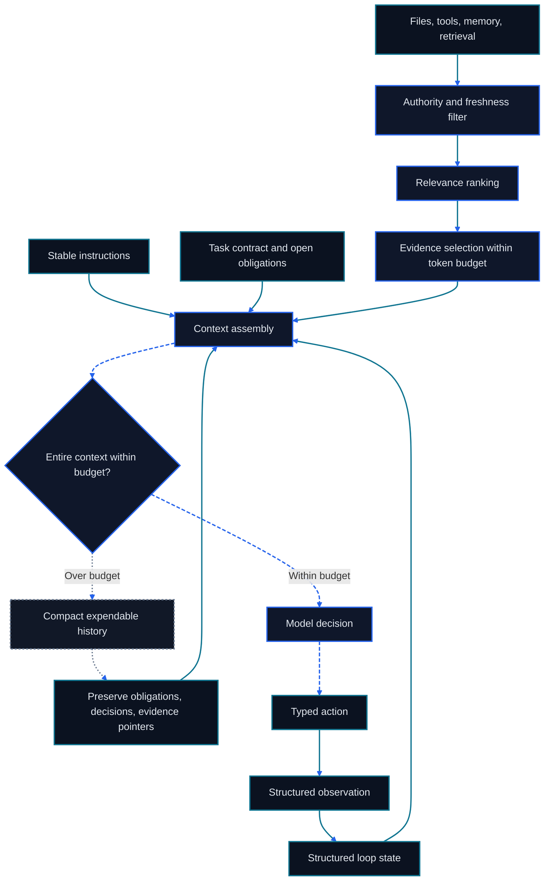

> This chapter is part of the bilingual Go Agentic course. For project attribution and third-party notices, see [Sources and Acknowledgements](../Sources-and-Acknowledgements.md).

# Chapter 9: Context Engineering and Loop Engineering

<figure class="course-hero">
  
  <figcaption><em>Context engineering selects and orders evidence before it reaches the model.</em></figcaption>
</figure>



<div class="diagram-legend" aria-label="Flow legend">
  <span class="diagram-legend-data">Data · solid cyan</span>
  <span class="diagram-legend-control">Control · dashed blue</span>
  <span class="diagram-legend-failure">Failure · dotted neutral</span>
</div>

*Diagram conclusion:* Context engineering is a budgeted selection pipeline whose compacted state must preserve obligations and evidence across loop iterations.

Prompt engineering shapes an instruction. Context engineering controls the full working set for every model call: instructions, Tool schemas, task state, selected evidence, recent observations, and output space. Loop engineering decides when to search, act, validate, retry, compact, resume, or stop.

These concerns meet in one practical question:

> What is the smallest current, relevant, and sufficient state that lets the Agent choose the next safe action and verify the result?

This chapter preserves the course’s Agentic Search, Just-in-Time Context, progressive disclosure, compaction, and structured-note path, then makes budgets, recovery, validation, termination, and economics explicit. The executable fixture is deterministic and has no tutorial-framework dependency.

## 9.1 Context Is the Model’s Current Working Set

A useful Context has distinct regions:

```text
system and project instructions
task, authority, and completion contract
Tool schemas
structured resume state
selected evidence with provenance
recent action—observation trace
reserved space for the next response
```

More Context is not automatically better. Irrelevant logs dilute attention; stale files conflict with current code; repeated Tool output costs tokens; untrusted documents may contain injected instructions. A long context window raises the capacity ceiling but does not select, validate, or structure its contents.

Context is also not Memory. Memory lives outside the current model call and must be retrieved. Durable state remains in the system that owns it. Context is the temporary view assembled from those sources for one decision.

## 9.2 Allocate a Context Budget Before Selecting Evidence

Treat the window as an accounting identity:

```text
window
= instructions
+ task and resume state
+ Tool schemas
+ selected evidence
+ recent trace
+ output reserve
```

If the fixed regions and output reserve consume the whole window, retrieval has no usable budget. If output reserve is omitted, the model may receive rich evidence but have no room to reason or answer.

The deterministic fixture uses:

```python
evidence_tokens = (
    window_tokens
    - instruction_tokens
    - tool_schema_tokens
    - output_reserve_tokens
)
```

Production accounting may also reserve tokens for task state, model-specific framing, and safety policies. Use the provider’s actual tokenizer at that boundary. The simple fixture accepts explicit token costs so its tests stay stable.

### 9.2.1 Spend tokens on decision value

A candidate earns Context space when it is authorized, current, relevant to the next decision, and useful enough for its token cost. Selection therefore happens after filtering:

```text
permission → freshness → relevance → ranking → budget fit
```

Recency cannot rescue irrelevance. Similarity cannot rescue expiry. A high-scoring document outside the user’s authority must never enter ranking.

## 9.3 Agentic Search and Just-in-Time Context

Fixed retrieval runs once before generation. Agentic Search is an iterative observation loop:

```text
form a narrow query
        ↓
inspect lightweight results
        ↓
enough evidence? ── yes ─→ act or answer
        │
        no
        ↓
refine query, change source, or expand one result
```

This is Just-in-Time (JIT) Context: keep most information outside the window and pull it in only when the current decision needs it. A coding Agent should not ingest a whole repository before it knows which subsystem failed. A procurement Agent should not load a month of email when an order ID and date range can narrow the search.

RAG names the retrieval-plus-generation pattern. Agentic RAG adds query planning, repeated retrieval, and evidence checks. JIT Context describes when material enters the window. The ideas overlap, but they answer different design questions.

### 9.3.1 Lightweight references are a map, not the territory

The Agent needs enough structure to decide where to look next:

```text
repository tree, filenames, sizes, and modification times
email sender, subject, thread ID, and date
database schema and row identifiers
document title, section headings, and page numbers
```

These references are cheaper than full content. They also preserve navigational handles for later retrieval. `tests/test_login.py` suggests expected behavior; `src/auth/login.py` suggests implementation; `contracts/2026/` is likely more current than an archive. Metadata guides search but does not prove a claim.

### 9.3.2 Progressive disclosure: overview to exact evidence

Autonomous navigation should expand information in stages:

```text
repository tree
  ↓ discover auth and tests
focused test output
  ↓ discover username normalization failure
relevant file summary
  ↓ discover normalize_username
exact function body
  ↓ support a minimal edit
focused test rerun
  ↓ validate completion
```

Each action earns the next piece of Context. The current window contains a map plus a few relevant artifacts instead of every file encountered. For procurement, the same pattern is `order ID → matching thread headers → latest message → cited commitment → ERP check`.

### 9.3.3 Validate retrieval before trusting it

For every selected unit, record source, observation time, validity or version, permission scope, and retrieval reason. Reject stale and irrelevant evidence explicitly. When sources conflict, surface the conflict and prefer the current authoritative source; do not average incompatible facts into a confident answer.

## 9.4 Long-Horizon Work Requires State, Not Endless History

Long tasks fail for two reasons:

1. The accumulated trace exceeds the context window.
2. The trace still fits but resolved problems, repeated searches, obsolete code, and old errors hide the state that matters.

The second is context pollution or context rot. The goal is not to retain every token. The goal is to retain enough state to continue correctly.

### 9.4.1 Compaction compresses history without losing the task

Compaction is a high-quality handoff from an old Context to a new one. After a long login migration, a useful record looks like this:

```text
Goal: migrate authentication and verify login behavior

Completed:
- login.py and oauth.py inspected
- 38 of 42 tests pass

Decisions:
- strip usernames at the authentication boundary
- preserve the refresh-token interface

Blockers:
- test_refresh_expired still fails

Evidence:
- test:login-42
- file:src/auth/login.py

Next:
- inspect refresh expiry calculation
- rerun the focused refresh test
```

Good compaction preserves the goal, authority, completion rule, decisions, completed work, unresolved failures, identifiers, paths, evidence references, consumed usage, limits, remaining budget, and next actions. It can discard duplicate searches, superseded hypotheses, and large outputs that are still available by reference.

Compaction is lossy. Every required evidence reference must be covered by at least one source snapshot; otherwise checkpoint creation fails. The summary must be auditable against the source event IDs, and critical state should also exist in structured records. Pi retains full session history in JSONL even when the model continues from a compacted representation.

### 9.4.2 Structured notes preserve resumable state outside Context

Compaction reacts to a growing trace. Structured notes are proactive: when an important decision or state change occurs, write it outside the model window in a stable schema.

```yaml
goal: fix_login_normalization
authority: [workspace:read, workspace:edit, tests:run]
completion_rule: focused_login_test_passes_against_current_file
completed:
  - read_failing_test
  - inspect_src/auth/login.py
decisions:
  - strip_surrounding_username_whitespace
blockers:
  - focused_test_still_failing
next_actions:
  - edit_login.py
  - rerun_focused_test
evidence_refs:
  - test:login-42
  - file:src/auth/login.py
usage: {steps: 2, input_tokens: 120, output_tokens: 30, cost_units: 6}
limits: {max_steps: 5, max_total_tokens: 500, max_cost_units: 20}
remaining_budget: {remaining_steps: 3, remaining_tokens: 350, remaining_cost_units: 14}
evidence_snapshots:
  - {evidence_id: e1, source: test:login-42, observed_at: 90, valid_until: 150, fingerprint: "<sha256>"}
  - {evidence_id: e2, source: file:src/auth/login.py, observed_at: 95, valid_until: 150, fingerprint: "<sha256>"}
```

Structured notes are task state, not an essay. Stable fields let a model and a human read, update, validate, and resume them. A checkpoint must survive serialization into a new object, reject negative consumed-usage counters, recompute remaining budget from persisted usage and limits, and compare evidence snapshots before releasing resumable state. If a legacy or tampered record lacks a snapshot for a required reference, restore must report that reference as missing and withhold state. Store the checkpoint in a versioned file, task database, or other durable system according to concurrency and privacy needs.

### 9.4.3 Compaction, memory, and external state

| Mechanism | Purpose | Trigger | Authority |
| --- | --- | --- | --- |
| Compaction record | Carry a shorter working history forward | Context pressure or phase boundary | Derived from the session trace |
| Structured resume state | Preserve authority, completion, progress, budgets, evidence state, and next action | Meaningful task-state change | Task-control record |
| Memory | Retain selected experience for later tasks | Memory write policy | Derived and correctable |
| External state | Represent current operational truth | Authorized system mutation | Owning system of record |

They work together. Compaction may reference Memory and external records, but it must not copy a stale business value and declare it authoritative.

### 9.4.4 Recovery is a validation procedure

On resume after interruption or compaction:

1. Deserialize a copy of the task goal, authority, completion rule, usage, limits, and structured state.
2. Recompute remaining step, token, and cost budgets; reject a persisted value that disagrees.
3. Confirm that every required evidence reference has a snapshot, then compare source, observation time, validity, and content fingerprint; flag each item as current, changed, stale, or missing.
4. Re-read mutable external state such as files, tests, approvals, or ERP records.
5. Release resumable state only when required evidence is current and a loop budget remains; otherwise revise, refresh, or terminate.

Recovery must tolerate a changed Environment. A resumed Agent may find a new commit, a corrected order, an expired approval, or a deleted file. Replaying the old next action without revalidation can corrupt current work.

## 9.5 Validation Engineering Defines “Done”

Validation is a separate responsibility from generation and Tool execution. For each action, identify the observer that can prove its postcondition:

| Action | Weak claim | Validating evidence |
| --- | --- | --- |
| Edit login logic | `edit` returned success | Focused test against current file |
| Retrieve contract term | Similar text was found | Current authorized clause with source ID |
| Update order | API returned 200 | Read-back state with new revision and values |
| Send escalation | Agent drafted a message | Provider message ID and intended recipient |

Validation can fail even when the Tool succeeds. A command can exit zero while checking the wrong target; an API can accept a request that later fails asynchronously. Define success from the Task’s postcondition and use the narrowest independent evidence that proves it.

When validation fails, return structured feedback to the loop: observed value, expected value, source, and whether retry is useful. Repeating the same action without new information is not recovery.

## 9.6 Termination Engineering Makes the Loop Bounded

A production loop needs explicit stop reasons, evaluated in a deliberate order:

```text
1. cancelled, denied, or unsafe
2. verified success
3. unrecoverable or invalid state
4. step, token, time, or cost budget exhausted
5. waiting for an external event or human decision
```

Every exit returns status, last validated state, remaining work, and evidence references. “Stopped” without a reason cannot be resumed reliably.

### 9.6.1 Retry only when the next attempt changes

A useful retry changes at least one variable: query, source, Tool arguments, hypothesis, execution Environment, or plan. Apply backoff to transient services, but do not back off a deterministic schema error. Escalate permission denial rather than silently searching for a bypass.

Detect no-progress loops with repeated action signatures, unchanged observations, or an unchanged state version. Stop before the nominal budget when further iterations have no plausible information gain.

## 9.7 Loop Economics: Every Iteration Must Earn Its Cost

One loop step may consume model input, model output, Tool fees, compute, wall time, and human review. Track them together:

```text
step cost = model input + model output + Tool/compute + review cost
total cost = sum(step cost for every attempt, including failed retries)
```

Large Context increases both input cost and latency. Repeatedly sending unchanged instructions and old Tool output compounds that cost. JIT retrieval, references, caching, and compaction reduce repeated input; focused validation prevents broad expensive checks on every step.

The continuation decision is economic as well as technical:

```text
continue only if
expected information or task value of the next step
    > marginal cost and risk,
and all authority and budget constraints still hold
```

At minimum, keep a loop ledger with step count, input/output tokens, Tool calls, cost units, elapsed time, validation result, and termination reason. Compare task success and total cost, not token price in isolation; a cheaper model that needs many retries may cost more overall.

## 9.8 Deterministic Context and Loop Fixture

`code/go-agentic/09-context-loop/` implements the chapter’s contracts with explicit token and cost units. Its [example README](../../code/go-agentic/09-context-loop/README.md) records purpose, dependencies, inputs, outputs, safety boundaries, limitations, and exact commands.

| Interface | Behavior |
| --- | --- |
| `ContextBudget` | Reserves instructions, Tool schemas, and output before evidence |
| `Evidence` | Rejects negative token costs before selection can bypass the budget |
| `select_context` | Filters stale/irrelevant evidence, ranks matches, and fits the budget |
| `CompactionRecord` | Serializes complete required-reference snapshots, authority, completion, usage, limits, and remaining budget |
| `restore_compaction` | Recomputes budgets and withholds state when a required snapshot is absent or evidence changed, expired, or disappeared |
| `LoopUsage` | Rejects negative persisted counters and accumulates steps, tokens, and cost units |
| `termination_reason` | Stops on verified success or step, token, and cost boundaries |

Run it from the repository root:

```bash
python3 -m pytest code/go-agentic/09-context-loop/test_context.py -q
```

The fixture does not call a model, provider tokenizer, network, or API. Tests use hand-checked token costs and fixed evidence. One case proves that expired matching evidence and fresh unrelated evidence are both rejected; another proves the selector never exceeds its evidence budget.

## 9.9 End-to-End Case Flows

### 9.9.1 Login repair

```text
budget fixed regions and output
  ↓
inspect repository map
  ↓
JIT retrieve focused failure and auth function
  ↓
edit minimal cause
  ↓
validate with focused test
  ↓
pass: save evidence and terminate
fail: update blocker/next action; retry or stop by budget
```

If Context pressure triggers compaction after the edit, the resume state must say the test is still unverified. A successful edit Observation cannot be compacted into “login fixed.”

### 9.9.2 Procurement tracking

Suppose the Agent tracks ABB order `PO-20260901`. Its structured state may be:

```yaml
order: PO-20260901
supplier: ABB
original_delivery_date: 2026-09-08
last_observed_commitment: 2026-09-11
commitment_source: email:1008
erp_revision: 17
status: delayed
next_action: check shipment event on 2026-09-11
```

When asked for an update, the Agent loads this reference state, then performs JIT retrieval only for messages and shipment events after the last observation. It validates the current ERP revision before answering or mutating anything. Compaction keeps the order ID, sources, last checked revision, approval state, and next action; it discards repeated mailbox searches.

This combines the chapter’s rules:

```text
structured state → know where to resume
JIT Context      → fetch only new evidence
validation       → confirm authoritative state
termination      → stop on proof, wait, or budget
ledger           → measure the full loop
```

## 9.10 Common Failure Modes

- **Context dump:** loading every file or message before a query exists.
- **Stale evidence:** using a once-relevant result after its version or validity changed.
- **Reference loss:** compaction preserves a conclusion but drops the source ID needed to audit it.
- **State loss:** a summary omits blockers or next actions and the Agent repeats completed work.
- **Premature success:** Tool execution is treated as Task validation.
- **Infinite retry:** the same action receives the same observation until cost exhaustion.
- **Budget cliff:** no output reserve remains when the model must answer.
- **Cheap-step illusion:** per-call price is optimized while retries and human recovery grow.

## 9.11 Chapter Summary

- Context is the model’s temporary working set, assembled for each decision.
- Budget fixed regions and output space before selecting evidence.
- Agentic Search, JIT Context, lightweight references, and progressive disclosure control what enters the window.
- Compaction compresses trace; structured notes preserve resumable state outside Context.
- Recovery revalidates mutable evidence before continuing.
- Validation defines completion; termination bounds failure; loop economics measures all attempts.

## Exercises

1. Allocate a 32,000-token window across instructions, state, Tool schemas, evidence, recent trace, and output reserve. Defend the trade-offs.
2. Design a progressive search path for a 50-file login subsystem and name the reference retained at each level.
3. Rewrite a vague compaction summary into goal, completed, decisions, blockers, evidence, and next actions.
4. Define validation and termination contracts for a procurement escalation that requires approval.
5. Construct a no-progress detector for repeated Tool calls with unchanged observations.
6. Extend the deterministic fixture with a cost-effective candidate that loses selection because it is unauthorized.

## Mastery Standard

You have mastered this chapter when you can budget a model call, retrieve evidence progressively, reject stale and irrelevant candidates, create an auditable compaction and resume record, recover against changed external state, define independent validation, terminate every loop with a reason, and compare solutions by verified task success and total cost.

## Primary Sources

1. Anthropic engineering note on [context design for AI agents](https://www.anthropic.com/engineering/effective-context-engineering-for-ai-agents)
2. [Pi compaction internals](https://github.com/earendil-works/pi/blob/main/packages/coding-agent/docs/compaction.md)
3. [Lost in the Middle: How Language Models Use Long Contexts](https://arxiv.org/abs/2307.03172)
4. [ReAct: Synergizing Reasoning and Acting in Language Models](https://arxiv.org/abs/2210.03629)
5. [NIST AI Risk Management Framework](https://www.nist.gov/itl/ai-risk-management-framework)
