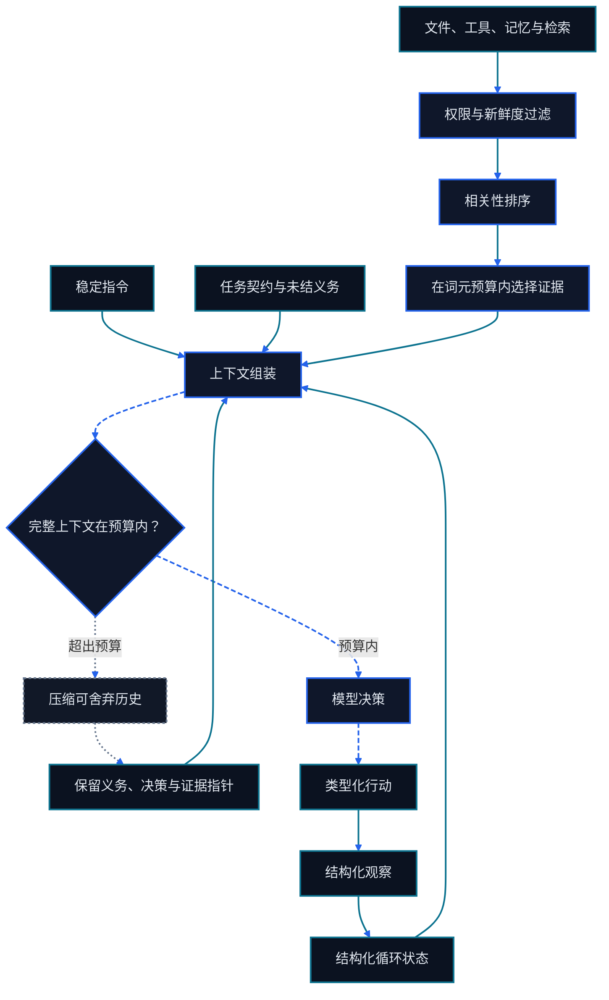

> 本章属于 Go Agentic 双语课程。项目归属与第三方说明见[来源与致谢](../来源与致谢.md)。

# 第九章 Context Engineering 与 Loop Engineering

<figure class="course-hero">
  
  <figcaption><em>上下文工程在信息进入模型前完成证据的选择与排序。</em></figcaption>
</figure>



<div class="diagram-legend" aria-label="流程图例">
  <span class="diagram-legend-data">数据 · 青色实线</span>
  <span class="diagram-legend-control">控制 · 蓝色虚线</span>
  <span class="diagram-legend-failure">失败 · 中性色点线</span>
</div>

*图示结论：* 上下文工程是受预算约束的选择管线，其压缩状态必须跨循环保留义务与证据。

Prompt Engineering 塑造一条指令。Context Engineering 控制每次模型调用的完整工作集：指令、Tool Schema、Task State、选定证据、最近 Observation 与输出空间。Loop Engineering 决定何时搜索、行动、验证、重试、压缩、恢复或停止。

这些问题汇聚成一个实用问题：

> 什么是最小、当前、相关且充分的状态，能让 Agent 选择下一项安全行动并验证结果？

本章保留课程已有的 Agentic Search、Just-in-Time Context、Progressive Disclosure、Compaction 与 Structured Notes 主线，再明确加入预算、恢复、验证、终止与经济性。可执行 Fixture 是确定性的，不依赖教程专用框架。

## 9.1 Context 是模型当前的工作集

一份有用的 Context 包含不同区域：

```text
System 与项目指令
Task、权限与完成契约
Tool Schema
结构化 Resume State
带 Provenance 的选定证据
最近的 Action—Observation Trace
为下一次响应预留的空间
```

更多 Context 不会自动带来更好结果。无关 Log 会稀释注意力；陈旧文件会与当前代码冲突；重复 Tool 输出会消耗 token；不可信文档可能包含注入指令。更长的上下文窗口只会提高容量上限，不会替你选择、验证和组织内容。

Context 也不是 Memory。Memory 位于当前模型调用之外，必须先被检索。Durable State 仍保留在拥有它的系统中。Context 是为一次决策从这些来源装配出的临时视图。

## 9.2 先分配 Context Budget，再选择证据

把窗口当作一条会计恒等式：

```text
window
= instructions
+ task and resume state
+ Tool schemas
+ selected evidence
+ recent trace
+ output reserve
```

如果固定区域与 Output Reserve 用完整个窗口，Retrieval 就没有可用预算。如果遗漏 Output Reserve，模型也许收到了丰富证据，却没有空间推理或回答。

确定性 Fixture 使用：

```python
evidence_tokens = (
    window_tokens
    - instruction_tokens
    - tool_schema_tokens
    - output_reserve_tokens
)
```

生产系统还可以为 Task State、模型特定边界文本和安全策略单独预留 token，并在边界处使用 Provider 的真实 Tokenizer。简单 Fixture 接收显式 Token Cost，使测试保持稳定。

### 9.2.1 把 token 花在决策价值上

候选项只有在获得授权、保持当前、与下一步决策相关，并且相对 Token Cost 足够有用时，才值得进入 Context。因此，选择发生在过滤之后：

```text
permission → freshness → relevance → ranking → budget fit
```

Recency 不能挽救 Irrelevance，Similarity 不能挽救 Expiry。超出用户权限的高分文档绝不能进入排序。

## 9.3 Agentic Search 与 Just-in-Time Context

固定 Retrieval 在生成前只运行一次。Agentic Search 是迭代式 Observation Loop：

```text
构造窄查询
    ↓
检查轻量结果
    ↓
证据足够？── 是 ─→ 行动或回答
    │
    否
    ↓
改写查询、更换来源或展开一条结果
```

这就是 Just-in-Time（JIT）Context：让大部分信息留在窗口外，只在当前决策需要时拉取。代码 Agent 不应在知道哪个子系统失败前加载整个仓库。采购 Agent 如果能用订单 ID 和日期范围缩小搜索，也不应加载一个月的邮件。

RAG 指“检索 + 生成”模式。Agentic RAG 增加查询规划、重复检索与证据检查。JIT Context 描述材料何时进入窗口。三者有交集，但回答的是不同设计问题。

### 9.3.1 Lightweight Reference 是地图，而不是领土

Agent 需要足够的结构来判断下一步去哪里看：

```text
仓库树、文件名、大小与修改时间
邮件发送方、主题、Thread ID 与日期
数据库 Schema 与 Row ID
文档标题、章节标题与页码
```

这些 Reference 比完整内容便宜，也会保留供后续检索使用的导航 Handle。`tests/test_login.py` 暗示预期行为；`src/auth/login.py` 暗示实现；`contracts/2026/` 很可能比 Archive 更新。Metadata 能引导搜索，但不能证明主张。

### 9.3.2 Progressive Disclosure：从概览走向精确证据

自主导航应分阶段展开信息：

```text
仓库树
  ↓ 发现 auth 与 tests
聚焦测试输出
  ↓ 发现 username normalization 失败
相关文件摘要
  ↓ 发现 normalize_username
精确函数体
  ↓ 支持最小编辑
重新运行聚焦测试
  ↓ 验证完成
```

每项行动都为下一份 Context 赢得理由。当前窗口只包含一张地图和少量相关工件，而不是所有遇到过的文件。对采购任务，同一模式是 `订单 ID → 匹配的 Thread Header → 最新消息 → 被引用的承诺 → ERP 检查`。

### 9.3.3 先验证 Retrieval，再相信它

为每个选定单元记录 Source、Observation Time、Validity 或 Version、Permission Scope 与检索原因。显式拒绝 Stale 和 Irrelevant Evidence。来源冲突时，应展示冲突并优先采用当前权威来源，不能把互不相容的事实平均成一个自信答案。

## 9.4 长时程工作需要状态，而不是无尽 History

长任务会因为两个原因失控：

1. 累积 Trace 超过上下文窗口。
2. Trace 仍放得下，但已解决问题、重复搜索、过期代码和旧错误遮住了真正重要的状态。

第二种问题就是 Context Pollution 或 Context Rot。目标不是保留每个 token，而是保留足以正确继续的状态。

### 9.4.1 Compaction 压缩历史，但不丢失任务

Compaction 是从旧 Context 到新 Context 的高质量交接。一次长登录迁移之后，有用的记录应该是：

```text
Goal: 迁移认证模块并验证登录行为

Completed:
- 已检查 login.py 与 oauth.py
- 42 项测试通过 38 项

Decisions:
- 在认证边界 strip username
- 保留 refresh-token 接口

Blockers:
- test_refresh_expired 仍失败

Evidence:
- test:login-42
- file:src/auth/login.py

Next:
- 检查 refresh 到期时间计算
- 重新运行聚焦的 refresh test
```

好的 Compaction 会保留 Goal、Authority、Completion Rule、Decision、Completed Work、Unresolved Failure、Identifier、Path、Evidence Reference、Consumed Usage、Limit、Remaining Budget 与 Next Action。它可以删除重复搜索、被推翻的假设和仍可通过 Reference 找回的大段输出。

Compaction 是有损的。每个必要 Evidence Reference 都必须由至少一个 Source Snapshot 覆盖；否则 Checkpoint 创建失败。Summary 必须能通过 Source Event ID 审计，关键状态也应存在于结构化记录中。Pi 即使让模型从压缩表示继续，也会在 JSONL 中保留完整 Session History。

### 9.4.2 Structured Notes 在 Context 外保存可恢复状态

Compaction 响应不断增长的 Trace。Structured Notes 更主动：重要决定或状态变更发生时，就在模型窗口外用稳定 Schema 记录。

```yaml
goal: fix_login_normalization
authority: [workspace:read, workspace:edit, tests:run]
completion_rule: focused_login_test_passes_against_current_file
completed:
  - read_failing_test
  - inspect_src/auth/login.py
decisions:
  - strip_surrounding_username_whitespace
blockers:
  - focused_test_still_failing
next_actions:
  - edit_login.py
  - rerun_focused_test
evidence_refs:
  - test:login-42
  - file:src/auth/login.py
usage: {steps: 2, input_tokens: 120, output_tokens: 30, cost_units: 6}
limits: {max_steps: 5, max_total_tokens: 500, max_cost_units: 20}
remaining_budget: {remaining_steps: 3, remaining_tokens: 350, remaining_cost_units: 14}
evidence_snapshots:
  - {evidence_id: e1, source: test:login-42, observed_at: 90, valid_until: 150, fingerprint: "<sha256>"}
  - {evidence_id: e2, source: file:src/auth/login.py, observed_at: 95, valid_until: 150, fingerprint: "<sha256>"}
```

Structured Notes 是 Task State，不是作文。稳定字段让模型和人都能读取、更新、验证并恢复。Checkpoint 必须经序列化形成独立新对象，拒绝负数 Consumed Usage Counter，根据持久化 Usage 与 Limit 重新计算 Remaining Budget，并在释放可恢复状态前比较 Evidence Snapshot。如果旧版或遭篡改的 Record 缺少必要 Reference 对应的 Snapshot，Restore 必须把该 Reference 报告为 Missing 并拒绝释放 State。根据并发与隐私要求，可将 Checkpoint 保存在版本化文件、Task Database 或其他 Durable System 中。

### 9.4.3 Compaction、Memory 与 External State

| 机制 | 目的 | 触发时机 | 权威性 |
| --- | --- | --- | --- |
| Compaction Record | 用更短的工作历史继续 | Context 压力或阶段边界 | 从 Session Trace 派生 |
| Structured Resume State | 保存 Authority、Completion、进度、预算、证据状态与下一步 | 有意义的 Task State 变化 | Task Control Record |
| Memory | 为未来任务保留选定经验 | Memory Write Policy | 派生且可纠正 |
| External State | 表示当前运行事实 | 获授权的系统修改 | 所属 System of Record |

它们可以协同。Compaction 可以引用 Memory 和 External Record，但不能复制一个陈旧业务值，再把它宣称为权威事实。

### 9.4.4 Recovery 是一项验证流程

在中断或 Compaction 之后恢复时：

1. 反序列化 Task Goal、Authority、Completion Rule、Usage、Limit 与 Structured State 的副本。
2. 重新计算剩余 Step、Token 与 Cost Budget；拒绝与计算结果不一致的持久化值。
3. 先确认每个必要 Evidence Reference 都有 Snapshot，再比较 Source、Observation Time、Validity 与 Content Fingerprint；把每项标记为 Current、Changed、Stale 或 Missing。
4. 重新读取文件、测试、批准或 ERP Record 等可变 External State。
5. 只有在必要证据仍为 Current 且循环预算尚存时才释放可恢复状态；否则修订、刷新或终止。

Recovery 必须容忍 Environment 已经变化。恢复后的 Agent 可能遇到新 Commit、已纠正订单、过期批准或被删除文件。不重新验证就重放旧 Next Action，可能破坏当前工作。

## 9.5 Validation Engineering 定义“完成”

Validation 与生成、Tool Execution 是不同职责。对每项行动，找出能够证明 Postcondition 的 Observer：

| 行动 | 弱主张 | 验证证据 |
| --- | --- | --- |
| 编辑登录逻辑 | `edit` 返回成功 | 针对当前文件的聚焦测试 |
| 检索合同条款 | 找到相似文本 | 当前且获授权的 Clause 与 Source ID |
| 更新订单 | API 返回 200 | 带新 Revision 与值的回读状态 |
| 发送升级消息 | Agent 起草了消息 | Provider Message ID 与目标收件人 |

即使 Tool 成功，Validation 也可能失败。命令可能 Exit 0，却检查了错误目标；API 也可能接收请求后异步失败。应根据 Task 的 Postcondition 定义成功，并使用最窄的独立证据证明它。

Validation 失败时，向循环返回结构化 Feedback：Observed Value、Expected Value、Source，以及 Retry 是否有用。没有新信息却重复同一行动，不是 Recovery。

## 9.6 Termination Engineering 让循环有界

生产循环需要显式 Stop Reason，并按明确顺序判断：

```text
1. 已取消、被拒绝或不安全
2. 已验证成功
3. 不可恢复或状态无效
4. Step、Token、Time 或 Cost Budget 耗尽
5. 等待外部事件或人工决定
```

每次退出都应返回 Status、最后验证状态、剩余工作和 Evidence Reference。没有原因的“已停止”无法可靠恢复。

### 9.6.1 只有下一次尝试会变化时才 Retry

有用的 Retry 至少改变一项变量：Query、Source、Tool Argument、Hypothesis、Execution Environment 或 Plan。对瞬态服务使用 Backoff，但不要对确定性 Schema Error 做 Backoff。Permission Denial 应升级处理，不能暗中寻找绕过方式。

通过重复的 Action Signature、不变的 Observation 或不变的 State Version 检测无进展循环。如果后续迭代不存在合理的信息增益，即使尚未触及名义预算，也应停止。

## 9.7 Loop Economics：每次迭代都必须配得上成本

一个 Loop Step 可能消耗模型输入、模型输出、Tool 费用、计算、墙钟时间与人工审查。应合并记录：

```text
step cost = model input + model output + Tool/compute + review cost
total cost = sum(step cost for every attempt, including failed retries)
```

大 Context 会同时增加输入成本与延迟。重复发送不变指令和旧 Tool 输出会使成本累积。JIT Retrieval、Reference、Caching 与 Compaction 能减少重复输入；聚焦 Validation 则避免每一步都执行宽而昂贵的检查。

继续循环既是技术决策，也是经济决策：

```text
continue only if
expected information or task value of the next step
    > marginal cost and risk,
and all authority and budget constraints still hold
```

Loop Ledger 至少应记录 Step Count、Input/Output Token、Tool Call、Cost Unit、Elapsed Time、Validation Result 与 Termination Reason。比较 Task Success 与 Total Cost，而不是孤立的 Token Price；一个便宜但需要许多 Retry 的模型，整体可能更贵。

## 9.8 确定性 Context 与 Loop Fixture

`code/go-agentic/09-context-loop/` 使用显式 Token 和 Cost Unit 实现本章契约；[示例 README](../../code/go-agentic/09-context-loop/README.md)列出目的、依赖、输入输出、安全边界、限制和精确命令。

| 接口 | 行为 |
| --- | --- |
| `ContextBudget` | 在 Evidence 之前为 Instructions、Tool Schema 与 Output 预留空间 |
| `Evidence` | 在 Selection 通过负 Token Cost 绕过预算前拒绝它 |
| `select_context` | 过滤 Stale/Irrelevant Evidence，排序匹配，并适配预算 |
| `CompactionRecord` | 序列化覆盖全部必要 Reference 的 Snapshot、Authority、Completion、Usage、Limit 与 Remaining Budget |
| `restore_compaction` | 重新计算预算，并在必要 Snapshot 缺失或 Evidence 改变、过期、消失时拒绝释放状态 |
| `LoopUsage` | 拒绝持久化的负数 Counter，并累积 Step、Token 与 Cost Unit |
| `termination_reason` | 在验证成功或 Step、Token、Cost 边界时停止 |

在仓库根目录运行：

```bash
python3 -m pytest code/go-agentic/09-context-loop/test_context.py -q
```

Fixture 不调用模型、Provider Tokenizer、网络或 API。测试使用人工核对的 Token Cost 与固定 Evidence。一个案例证明，过期但匹配的证据和新鲜但无关的证据都会被拒绝；另一个案例证明 Selector 永远不会超过 Evidence Budget。

## 9.9 两个端到端案例流

### 9.9.1 登录修复

```text
为固定区域与输出分配预算
  ↓
检查仓库地图
  ↓
JIT 检索聚焦失败与认证函数
  ↓
编辑最小原因
  ↓
用聚焦测试验证
  ↓
通过：保存证据并终止
失败：更新 Blocker/Next Action；重试或按预算停止
```

如果编辑后 Context 压力触发 Compaction，Resume State 必须说明测试仍未验证。成功的 Edit Observation 不能被压缩成“登录已修复”。

### 9.9.2 采购跟踪

假设 Agent 跟踪 ABB 订单 `PO-20260901`。其 Structured State 可以是：

```yaml
order: PO-20260901
supplier: ABB
original_delivery_date: 2026-09-08
last_observed_commitment: 2026-09-11
commitment_source: email:1008
erp_revision: 17
status: delayed
next_action: check shipment event on 2026-09-11
```

收到进度询问时，Agent 先加载这份 Reference State，再对最后 Observation 之后的消息和 Shipment Event 做 JIT Retrieval。回答或修改前，它会验证当前 ERP Revision。Compaction 保留 Order ID、Source、Last Checked Revision、Approval State 与 Next Action，同时删除重复邮箱搜索。

这组合了本章规则：

```text
structured state → 知道从哪里恢复
JIT Context      → 只取回新证据
validation       → 确认权威状态
termination      → 因证据、等待或预算而停止
ledger           → 度量完整循环
```

## 9.10 常见失败模式

- **Context Dump：**在查询出现之前加载每个文件或每封消息。
- **Stale Evidence：**结果的 Version 或 Validity 变化后仍继续使用。
- **Reference Loss：**Compaction 保留结论，却丢掉审计所需的 Source ID。
- **State Loss：**Summary 遗漏 Blocker 或 Next Action，导致重复已完成工作。
- **Premature Success：**把 Tool Execution 当成 Task Validation。
- **Infinite Retry：**同一行动持续收到同一 Observation，直到耗尽成本。
- **Budget Cliff：**模型必须回答时已经没有 Output Reserve。
- **Cheap-Step Illusion：**优化单次调用价格，却增加 Retry 与人工恢复。

## 9.11 本章小结

- Context 是模型的临时工作集，为每次决策装配。
- 选择证据前，先为固定区域和输出空间分配预算。
- Agentic Search、JIT Context、Lightweight Reference 与 Progressive Disclosure 控制什么进入窗口。
- Compaction 压缩 Trace；Structured Notes 在 Context 外保存可恢复状态。
- Recovery 会在继续前重新验证可变证据。
- Validation 定义完成，Termination 限制失败，Loop Economics 度量所有尝试。

## 习题

1. 在 32,000-token 窗口中为 Instructions、State、Tool Schema、Evidence、Recent Trace 与 Output Reserve 分配预算，并解释取舍。
2. 为包含 50 个文件的登录子系统设计 Progressive Search Path，并列出每一层保留的 Reference。
3. 把一份模糊 Compaction Summary 改写为 Goal、Completed、Decisions、Blockers、Evidence 与 Next Actions。
4. 为需要批准的采购升级操作定义 Validation 与 Termination Contract。
5. 为 Observation 不变的重复 Tool Call 构造 No-Progress Detector。
6. 扩展确定性 Fixture，加入一个成本很低但因未授权而不能入选的候选项。

## 掌握标准

当你能够分配一次模型调用的预算，渐进检索证据，拒绝陈旧和无关候选，创建可审计的 Compaction 与 Resume Record，针对已变化的 External State 恢复，定义独立 Validation，让每个循环带原因终止，并按已验证任务成功与总成本比较方案时，就掌握了本章。

## 一手资料

1. Anthropic 工程文章：[面向 AI Agent 的 Context 设计](https://www.anthropic.com/engineering/effective-context-engineering-for-ai-agents)
2. [Pi Compaction 原理](https://github.com/earendil-works/pi/blob/main/packages/coding-agent/docs/compaction.md)
3. [Lost in the Middle: How Language Models Use Long Contexts](https://arxiv.org/abs/2307.03172)
4. [ReAct: Synergizing Reasoning and Acting in Language Models](https://arxiv.org/abs/2210.03629)
5. [NIST AI Risk Management Framework](https://www.nist.gov/itl/ai-risk-management-framework)
